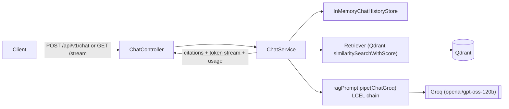
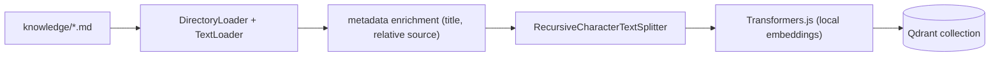

# Phase 1 — LangChain Foundation

> Scope: `apps/api`. Goal: replace ad-hoc, hand-rolled AI infrastructure with
> native LangChain (JS v1) primitives, and ship a working end-to-end RAG chat
> flow (Groq + Qdrant + local embeddings) with citations.

## 1. What existed before this phase

Before this phase, `apps/api` had two AI stacks living side by side:

1. A **custom, hand-rolled stack** (`src/ai/**`) with its own `LLMProvider`
   interface, `OpenAIProvider`, `SemanticRetriever`, a custom
   `QdrantVectorStore` wrapper, `TokenBudgetManager`, `ContextWindowTrimmer`,
   `PromptBuilder`, and `ConversationSummarizer`. This is what actually
   powered the `/api/v1/chat` routes.
2. A **partially-started LangChain stack** (`src/langchain/**`) that only
   powered the knowledge-indexing CLI, and was itself broken — the chat model
   factory was an empty file, and the CLI's command registry imported files
   that had already been deleted.

This phase removes stack (1) entirely and finishes stack (2), so LangChain is
now the *only* AI infrastructure in the codebase.

## 2. Concepts covered in this phase

| Concept | Where it's used |
| --- | --- |
| **Chat Models** | `langchain/chat/create-chat-model.ts` — `ChatGroq` from `@langchain/groq` |
| **Messages** | `HumanMessage` / `AIMessage` / `AIMessageChunk` from `@langchain/core/messages` |
| **Prompt Templates** | `langchain/prompts/rag-prompt.ts` — `ChatPromptTemplate` + `MessagesPlaceholder` |
| **LCEL** | `chat.service.ts` — `ragPrompt.pipe(chatModel)` composes a `Runnable` chain |
| **Document Loaders** | `langchain/loaders/create-knowledge-loader.ts` — `DirectoryLoader` + `TextLoader` |
| **Text Splitters** | `langchain/splitters/create-text-splitter.ts` — `RecursiveCharacterTextSplitter` |
| **Embeddings** | `langchain/embeddings/*` — custom `Embeddings` subclass wrapping local Transformers.js |
| **Vector Stores** | `langchain/vectorstores/*` — `QdrantVectorStore` |
| **Retrievers** | `langchain/retrievers/create-retriever.ts` (scored) and `vectorStore.asRetriever()` (native, in the CLI) |
| **Chat History** | `modules/chat/infrastructure/in-memory-chat-history-store.ts` — `InMemoryChatMessageHistory` |

## 3. Architecture

### 3.1 Chat / RAG request flow



`ChatService` deliberately keeps retrieval and history orchestration
**explicit** (rather than folding everything into one giant LCEL chain).
Two reasons:

- We need similarity **scores** for citations, and `.asRetriever()` doesn't
  surface those directly — `similaritySearchWithScore` does.
- Explicit orchestration is easier to instrument later (Phase 5 —
  Observability): every step (retrieval, prompt, model call) is a named,
  independently-loggable operation instead of an opaque chain.

The LCEL composition (`ragPrompt.pipe(chatModel)`) is still real and is what
actually calls the model for both `invoke()` (JSON) and `stream()` (SSE).

### 3.2 Knowledge indexing pipeline



Documents are enriched right after loading: the `source` metadata (an
absolute path by default) is rewritten relative to `KNOWLEDGE_DIRECTORY`, and
a `title` is derived from the first `# Heading` in the file (falling back to
the filename). Both fields show up later in citations.

## 4. API reference

### `POST /api/v1/chat`

Request:

```json
{ "message": "What's in the free tier?", "sessionId": "optional-uuid" }
```

Response:

```json
{
  "sessionId": "…",
  "reply": "The Free Tier includes... [1]",
  "model": "openai/gpt-oss-120b",
  "citations": [
    { "index": 1, "source": "faq.md", "title": "Frequently Asked Questions", "score": 0.82, "snippet": "…" }
  ],
  "usage": { "input_tokens": 412, "output_tokens": 96, "total_tokens": 508 }
}
```

### `GET /api/v1/chat/stream?message=...&sessionId=...`

Server-Sent Events, in order:

1. `event: citations` — `{ type, sessionId, citations }` (sent immediately, before generation)
2. `event: token` (repeated) — `{ type, sessionId, text }`
3. `event: done` — `{ type, sessionId, model, usage? }`
4. `event: error` (on failure) — `{ type, message }`

> **Known limitation:** `usage` is reliably populated on the non-streaming
> `POST /api/v1/chat` response, but `@langchain/groq@1.3.1` does not
> currently surface `usage_metadata` on any chunk of a streamed response for
> reasoning models like `openai/gpt-oss-120b` — so the streamed `done` event
> may omit `usage`. This is an upstream connector limitation, not something
> in our chain; full usage/cost accounting is formalized in the
> Observability phase.

## 5. How to run

```bash
docker compose up -d qdrant

# Index the sample knowledge base (knowledge/*.md) into Qdrant
pnpm --filter @atlas/api ai knowledge:index
# pass --reset to drop and recreate the collection first

# Sanity-check retrieval without the HTTP server
pnpm --filter @atlas/api ai knowledge:search "refund policy"

# Start the API
pnpm --filter @atlas/api dev
```

Requires a real `GROQ_API_KEY` in `apps/api/.env` (see
`src/config/.env.example`).

## 6. Old → New mapping (what was removed)

| Old (`src/ai/**`, deleted) | New |
| --- | --- |
| `LLMProvider` / `OpenAIProvider` | `ChatGroq` (`@langchain/groq`) |
| `PromptBuilder` | `ChatPromptTemplate` (`langchain/prompts/rag-prompt.ts`) |
| `TransformersEmbeddingProvider` / `ProviderEmbeddingService` | `TransformersEmbeddings` implementing `Embeddings` |
| Custom `QdrantVectorStore` wrapper | `@langchain/qdrant`'s `QdrantVectorStore` |
| `SemanticRetriever` | `langchain/retrievers/create-retriever.ts` + native `vectorStore.asRetriever()` |
| `ChatSession` / `InMemoryConversationStore` | `InMemoryChatMessageHistory` (`@langchain/core/chat_history`) |
| `ContextWindowTrimmer` / `TokenBudgetManager` | Deferred to Phase 3 (Memory) |
| `ConversationSummarizer` | Deferred to Phase 3 (Memory) |
| `GenerateRequest` / `GenerateResponse` | `BaseMessage[]` / `AIMessageChunk` |

The generic OpenAI-compatible provider path was also dropped: the chat model
is now Groq-only via `@langchain/groq`, and the `openai` / `gray-matter` npm
packages were removed since nothing in the new stack depends on them
directly.

## 7. What's intentionally out of scope here

- **Hybrid search, BM25, RRF, MMR, cross-encoder reranking** → Phase 2 (Advanced RAG)
- **Token budgeting, context trimming, conversation summarization, long-term/semantic memory** → Phase 3 (Memory). Chat history in this phase is in-memory and unbounded.
- **Structured output, JSON mode, few-shot prompting** → Phase 4 (Prompt Engineering)
- **Cost tracking, tracing, prompt inspection dashboards** → later Observability phase

## 8. Adding another chat model provider

`createChatModel()` (`langchain/chat/create-chat-model.ts`) is a small
dispatcher keyed by the `CHAT_PROVIDER` env var, not a hardcoded `ChatGroq`.
Every LangChain chat model integration implements the same `BaseChatModel`
contract, and `ChatService` only ever depends on that base type — so it has
zero knowledge of which provider is active. Adding OpenAI or Gemini later is:

1. `pnpm --filter @atlas/api add @langchain/openai` (or `@langchain/google-genai`)
2. Add the new value to the `CHAT_PROVIDER` enum in `config/env.ts`, plus that
   provider's own env vars (e.g. `OPENAI_API_KEY`, `OPENAI_MODEL`)
3. Add a matching `case` in `createChatModel()` constructing that provider's
   chat model

No changes to `ChatService`, the prompt, the retriever, or the routes are
needed. Only Groq is implemented today (free tier, fast inference); this is
a deliberate scope decision, not a limitation of the design.

## 9. Things learned

- LangChain's `BaseMessage.text` getter normalizes multi-part content into a
  plain string, which is what makes `chain.invoke(...).text` and streamed
  `chunk.text` ergonomic to use directly in application code.
- `AIMessageChunk` instances support `+`-like merging via
  `@langchain/core/utils/stream`'s `concat()`, which is how a full message
  (including aggregated `usage_metadata`) is reconstructed from a token
  stream without hand-rolled accumulation logic.
- `VectorStore.asRetriever()` is the "native contract" retriever (a
  `BaseRetriever` `Runnable`), but it doesn't expose similarity scores in
  JS today — so score-driven features (citations, score-threshold filtering)
  still need direct `similaritySearchWithScore` calls.
