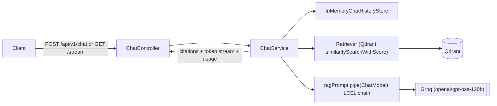
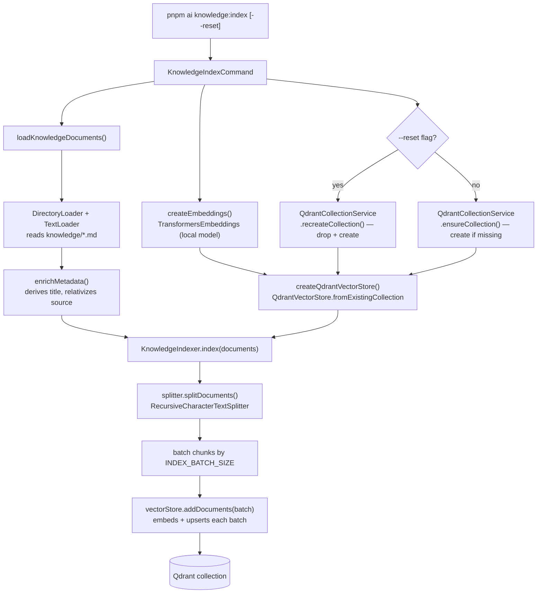

# Phase 1 — LangChain Foundation

> Scope: `apps/api`. A LangChain (JS v1) RAG chat backend — Groq + Qdrant +
> local embeddings — with citations, SSE streaming, conversation history, and
> a CLI for knowledge indexing.

## 1. Concepts covered in this phase

| Concept | Where it's used |
| --- | --- |
| **Chat Models** | `langchain/chat/create-chat-model.ts` — provider-dispatched `BaseChatModel` (`ChatGroq` from `@langchain/groq` today) |
| **Messages** | `HumanMessage` / `AIMessage` / `AIMessageChunk` from `@langchain/core/messages` |
| **Prompt Templates** | `langchain/prompts/rag-prompt.ts` — `ChatPromptTemplate` + `MessagesPlaceholder` |
| **LCEL** | `chat.service.ts` — `ragPrompt.pipe(chatModel)` composes a `Runnable` chain |
| **Document Loaders** | `langchain/loaders/create-knowledge-loader.ts` — `DirectoryLoader` + `TextLoader` |
| **Text Splitters** | `langchain/splitters/create-text-splitter.ts` — `RecursiveCharacterTextSplitter` |
| **Embeddings** | `langchain/embeddings/*` — custom `Embeddings` subclass wrapping local Transformers.js |
| **Vector Stores** | `langchain/vectorstores/*` — `QdrantVectorStore` |
| **Retrievers** | `langchain/retrievers/create-retriever.ts` (scored) and `vectorStore.asRetriever()` (native, in the CLI) |
| **Chat History** | `modules/chat/infrastructure/in-memory-chat-history-store.ts` — `InMemoryChatMessageHistory` |

## 2. Architecture

### 2.1 Chat / RAG request flow



`ChatService` deliberately keeps retrieval and history orchestration
**explicit** (rather than folding everything into one giant LCEL chain).
Two reasons:

- We need similarity **scores** for citations, and `.asRetriever()` doesn't
  surface those directly — `similaritySearchWithScore` does.
- Explicit orchestration is easier to instrument later (Phase 5 —
  Observability): every step (retrieval, prompt, model call) is a named,
  independently-loggable operation instead of an opaque chain.

The LCEL composition (`ragPrompt.pipe(chatModel)`) is still real and is what
actually calls the model for both `invoke()` (JSON) and `stream()` (SSE).

### 2.2 Knowledge indexing pipeline

Triggered by `pnpm --filter @atlas/api ai knowledge:index` (see
`cli/commands/knowledge-index.command.ts`):



Step by step:

1. **Load** — `loadKnowledgeDocuments()` (`langchain/loaders/create-knowledge-loader.ts`)
   uses a `DirectoryLoader` + `TextLoader` to read every `.md` file under
   `KNOWLEDGE_DIRECTORY`, then `enrichMetadata()` rewrites each document's
   `source` to be relative to that directory and derives a `title` from its
   first `# Heading` (falling back to the filename). Both fields later show
   up in citations.
2. **Prepare the collection** — a `QdrantCollectionService` either recreates
   the collection from scratch (`--reset`, drops + re-creates) or ensures it
   exists (default, no-op if already present), sized to the active
   embedding model's dimensions.
3. **Split** — `KnowledgeIndexer.index()` (`langchain/indexing/knowledge-indexer.ts`)
   runs every loaded document through a `RecursiveCharacterTextSplitter`
   (`TEXT_CHUNK_SIZE` / `TEXT_CHUNK_OVERLAP`) to produce chunks.
4. **Embed + upsert** — chunks are processed in batches of `INDEX_BATCH_SIZE`;
   each `vectorStore.addDocuments(batch)` call embeds the batch with the
   local `TransformersEmbeddings` model and upserts the resulting vectors +
   payload into the Qdrant collection.

## 3. API reference

### `POST /api/v1/chat`

Request:

```json
{ "message": "What's in the free tier?", "sessionId": "optional-uuid" }
```

Response:

```json
{
  "sessionId": "…",
  "reply": "The Free Tier includes... [1]",
  "model": "openai/gpt-oss-120b",
  "citations": [
    { "index": 1, "source": "faq.md", "title": "Frequently Asked Questions", "score": 0.82, "snippet": "…" }
  ],
  "usage": { "input_tokens": 412, "output_tokens": 96, "total_tokens": 508 }
}
```

### `GET /api/v1/chat/stream?message=...&sessionId=...`

Server-Sent Events, in order:

1. `event: citations` — `{ type, sessionId, citations }` (sent immediately, before generation)
2. `event: token` (repeated) — `{ type, sessionId, text }`
3. `event: done` — `{ type, sessionId, model, usage? }`
4. `event: error` (on failure) — `{ type, message }`

> **Known limitation:** `usage` is reliably populated on the non-streaming
> `POST /api/v1/chat` response, but `@langchain/groq@1.3.1` does not
> currently surface `usage_metadata` on any chunk of a streamed response for
> reasoning models like `openai/gpt-oss-120b` — so the streamed `done` event
> may omit `usage`. This is an upstream connector limitation, not something
> in our chain; full usage/cost accounting is formalized in the
> Observability phase.

## 4. How to run

```bash
docker compose up -d qdrant

# Index the sample knowledge base (knowledge/*.md) into Qdrant
pnpm --filter @atlas/api ai knowledge:index
# pass --reset to drop and recreate the collection first

# Sanity-check retrieval without the HTTP server
pnpm --filter @atlas/api ai knowledge:search "refund policy"

# Start the API
pnpm --filter @atlas/api dev
```

Requires a real `GROQ_API_KEY` in `apps/api/.env` (see
`src/config/.env.example`).

## 5. What's intentionally out of scope here

- **Hybrid search, BM25, RRF, MMR, cross-encoder reranking** → Phase 2 (Advanced RAG)
- **Token budgeting, context trimming, conversation summarization, long-term/semantic memory** → Phase 3 (Memory). Chat history in this phase is in-memory and unbounded.
- **Structured output, JSON mode, few-shot prompting** → Phase 4 (Prompt Engineering)
- **Cost tracking, tracing, prompt inspection dashboards** → later Observability phase

## 6. Adding another chat model provider

`createChatModel()` (`langchain/chat/create-chat-model.ts`) is a small
dispatcher keyed by the `CHAT_PROVIDER` env var. Every LangChain chat model
integration implements the same `BaseChatModel` contract, and `ChatService`
only ever depends on that base type — so it has zero knowledge of which
provider is active. Adding OpenAI or Gemini is:

1. `pnpm --filter @atlas/api add @langchain/openai` (or `@langchain/google-genai`)
2. Add the new value to the `CHAT_PROVIDER` enum in `config/env.ts`, plus that
   provider's own env vars (e.g. `OPENAI_API_KEY`, `OPENAI_MODEL`)
3. Add a matching `case` in `createChatModel()` constructing that provider's
   chat model

No changes to `ChatService`, the prompt, the retriever, or the routes are
needed. Only Groq is implemented today (free tier, fast inference); this is
a deliberate scope decision, not a limitation of the design.

## 7. Implementation notes

- LangChain's `BaseMessage.text` getter normalizes multi-part content into a
  plain string, which is what makes `chain.invoke(...).text` and streamed
  `chunk.text` ergonomic to use directly in application code.
- `AIMessageChunk` instances support `+`-like merging via
  `@langchain/core/utils/stream`'s `concat()`, which is how a full message
  (including aggregated `usage_metadata`) is reconstructed from a token
  stream without hand-rolled accumulation logic.
- `VectorStore.asRetriever()` is the "native contract" retriever (a
  `BaseRetriever` `Runnable`), but it doesn't expose similarity scores in
  JS today — so score-driven features (citations, score-threshold filtering)
  still need direct `similaritySearchWithScore` calls.
