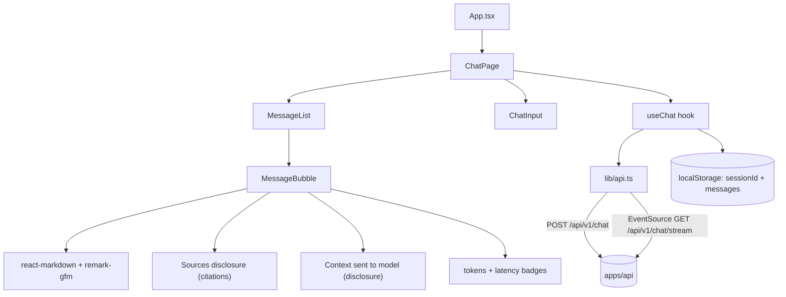

# Phase 1 — Web UI

> Scope: `apps/web`. Goal: a Vite + React + TypeScript + Tailwind CSS +
> shadcn/ui chat client wired to the `apps/api` chat endpoints, implementing
> every Phase 1 UI goal from the roadmap: chat interface, streaming UI,
> markdown rendering, conversation history, retrieved chunks, citations,
> token usage, latency, and prompt preview.

## 1. What existed before this phase

`apps/web` was an empty placeholder (`package.json` only, `name: "@atlas/web"`).
There was no frontend at all — Phase 1's backend was only exercised via `curl`
and the CLI.

## 2. Monorepo fit

- `pnpm-workspace.yaml` already globs `apps/*`, so `apps/web` is automatically
  a workspace member.
- Root `turbo.json`'s `dev` task is `persistent: true, cache: false`, and root
  `package.json`'s `dev` script is `turbo run dev` — with `apps/web/package.json`
  now having a `dev` script, `pnpm dev` at the repo root boots **both** the API
  and the web app together.
- Root `biome.json` already globs `**` (excluding `dist`/`coverage`/`.turbo`),
  so `apps/web` is linted/formatted by the existing `pnpm lint` / `pnpm format`
  — no new tooling config was needed. The repo uses Biome exclusively; the
  ESLint-free `oxlint` scaffolding that `create-vite`'s `react-ts` template
  generates today was removed to keep a single linter/formatter across the
  monorepo.
- Backend CORS is permissive (`app.use(cors())`), so the Vite dev server can
  call the API directly with no dev proxy. The API base URL is read from
  `VITE_API_URL` (default `http://localhost:3000`), so it's swappable for a
  deployed backend later.

## 3. Scaffold

Generated with `pnpm create vite@latest . --template react-ts` (React 19,
Vite 8, TypeScript 6), then customized:

- Removed `oxlint` (config + dependency + script) — Biome-only tooling.
- `tsconfig.app.json` extends a new shared `packages/tsconfig/react.json`
  (mirrors the existing `packages/tsconfig/node.json` pattern: extends
  `base.json`, adds `lib: ["ES2023", "DOM", "DOM.Iterable"]`,
  `jsx: "react-jsx"`, `moduleResolution: "Bundler"`). `tsconfig.node.json`
  (for `vite.config.ts`) extends the existing shared `node.json` for
  consistency with `apps/api`.
- `@/*` path alias to `src/*`, resolved for both TypeScript (`tsconfig.app.json`
  `paths`) and the bundler (`vite.config.ts` `resolve.alias`) — matching the
  `@/*` convention already used in `apps/api`.
- Tailwind CSS v4 via `@tailwindcss/vite` (no separate PostCSS config file
  needed) plus `@tailwindcss/typography` (for `prose` classes on rendered
  markdown) and `tw-animate-css` (for the `animate-in`/`fade-in`/`zoom-in`
  utility classes shadcn components use).
- shadcn/ui primitives (`components.json`, `src/lib/utils.ts` `cn()`, CSS
  theme variables in `src/index.css`) — **hand-authored** rather than run
  through the `shadcn` CLI, following shadcn's standard copy-in convention
  (Radix primitive + `class-variance-authority` variants + `cn()`), to avoid
  depending on a network registry fetch + interactive prompts in this
  environment. The primitives added: `Button`, `Textarea`, `ScrollArea`,
  `Card`, `Badge`, `Separator`, `Avatar`, `Collapsible`, `Tooltip`.
- `react-markdown` + `remark-gfm` for markdown rendering, `lucide-react` for
  icons.

## 4. Architecture



- **Streaming client** (`src/lib/api.ts`): the backend's
  `GET /api/v1/chat/stream?message=&sessionId=` emits named SSE events
  (`citations`, `token`, `done`, `error`) over a plain GET — exactly what the
  browser's native `EventSource` API supports, so `streamChatMessage()` uses
  `EventSource.addEventListener('citations' | 'token' | 'done' | 'error', ...)`
  directly instead of hand-rolled fetch/`ReadableStream` SSE parsing.
- **`useChat` hook** (`src/hooks/use-chat.ts`): owns `messages[]`,
  `sessionId`, `isStreaming`, and per-message `citations` / `usage` /
  `latencyMs` / `firstTokenMs`. Persists `sessionId` + `messages` to
  `localStorage` (key `atlas.chat.v1`) so a page refresh doesn't lose the
  conversation — there's no multi-session/thread list in this phase, only
  in-thread history, matching the roadmap scope.
- **Types** (`src/types/chat.ts`): mirror the backend's `ChatResponse` /
  `ChatCitation` / `StreamChunk` shapes from `apps/api/src/modules/chat/chat.types.ts`,
  kept in sync by hand since there's no shared-types package wired up between
  the two apps yet.

## 5. Roadmap item → implementation mapping

| Roadmap UI goal | Implementation |
| --- | --- |
| Chat interface | `ChatPage`, `ChatInput`, `MessageBubble` — single-column layout, dark theme by default |
| Streaming UI | `EventSource`-driven token-by-token rendering (`useChat` → `MessageBubble`), with a blinking cursor while `isStreaming` |
| Markdown rendering | `react-markdown` + `remark-gfm` inside `MessageBubble`, styled with Tailwind Typography's `prose` classes |
| Conversation history | `useChat` state persisted to `localStorage`, replayed as a `MessageBubble` list on load |
| Retrieved chunks | `SourcesPanel` — a per-message disclosure listing each retrieved chunk's snippet, source, and similarity score |
| Citations | Bare `[n]` markers in the rendered answer are rewritten into markdown links (`linkifyCitations` in `message-bubble.tsx`) that scroll to and highlight the matching `SourcesPanel` entry |
| Token usage | `UsageBadges` reads `usage.input_tokens` / `output_tokens` / `total_tokens` from the `done` SSE event; hidden gracefully when absent (see the known Groq streaming `usage_metadata` limitation documented in `phase-1-langchain-foundation.md`) |
| Latency | Measured client-side in `useChat` (request start → `done` event for total latency, request start → first `token` event for time-to-first-token), shown as badges |
| Prompt preview | `PromptPreviewPanel` — a disclosure reconstructing the exact numbered, source-tagged context block injected into the RAG prompt, built from the `citations` SSE event (which arrives before generation). This shows *what the model was grounded on*, not the full system-prompt instruction text |

## 6. How to run

```bash
# Terminal 1 — backend (see phase-1-langchain-foundation.md for prerequisites)
pnpm --filter @atlas/api dev

# Terminal 2 — frontend
pnpm --filter @atlas/web dev

# Or both together from the repo root:
pnpm dev
```

The web app runs at `http://localhost:5173` and talks to the API at the URL
in `apps/web/.env` (`VITE_API_URL`, defaults to `http://localhost:3000`).

## 7. What's intentionally out of scope here

- **Multi-session / thread list UI** — only in-thread history persistence,
  per the roadmap's Phase 1 scope. A conversation switcher is a natural
  Phase 3 (Memory) UI addition.
- **Auth / user accounts** — no login flow anywhere yet.
- **Full prompt inspection (system prompt, raw model params)** — the prompt
  preview shows retrieved context only, not the full `ChatPromptTemplate`
  output; a full prompt/trace inspector is deferred to the Observability
  phase.
- **Optimistic retry / regenerate UI** — a failed stream currently just shows
  an inline error on that message.

## 8. Things learned

- The browser's native `EventSource` API is a strong fit whenever a backend
  already emits well-formed named SSE events over a plain `GET` — it handles
  reconnection semantics and event-type dispatch without any manual buffering
  or line-parsing, at the cost of only supporting `GET` (which is why the
  streaming endpoint takes `message`/`sessionId` as query params instead of a
  POST body).
- Rewriting `[n]` citation markers into real markdown links (`[n](#cite-id)`)
  before handing the string to `react-markdown` is a simple way to get
  clickable, cross-linked citations without a custom remark/rehype plugin —
  as long as the regex is careful not to touch already-well-formed markdown
  links (`[text](url)`).
- Tailwind CSS v4's CSS-first configuration (`@theme`, `@plugin`, `@import` in
  `index.css`) removes the need for a separate `tailwind.config.ts` or
  `postcss.config.js` entirely when paired with `@tailwindcss/vite`.
