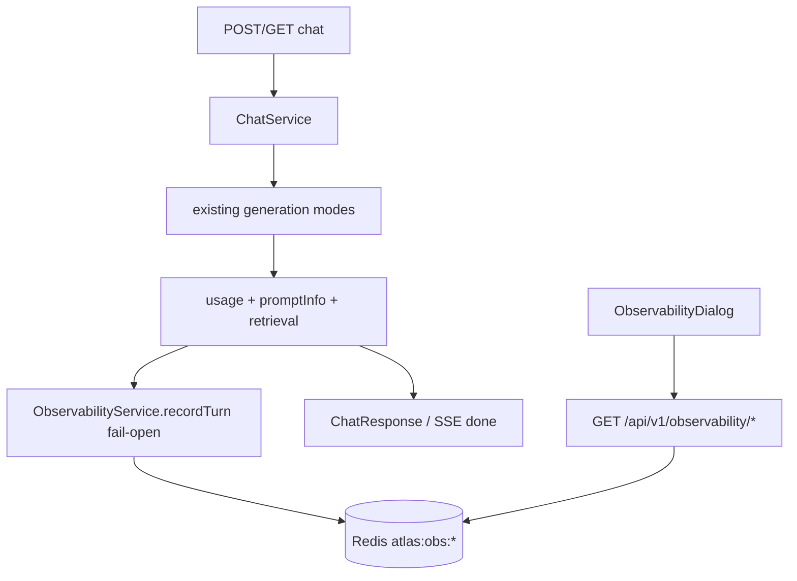

# Phase 10 — Observability (Backend)

> Scope: `apps/api`. Adds **first-party Redis-backed per-turn traces** —
> prompt snapshots, token usage, estimated cost, latency stages, and
> retrieval timings — plus a read API under `/api/v1/observability`. This
> is the "Observability" section of `Atlas-AI-Roadmap.md`. No LangSmith,
> OpenTelemetry, or Prometheus. Everything below describes what was
> actually built.

## 0. What is observability here?

**A turn** is one chat request that reaches finalization (or a graph
interrupt). Atlas persists an `ObservabilityTurn` JSON document for that
turn. **Spans** are not OpenTelemetry spans — they are named timing
stages on that record (`retrieval:*`, `generation`, `evaluation`,
`total`). Correlation uses `requestId` (Express `req.id`), `sessionId`,
and `turnId`.

| Piece | Implementation |
| --- | --- |
| Store | Redis JSON + sorted indexes (`RedisObservabilityStore`) |
| Capture | Always-on in `ChatService.invoke` / `stream` (fail-open) |
| Cost | Env $/1K token rates × usage — estimate only, not a bill |
| API | `GET /turns`, `GET /turns/:turnId`, `GET /metrics` |

### 0.1 Core vocabulary

| Term | Meaning here |
| --- | --- |
| **ObservabilityTurn** | One persisted chat turn with prompt, usage, cost, latency, retrieval, flags. |
| **Stage** | Named duration on `latency.stages` (hand-rolled "span"). |
| **Fail-open** | Persist failures are logged; chat never fails because of observability. |
| **Aggregate N** | `GET /metrics` rolls up the newest N turns in-process (default 200). |

### 0.2 Boundary with Phase 9 / Phase 11

Phase 9 **Evaluation** scores answer quality (faithfulness, etc.) and is
opt-in via `useEvaluation`. Phase 10 always captures operational metrics
when `OBSERVABILITY_ENABLED=true`. Phase 11 (production) may add auth on
these endpoints, LangSmith/OTel, and Prometheus — out of scope here.

## 1. Capture pipeline



Capture is **always on** (no `useObservability` flag) so the monitoring
dashboard always has data. Disable with `OBSERVABILITY_ENABLED=false`.

On graph interrupt, a turn is still saved with `flags.interrupted: true`
(no history append / no full usage yet). Streaming records `firstTokenMs`
when the first `token` event is yielded.

## 2. Cost model

```
costUsd = (input_tokens/1000)*OBSERVABILITY_INPUT_COST_PER_1K_TOKENS
        + (output_tokens/1000)*OBSERVABILITY_OUTPUT_COST_PER_1K_TOKENS
```

Rates are placeholders for demos — document them as estimates. Omitted
when the model returns no usage metadata.

## 3. Env vars

| Var | Default | Purpose |
| --- | --- | --- |
| `OBSERVABILITY_ENABLED` | `true` | Master switch |
| `OBSERVABILITY_REDIS_PREFIX` | `atlas:obs:` | Key prefix |
| `OBSERVABILITY_RUN_TTL_MINUTES` | `10080` | 7-day TTL |
| `OBSERVABILITY_PROMPT_MAX_CHARS` | `2000` | Truncate prompt variables |
| `OBSERVABILITY_INPUT_COST_PER_1K_TOKENS` | `0.05` | Estimate rate |
| `OBSERVABILITY_OUTPUT_COST_PER_1K_TOKENS` | `0.08` | Estimate rate |

## 4. API

| Endpoint | Purpose |
| --- | --- |
| `GET /api/v1/observability/turns?limit=&sessionId=` | Recent turns (newest first) |
| `GET /api/v1/observability/turns/:turnId` | Full turn (prompt + inspector) |
| `GET /api/v1/observability/metrics?limit=` | Rollups: tokens, cost, avg latency, byMode, retrieval stage avgs |

## 5. Redis keys

| Key | Shape |
| --- | --- |
| `{prefix}turns:{turnId}` | JSON `ObservabilityTurn` + TTL |
| `{prefix}turns:index` | ZSET score=`createdAt` ms → turnId |
| `{prefix}session:{sessionId}` | ZSET of turnIds for session filter |

## 6. File layout

```
apps/api/src/modules/observability/
  cost.ts
  observability.types.ts
  observability.service.ts
  observability.controller.ts
  observability.route.ts
  infrastructure/redis-observability-store.ts
  index.ts
```

Wired in `application.factory.ts` and mounted from `http/app.ts`.
`ChatController` passes `req.id` as `requestId` into invoke/stream.

## 7. How to run

```bash
pnpm --filter @atlas/api dev
```

```bash
curl -X POST http://localhost:3000/api/v1/chat \
  -H 'Content-Type: application/json' \
  -d '{"message":"What are the Free Tier limits?"}'

curl 'http://localhost:3000/api/v1/observability/turns?limit=5'
curl 'http://localhost:3000/api/v1/observability/metrics?limit=50'
# pick a turnId from /turns
curl "http://localhost:3000/api/v1/observability/turns/<turnId>"
```

## 8. Out of scope

- LangSmith / OpenTelemetry / Prometheus
- Auth-gated observability endpoints
- Real-time WebSocket live metrics
- Storing unbounded full replies/context without truncation
