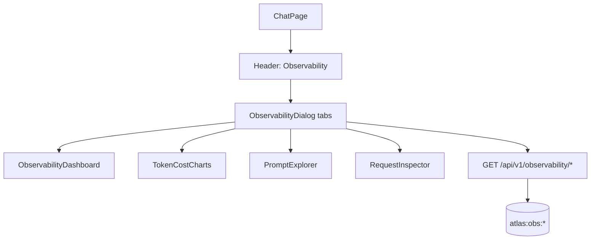

# Phase 10 — Observability UI

> Scope: `apps/web`. Extends the Phase 1–9 chat client with Phase 10
> roadmap UI: **monitoring dashboard**, **token & cost charts**, **prompt
> explorer**, and **request inspector**, wired to the backend in
> `phase-10-observability.md`.

## 1. Architecture

- **Header button** — same pattern as Benchmarks / Compare; opens a large dialog (not a `react-router` app).
- **Tabs** — local React state (`overview` | `tokens` | `prompts` | `inspector`).
- **Session filter** — dialog receives `sessionId` from `useChat` and passes it to `listObservabilityTurns` so the list prefers the current conversation (metrics remain global over last N).

## 2. Components

| Component | Role |
| --- | --- |
| `ObservabilityDialog` | Shell + tabs + refresh; loads metrics + turns |
| `ObservabilityDashboard` | KPI cards (requests, tokens, cost, avg latency) + mode bars + retrieval stage avgs |
| `TokenCostCharts` | CSS horizontal bars for tokens / cost / latency over recent turns |
| `PromptExplorer` | Turn list → truncated prompt variables + template meta |
| `RequestInspector` | Stages timeline, usage, cost, flags, retrieval |

Visual language matches Evaluation dashboard (muted borders, mono badges, CSS bars — no chart library).

## 3. Wiring

- `types/chat.ts` — `ObservabilityTurn`, `ObservabilityMetrics`, related types
- `lib/api.ts` — `listObservabilityTurns`, `getObservabilityTurn`, `getObservabilityMetrics`
- `chat-page.tsx` — Observability header button + dialog

## 4. Roadmap mapping

| Roadmap UI | Implementation |
| --- | --- |
| Monitoring dashboard | `ObservabilityDashboard` (Overview tab) |
| Token & cost charts | `TokenCostCharts` |
| Prompt explorer | `PromptExplorer` |
| Request inspector | `RequestInspector` |

## 5. Limitations

- Cost is an **estimate** from env $/1K rates; tokens may be 0 if the model omits usage metadata.
- Metrics roll up the newest N turns in-process on the API (default 200) — not a streaming live dashboard.
- Prompt variables are truncated server-side (`OBSERVABILITY_PROMPT_MAX_CHARS`).
- No auth on observability endpoints (Phase 11).

## 6. How to run

Same as Phase 1. Start API + web, send a chat message, open **Observability** in the header. Overview should show request count ≥ 1; Prompts/Inspector should list the turn.
