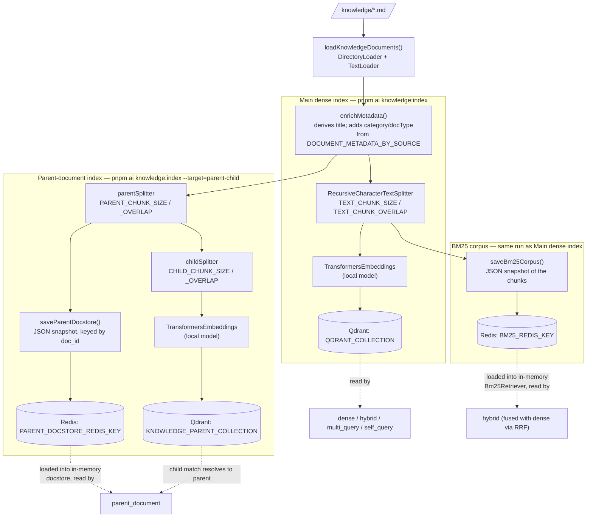
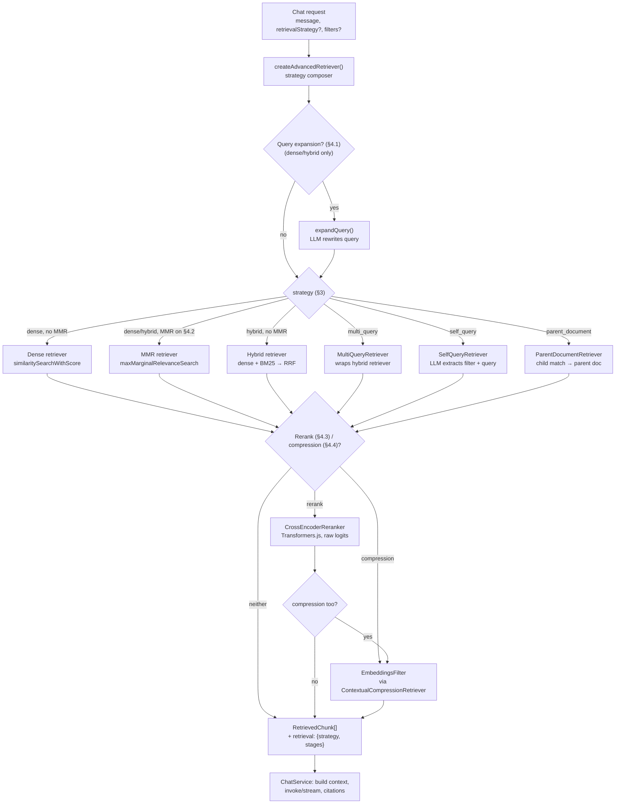

# Phase 2 — Advanced RAG

> Scope: `apps/api`. Extends the Phase 1 dense-only RAG chat backend with a
> composable, strategy-selectable retrieval pipeline — hybrid search, MMR,
> cross-encoder reranking, context compression, query expansion,
> multi-query, self-query, parent-document retrieval, and metadata
> filtering — exposed on the chat API behind an optional
> `retrievalStrategy`/`filters` request contract.

## 1. Vocabulary: three separate phases, not one blob

Everything in this document falls into one of three phases. Keeping them
mentally separate is the single most useful thing for understanding (and
extending) this pipeline:

| Phase | Question it answers | When it runs | Section |
| --- | --- | --- | --- |
| **Ingestion / embedding strategy** | How do we turn `knowledge/*.md` into a searchable index, and where does that index live? | Explicitly, via the `knowledge:index` CLI command — **never** automatically at app startup | §2 |
| **Retrieval strategy** | Given a user's question, which index (or combination of indexes) do we search, and how? | Per chat request, selected by `retrievalStrategy` | §3 |
| **Post-retrieval refinement** | Given the candidates a retrieval strategy already found, how do we reorder, filter, or broaden them before they reach the LLM? | Per chat request, layered on top of whichever retrieval strategy ran | §4 |

### Indexing vs. reindexing

- **Indexing** is the act of turning raw source documents into a searchable
  structure: load → chunk → embed → store. It's not just "generate
  embeddings" — chunking strategy and storage layout matter just as much as
  the embedding step.
- **Reindexing** is doing that *again* on an index that already exists,
  because the source documents changed, or because a setting that affects
  how chunks are produced changed (`TEXT_CHUNK_SIZE`, `PARENT_CHUNK_SIZE`,
  the embedding model, etc.). In this project, reindexing means re-running
  `knowledge:index` — there's no incremental/partial reindexing (§5
  explains why that's a deliberate simplification, and what changes at
  scale).
- `--reset` (accepted by `knowledge:index`) additionally **drops and
  recreates** the target Qdrant collection before reindexing, instead of
  upserting into the existing one — use it when chunking/embedding-model
  changes mean old vectors would be stale or wrong-dimensioned, not for a
  routine "the knowledge base changed" reindex (upserting is enough, and
  cheaper).

## 2. Ingestion / embedding strategies

This phase builds **three independent indexes** from the same source
documents (`knowledge/*.md`), each suited to a different retrieval
strategy in §3. All three are built **exclusively by `knowledge:index`** —
see §2.4 for why the app never builds or rebuilds one itself. That's three
indexes behind only **two** `knowledge:index` targets, though: §2.1's
dense index and §2.2's BM25 corpus are both built by `--target=main` in
the same run (§2.5); only §2.3's parent-document index gets its own
`--target=parent-child` (§9 has the exact commands).

### 2.1 Main dense index — semantic search

| | |
| --- | --- |
| **What** | `knowledge/*.md` is loaded, chunked (`RecursiveCharacterTextSplitter`, `TEXT_CHUNK_SIZE`/`TEXT_CHUNK_OVERLAP`), embedded with a local Transformers.js model (`LOCAL_EMBEDDING_MODEL`), and written to the Qdrant collection `QDRANT_COLLECTION`. |
| **Powers** | `dense`, `hybrid`, `multi_query`, `self_query` retrieval strategies, and MMR. |
| **Build** | `pnpm ai knowledge:index` (`--target=main`, the default). |
| **Storage** | Qdrant (dense vectors + metadata payload). |

Identical to Phase 1's indexing pipeline (see
`phase-1-langchain-foundation.md` §2.2), with one addition:
`enrichMetadata()` now also stamps `category`/`docType` on every chunk
(§6), which is what makes metadata filtering and self-query meaningful.

### 2.2 BM25 lexical corpus — keyword search

| | |
| --- | --- |
| **What** | BM25 (Okapi BM25) is classic lexical ranking: it scores a chunk against a query using term frequency (how often a query term appears in the chunk), inverse document frequency (how rare that term is across the whole corpus — rare terms count for more), and document-length normalization (so long chunks don't win purely by containing more words). It has no notion of "meaning" — it's exact/fuzzy keyword matching, the same family of algorithm classic search engines use. |
| **Why it exists alongside dense search** | Embeddings are good at "meaning" but can dilute exact matches — a product code, an unusual proper noun, or a rare term can end up embedded "close to" unrelated text. BM25 catches those cases because it only cares about literal term overlap. |
| **Powers** | `hybrid` (fused with dense via RRF, §3.2) and, transitively, `multi_query` (which wraps hybrid). |
| **Build** | Same `knowledge:index` run as §2.1 — both are derived from one shared chunk array, so they can never drift apart (see §2.5 for why this matters). |
| **Storage** | Redis, as a single JSON snapshot of the chunks (`BM25_REDIS_KEY`). `createBm25Retriever()` reads that snapshot and rebuilds the in-memory term-frequency/IDF index from it (cheap — no embedding involved). No Qdrant sparse vectors or external search engine are involved; see §2.6 for why. |

### 2.3 Parent-document index — small-chunk match, large-chunk context

| | |
| --- | --- |
| **What** | Documents are split twice: into large **parent** sections (`PARENT_CHUNK_SIZE`/`_OVERLAP`) and, within each parent, small **child** chunks (`CHILD_CHUNK_SIZE`/`_OVERLAP`). Only the small child chunks are embedded and searched (in a dedicated Qdrant collection, `KNOWLEDGE_PARENT_COLLECTION`, so Phase 1's flat dense/hybrid baseline is unaffected); the full parent sections are persisted separately, keyed by a generated `doc_id`. A match on a child chunk at query time resolves back to its parent, so the LLM gets the larger, more complete section instead of an isolated fragment. |
| **Why** | Small chunks embed and match more precisely (less topic-mixing per vector), but are too fragmentary to answer from on their own; large chunks give better context but match less precisely. This strategy gets both: precise matching *and* rich context, at the cost of indexing (and storing) two versions of the same content. |
| **Powers** | `parent_document` retrieval strategy only. |
| **Build** | `pnpm ai knowledge:index --target=parent-child` — a separate target from `--target=main` because it uses different chunk sizes and a separate Qdrant collection. |
| **Storage** | Child chunks → Qdrant (`KNOWLEDGE_PARENT_COLLECTION`). Parent sections → Redis, as a single JSON snapshot keyed by `doc_id` (`PARENT_DOCSTORE_REDIS_KEY`), read into an in-memory `InMemoryStore<Document>` at boot/query time (`loadParentDocstore()`/`saveParentDocstore()` in `parent-docstore-store.ts`). |

### 2.4 Ingestion happens only via CLI — the app never rebuilds an index

All three indexes above follow the same rule: **`knowledge:index` builds
it; the API server and `knowledge:search` only ever connect to it.**
`createBm25Retriever()`, `connectParentDocumentRetriever()`, and
`createQdrantVectorStore()` (dense) all just read from an already-populated
store, and throw a clear, actionable error if it's missing instead of
silently (re)building it on demand:

```
Error: BM25 corpus not found in Redis. Run `pnpm ai knowledge:index` to build it...
Error: Parent-document docstore not found in Redis. Run `pnpm ai knowledge:index --target=parent-child` to build it...
```

This wasn't always true — earlier in this phase, both BM25 and the
parent-document index were rebuilt from `knowledge/*.md` on every app
boot. That's cheap and invisible for a 3-file sample knowledge base, but
wrong in principle, for reasons that matter well before a knowledge base
gets "large":

- **Ingestion and serving are different kinds of work.** Loading, chunking,
  and embedding every document is a batch job — potentially slow, and
  something you want to run, watch, and retry deliberately. Serving a chat
  request should be fast and stateless. Coupling them means every app
  restart pays the ingestion cost again, and every extra server replica
  re-does the *same* expensive work redundantly instead of sharing one
  already-built index.
- **A transient ingestion hiccup shouldn't become an outage.** If rebuilding
  the index at boot fails partway (a malformed knowledge file, a model
  download stalling), the whole app fails to start — instead of a `pnpm ai
  knowledge:index` command you can inspect, fix, and retry on its own.
- **It's the same pattern Qdrant already established in Phase 1**: the app
  has always only *connected to* an existing Qdrant collection
  (`QdrantVectorStore.fromExistingCollection`) — it never embedded
  documents into it at boot. BM25 and parent-document now follow that same
  "index via CLI, connect at boot" model, just backed by Redis instead of
  Qdrant.

§5 covers what else would need to change for this to hold up with a much
larger knowledge base.

### 2.5 Why the main dense index and BM25 corpus can't drift apart

`knowledge-index.command.ts`'s `--target=main` splits `knowledge/*.md`
into chunks **once**, then both embeds that exact chunk array into Qdrant
*and* persists it as the BM25 snapshot in the same CLI run
(`KnowledgeIndexer.index(chunks)` + `saveBm25Corpus(chunks)`). Since both
indexes are computed from the identical in-memory array in one pass, there
is no way for BM25's corpus to fall out of sync with what's in Qdrant — a
risk that exists whenever two indexes are built from independently-run
splitting logic (e.g. if BM25 re-read and re-split the files itself, using
whatever chunking settings happened to be active *at that moment*).

### 2.6 Why not Qdrant-native hybrid search?

Qdrant supports native sparse vectors and server-side hybrid search
(`query()` with `prefetch` + fusion). This phase deliberately doesn't use
that, because `@langchain/qdrant@1.0.3`'s `QdrantVectorStore` only supports
a single unnamed dense vector — no named/sparse vectors — so using Qdrant's
native hybrid search would mean bypassing the LangChain integration
entirely (a raw `@qdrant/js-client-rest` client, a hand-rolled sparse
encoder, and reimplementing document/metadata mapping). There's also no JS
equivalent of Python's `fastembed` sparse BM25 encoder.

Instead, BM25 runs **in-process** (§2.2) and is fused with dense search
using a **hand-written RRF** utility (§3.2) rather than
`@langchain/classic`'s built-in `EnsembleRetriever`. `EnsembleRetriever`
dedupes by raw `pageContent` and discards the fused score entirely, keeping
only the first list's document object — Phase 1's design principle is
"keep explicit scores for citations," so `reciprocal-rank-fusion.ts` fuses
scores explicitly instead.

## 3. Retrieval strategies

`retrievalStrategy` selects which of these five strategies answers a given
chat request (`RETRIEVAL_STRATEGY` env var sets the default when a request
doesn't specify one). All five implement the same `Retriever` interface
and return the same `RetrievedChunk[]` shape, so `ChatService` and
citations never need to know which one ran (`retriever.types.ts`,
`to-retrieved-chunk.ts`).

### 3.1 `dense` — semantic similarity search

The baseline from Phase 1: embed the query with the same model used at
ingestion, then find the `RETRIEVAL_TOP_K` chunks in the main Qdrant
collection whose embeddings are closest by cosine similarity
(`similaritySearchWithScore`).

- **Good for**: paraphrased or conceptual questions where the answer's
  wording won't match the question's wording.
- **Weak at**: exact keyword/rare-term/code lookups — embeddings can rate
  unrelated text as "similar" to a specific term they were never trained to
  distinguish precisely.
- **Implementation**: `create-retriever.ts`.

### 3.2 `hybrid` — dense + BM25 fused with RRF

Runs dense (semantic) and BM25 (lexical, §2.2) retrieval **in parallel**
over a larger candidate pool (`RETRIEVAL_FETCH_K` each), then merges the
two ranked lists with **Reciprocal Rank Fusion (RRF)**:
`score += weight / (rank + k)` for each list a chunk appears in (rank
starting at 1). RRF combines lists using only *rank position*, not raw
score — necessary here because dense cosine similarity (bounded, roughly
[-1, 1]) and BM25's score (unbounded, log-frequency-based) live on
incompatible scales that can't be compared directly.
`RETRIEVAL_HYBRID_DENSE_WEIGHT` controls how much each list counts (BM25
gets `1 - denseWeight`); `RETRIEVAL_RRF_K` (default 60, the constant used
across most production hybrid-search implementations — Qdrant,
Elasticsearch, LangChain's own `EnsembleRetriever`) keeps a handful of rank
positions of difference from dominating the fused score.

- **Good for**: general-purpose querying where you don't know in advance
  whether a question needs "meaning" or "exact term" matching — this is
  the default (`RETRIEVAL_STRATEGY=dense` in `.env.example`, but `hybrid`
  is a reasonable production default once BM25 is trusted).
- **Implementation**: `create-hybrid-retriever.ts`,
  `reciprocal-rank-fusion.ts`.

### 3.3 `multi_query` — LLM query rewriting for recall

The LLM rewrites the user's question into `RETRIEVAL_MULTI_QUERY_COUNT`
alternate phrasings (e.g. "PTO rollover" → "how much unused vacation
carries over", "what happens to leftover PTO days"). Each phrasing is run
through the **hybrid** retriever (§3.2), and the results are merged and
deduplicated.

- **Good for**: ambiguous or underspecified questions where the "right"
  search terms aren't obvious from the question alone — casts a wider net
  by asking the same thing several different ways.
- **Cost**: one extra LLM call before retrieval even starts, plus N hybrid
  retrievals instead of one — slower and more expensive than the other
  strategies.
- **Caveat**: `MultiQueryRetriever`'s internal dedup logic compares the
  *full* document (content + metadata), not just `pageContent`. Since each
  query variant's hybrid retrieval can attach a slightly different fused
  RRF score to the same chunk, the same chunk can occasionally appear more
  than once in the results. A production system might dedupe by content
  only.
- **Implementation**: `create-multi-query-retriever.ts`, via
  `MultiQueryRetriever.fromLLM`.

### 3.4 `self_query` — LLM-extracted structured filter + query

The LLM turns a natural-language query into a *structured* query: a
semantic search string plus a metadata filter, using a description of
available fields (`KNOWLEDGE_ATTRIBUTE_INFO` — `category`, `docType`,
`source`; see §6). Example: "refund policy for electronics" → search
query `"refund policy"` + filter `category = retail`. The filter is
compiled into Qdrant's native filter DSL and applied server-side; the
search string runs as an ordinary dense search.

- **Good for**: questions that implicitly reference structured attributes
  ("HR policies about...", "the FAQ on...") without the user having to
  fill in a separate filter field themselves.
- **Trade-off**: an extra LLM call to extract the structured query, and it
  derives its *own* filter from the question — it doesn't accept the
  request's `filters` field (that's for `dense`/`hybrid`/MMR instead, §6).
- **Implementation**: `self-query/*`, via `SelfQueryRetriever.fromLLM` +
  a from-scratch `QdrantTranslator` (`self-query/qdrant-translator.ts`) —
  neither `@langchain/classic` nor `@langchain/qdrant` ship a Qdrant
  translator (unlike Pinecone/Weaviate/Chroma in the Python ecosystem). It
  compiles LangChain's structured-query IR into Qdrant's
  `must`/`should`/`must_not` filter DSL, addressing attributes as
  `metadata.<attribute>` (`@langchain/qdrant`'s default metadata payload
  key). `peggy` is a runtime dependency of the self-query expression parser
  and is installed explicitly in `apps/api/package.json` for this to work.

### 3.5 `parent_document` — resolve small-chunk matches to their parent

Searches the parent-document index (§2.3): finds the closest **child**
chunks by similarity search, then resolves each match's `doc_id` back to
its full **parent** section from the Redis-backed docstore, returning the
richer parent content instead of the fragment that actually matched.

- **Good for**: content where a fragment alone loses too much context to
  answer from (numbered steps, multi-part policies) but embedding the
  whole section directly would be too coarse to match precisely.
- **Implementation**: `parent-document/create-parent-document-retriever.ts`
  (`connectParentDocumentRetriever` at boot/query time, §2.4;
  `buildParentDocumentRetriever` for ingestion, §2.3).

### 3.6 Score semantics

A chunk's `score` reflects whichever stage **last** touched it, not always
a directly comparable cosine similarity:

| Strategy / stage | Score meaning |
| --- | --- |
| `dense` | Cosine similarity from Qdrant (0–1) |
| `hybrid` | Fused RRF value (small, unbounded-but-tiny positive number) |
| `multi_query` | The underlying hybrid retriever's fused score for whichever query variant surfaced the chunk |
| `self_query`, `parent_document` | Rank-based placeholder (`1.0` = best) — the underlying `SelfQueryRetriever`/`ParentDocumentRetriever` retrieve via `vectorStore.asRetriever()`/`.similaritySearch()`, which don't surface similarity scores in this LangChain.js version |
| MMR (`useMmr`) | Real cosine similarity, looked up from a parallel `similaritySearchWithScore` call over the same candidate pool (`maxMarginalRelevanceSearch` itself doesn't return scores) |
| Reranked (`useRerank`) | Raw cross-encoder logit (unbounded, can be negative — higher is still better) |
| Compressed only (`useCompression`) | Unchanged — `EmbeddingsFilter` filters, it doesn't rescore |

## 4. Post-retrieval refinement: MMR, reranking, compression, query expansion

These four operations don't select *which* index to search — they take
whatever a retrieval strategy already found (or, for query expansion, the
question itself) and refine it. Two run *before* the base strategy
(broadening the question), two run *after* it (reordering/trimming the
candidates):

| Stage | Runs | What it does |
| --- | --- | --- |
| Query expansion | Before retrieval | Broadens the query itself |
| MMR | Replaces the base strategy's selection step | Re-selects for diversity instead of pure relevance |
| Cross-encoder reranking | After retrieval | Reorders candidates by a more precise (but slower) relevance score |
| Context compression | After retrieval (and after reranking, if both are on) | Drops candidates that aren't actually relevant enough |

### 4.1 Query expansion — broaden the query, then retrieve once

**What**: before retrieval runs, an LLM call rewrites the user's question
into one broader query that appends related terms, synonyms, and alternate
phrasings — e.g. "reset password" → "reset password forgot password change
credentials login authentication". That expanded query is what actually
gets embedded/searched; the original question is preserved for the "did
you mean" style display (`effectiveQuery` in the API response, §7).

**Why**: improves recall for short or underspecified questions, without
the cost of running several *full* retrieval passes (contrast with
`multi_query`, §3.3, which is the "spend more, ask several ways" version of
the same idea — the two intentionally don't compose).

**Where**: only applies ahead of `dense`/`hybrid` (`RETRIEVAL_QUERY_EXPANSION_ENABLED`,
or the request's `useQueryExpansion`); `self_query`/`parent_document`
interpret the raw natural-language query themselves.

**Implementation**: `langchain/query/expand-query.ts`.

### 4.2 MMR (Maximal Marginal Relevance) — trade relevance for diversity

**What**: instead of returning the top-K chunks purely by similarity, MMR
fetches a larger candidate pool (`RETRIEVAL_MMR_FETCH_K`) and iteratively
re-selects K of them by balancing two things: how relevant a candidate is
to the query, and how *dissimilar* it is to chunks already selected.
`RETRIEVAL_MMR_LAMBDA` controls the trade-off (`1` = pure relevance, no
diversity benefit; `0` = maximum diversity).

**Why**: plain top-K similarity search can return several near-duplicate
chunks that all restate the same passage (common when a document repeats a
point across sections) — wasting context budget on redundant information
instead of covering more ground.

**Where**: available for `dense`/`hybrid` (`useMmr`); it always re-selects
from the *dense* vector store (`maxMarginalRelevanceSearch`) even when
`strategy: "hybrid"` is set — when enabled, MMR takes priority over hybrid
fusion for that request (see `create-advanced-retriever.ts`'s
`runBaseStrategy`). Since `maxMarginalRelevanceSearch` itself doesn't
return similarity scores, a parallel `similaritySearchWithScore` call over
the same candidate pool supplies the score used for citations.

**Implementation**: `create-mmr-retriever.ts`.

### 4.3 Cross-encoder reranking — precise reordering of the top candidates

**What**: a small transformer model (`RETRIEVAL_RERANK_MODEL`, default
`Xenova/ms-marco-MiniLM-L-6-v2`) scores each `(query, chunk)` pair
*jointly* — the model reads the query and the chunk together, rather than
comparing two independently-computed embeddings the way dense search does.
This lets it capture interactions between the two texts that separate
embeddings can't, at the cost of being far slower to run at scale (it must
process every candidate pair, not just a vector comparison), which is why
it's applied only to the top `RETRIEVAL_FETCH_K`-ish candidates a cheaper
strategy already narrowed down, not the whole corpus.

**Why it needs a custom implementation**: the model is a **single-logit
regression head** — it outputs one relevance score per pair, not a
probability distribution over classes. Transformers.js's
`pipeline("text-classification", ...)` applies softmax to the model's
output, and softmax over a single value always collapses to `1.0` — every
candidate would score identically and reranking would be a no-op.
`cross-encoder-reranker.ts` bypasses the pipeline and uses
`AutoTokenizer`/`AutoModelForSequenceClassification` directly (per the
model's own usage example), reading `outputs.logits.data` for the raw,
comparable relevance scores. Verified manually — for "refund policy for
electronics" the Category B (electronics) chunk scored `~3.8` against
`~-1.2` and `~-7.3` for the other candidates, correctly promoting the most
relevant chunk to first place.

**Where**: layered on top of *any* base strategy's output (`useRerank`),
keeping the top `RETRIEVAL_RERANK_TOP_N`. Runs entirely locally (no
reranking API/key), consistent with the local embeddings model.

**Implementation**: `langchain/rerank/cross-encoder-reranker.ts`
(`CrossEncoderReranker`).

### 4.4 Context compression — drop what's still irrelevant

**What**: after retrieval (and reranking, if both are enabled), re-embed
each candidate and the query, and drop any chunk whose similarity falls
below `RETRIEVAL_COMPRESSION_SIMILARITY_THRESHOLD`. Unlike reranking, this
doesn't reorder anything — it's a filter, not a rescoring step (see the
score-semantics table in §3.6).

**Why**: reduces noise and prompt tokens sent to the LLM — useful when a
base strategy's top-K includes borderline-relevant chunks (common with a
generous `fetchK`, or with MMR trading some relevance for diversity).

**Where**: layered on top of any base strategy's output (`useCompression`),
applied *after* reranking if both are on — rerank first to fix ordering,
then compression to drop what's still irrelevant even in the best
ordering.

**Implementation**: `create-compression-retriever.ts`
(`applyPostRetrievalStages`), via `ContextualCompressionRetriever` +
`EmbeddingsFilter`. Implemented via a `FunctionRetriever`
(`function-retriever.ts`) that "replays" the already-fetched documents into
a real `ContextualCompressionRetriever`, rather than wrapping a live
retriever — this pipeline passes plain `Document[]` between composable
stages, so the wrapper wouldn't add anything beyond what direct compressor
calls do.

### 4.5 Metadata filtering

Constrains retrieval to chunks matching structured metadata
(`filters: { "category": "hr" }`), independent of semantic similarity.
Honored by `dense`, `hybrid`, and MMR — translated to a native Qdrant
filter (`metadata-filter.ts`'s `toQdrantFilter`). BM25's branch of hybrid
search has no server-side filter support, so the same filter is applied
in-process instead (`matchesMetadataFilter`). `self_query` derives its own
filter from the natural-language query instead of taking one as input
(§3.4); `parent_document` doesn't support filtering (child-chunk metadata
doesn't carry through to the resolved parent cleanly).

## 5. Ingestion at scale — what this phase deliberately doesn't solve

This phase's ingestion design (§2) is intentionally simple, because the
sample knowledge base is three files. The architecture — CLI-only
ingestion, indexes that persist and are only ever *connected to* at
runtime (§2.4) — is what scales; the specific implementation choices below
are what wouldn't, and are worth naming explicitly rather than leaving
implicit:

- **No incremental indexing.** Every `knowledge:index` run reprocesses
  every document from scratch — cheap for 3 files, expensive (in time and
  embedding cost/compute) for thousands. A larger deployment would track
  which files actually changed (content hashing, a manifest, or a proper
  event-driven pipeline triggered by a CMS/document-store webhook) and
  only re-embed those.
- **Single-JSON-blob snapshots.** BM25's corpus and the parent-document
  docstore are each stored as one JSON value under one Redis key (§2.2,
  §2.3) — simple, and fine at kilobyte scale, but it means every
  `knowledge:index` run rewrites the *entire* corpus, and a large one could
  approach Redis's per-value practical limits. A larger deployment would
  either shard this (e.g. a Redis hash keyed by chunk/doc ID, so updates
  touch one field instead of the whole blob) or replace hand-rolled BM25
  with a real lexical search engine (Elasticsearch, OpenSearch, or
  Qdrant's own sparse vectors once `@langchain/qdrant` supports them, §2.6)
  that's designed to index and update at that scale.
- **Synchronous, single-process ingestion.** `knowledge:index` loads,
  splits, and embeds everything in one Node process, batching only the
  Qdrant writes (`INDEX_BATCH_SIZE`). A larger corpus would want this to
  run as a monitored background job (a queue like BullMQ, or a managed
  pipeline) with parallelism, progress tracking, and alerting on partial
  failure — not a command a human runs and watches to completion.
- **No versioned cutover.** `--reset` drops and recreates the *live*
  collection in place, so there's a window where it's empty or partially
  populated mid-reindex. A production system would index into a new,
  separate collection and atomically flip an alias/pointer once it's fully
  built and verified, so the app never serves against a half-built index.
- **No retrieval-quality evaluation.** There's no automated way to tell if
  a reindex (or a chunking/model change) made retrieval better or worse —
  see §11, this is deferred to a later Observability phase.

None of this is needed for a knowledge base this size, and adding it now
would be premature complexity for a project whose actual bottleneck is
elsewhere. It's documented here so the trade-off is a decision, not an
accident.

## 6. Knowledge metadata

`langchain/loaders/create-knowledge-loader.ts` enriches every loaded
document with structured `category`/`docType` metadata (looked up by
`source` file name, falling back to `general`/`document` for unrecognized
files):

| File | `category` | `docType` |
| --- | --- | --- |
| `employee-handbook.md` | `hr` | `policy` |
| `faq.md` | `product` | `faq` |
| `refund-policy.md` | `retail` | `policy` |

This is what makes `filters: { "category": "hr" }` (§4.5) and self-query
(§3.4 — "refund policy for electronics" → filter `category = retail`)
meaningful. `QdrantCollectionService.ensurePayloadIndex()` can optionally
index a metadata field in Qdrant for filter performance at larger scale —
not required for a corpus this small (Qdrant falls back to an unindexed
scan).

## 7. Chat API

### `POST /api/v1/chat`

All new fields are optional; omitting them preserves the exact Phase 1
request/response shape (strategy/toggles fall back to the
`RETRIEVAL_*` env vars).

Request:

```json
{
  "message": "What's the refund policy for electronics?",
  "sessionId": "optional-uuid",
  "retrievalStrategy": "hybrid",
  "filters": { "category": "retail" },
  "useMmr": false,
  "useRerank": true,
  "useCompression": false,
  "useQueryExpansion": false
}
```

- `retrievalStrategy`: one of `dense`, `hybrid`, `multi_query`,
  `self_query`, `parent_document` (§3).
- `filters`: equality filter on chunk metadata (`category`, `docType`,
  `source`, ...) — §4.5.

Response gains a `retrieval` block:

```json
{
  "sessionId": "…",
  "reply": "Electronics can be returned for a full refund only if unopened… [1]",
  "model": "openai/gpt-oss-120b",
  "citations": [{ "index": 1, "source": "refund-policy.md", "title": "Apex Retail Refund and Return Policy", "score": 0.016, "snippet": "…" }],
  "retrieval": { "strategy": "hybrid", "stages": [{ "name": "hybrid", "durationMs": 52 }] },
  "usage": { "input_tokens": 412, "output_tokens": 96, "total_tokens": 508 }
}
```

`retrieval.stages` is a timeline of every stage that ran (e.g.
`query_expansion` → `hybrid` → `rerank`), each with its wall-clock
duration — enough for a future retrieval-timeline UI without another
contract change.

### `GET /api/v1/chat/stream?message=...`

Same optional overrides as query-string parameters. `filters` is
JSON-encoded since query strings can't express nested objects:

```
GET /api/v1/chat/stream?message=...&retrievalStrategy=hybrid&filters=%7B%22category%22%3A%22retail%22%7D&useRerank=true
```

The `citations` SSE event now also carries `retrieval`:

```
event: citations
data: { "type": "citations", "sessionId": "…", "citations": [...], "retrieval": { "strategy": "hybrid", "stages": [...] } }
```

## 8. Architecture

Ingestion (§2, building the indexes) and querying (§3–§4, answering a chat
request) are separate flows that only meet at the indexes/stores each
strategy reads from — worth keeping visually distinct since they run at
different times (indexing is triggered explicitly via CLI; querying
happens per chat request) and are debugged independently.

### 8.1 Ingestion flow



Every arrow into a Qdrant/Redis store above only ever happens via
`knowledge:index`; every dashed "read by" arrow is what happens at app
boot / per chat request (§2.4) — nothing on the read side re-derives
anything from `knowledge/*.md`.

### 8.2 Query (retrieval) flow



## 9. How to run

`knowledge:index` has exactly **two** targets, even though §2 describes
**three** indexes — `--target=main` builds both the dense index (§2.1)
*and* the BM25 corpus (§2.2) in one run (deliberately, to keep them from
drifting apart, §2.5); there's no separate `--target=bm25`.
`--target=parent-child` builds the third, separate index (§2.3). **Both
targets must be run** before the server can serve every strategy — running
only one leaves `parent_document` (or, if you skip `main`, everything else)
throwing the "not found, run knowledge:index..." error from §2.4.

```bash
docker compose up -d qdrant
# Redis isn't provisioned by docker-compose.yml — point REDIS_URL
# (.env.example) at any already-running instance.
```

```bash
# --target=main (default) — dense index (§2.1) + BM25 corpus (§2.2)
pnpm --filter @atlas/api ai knowledge:index
# pass --reset to drop and recreate the Qdrant collection first
# (the Redis BM25 snapshot is always fully overwritten on every run)
```

```bash
# --target=parent-child — the separate parent-document index (§2.3),
# required before the server can start with `parent_document` available
pnpm --filter @atlas/api ai knowledge:index --target=parent-child
```

```bash
# Compare retrieval strategies without the HTTP server
pnpm --filter @atlas/api ai knowledge:search "refund policy for electronics" --strategy=hybrid
pnpm --filter @atlas/api ai knowledge:search "refund policy for electronics" --strategy=dense --mmr
pnpm --filter @atlas/api ai knowledge:search "refund policy for electronics" --strategy=dense --rerank
pnpm --filter @atlas/api ai knowledge:search "refund policy for electronics" --strategy=self_query
pnpm --filter @atlas/api ai knowledge:search "refund policy for electronics" --strategy=parent_document
pnpm --filter @atlas/api ai knowledge:search "PTO rollover" --strategy=dense --expand

# Start the API (fails fast with a clear error if either knowledge:index
# command above hasn't been run yet — see §2.4)
pnpm --filter @atlas/api dev
```

`knowledge:search` prints which strategy ran, the per-stage timeline, and
each chunk's score — the same information the chat API returns in
`retrieval`.

## 10. Implementation notes

- **`RETRIEVAL_*` env vars** (`config/env.ts`, `.env.example`) configure
  every stage's default: `RETRIEVAL_STRATEGY`, `RETRIEVAL_FETCH_K`,
  `RETRIEVAL_HYBRID_DENSE_WEIGHT`, `RETRIEVAL_RRF_K`,
  `RETRIEVAL_MMR_ENABLED`/`_LAMBDA`/`_FETCH_K`,
  `RETRIEVAL_RERANK_ENABLED`/`_MODEL`/`_TOP_N`,
  `RETRIEVAL_COMPRESSION_ENABLED`/`_SIMILARITY_THRESHOLD`,
  `RETRIEVAL_QUERY_EXPANSION_ENABLED`, `RETRIEVAL_MULTI_QUERY_COUNT`,
  `KNOWLEDGE_PARENT_COLLECTION`, `PARENT_CHUNK_SIZE`/`_OVERLAP`,
  `CHILD_CHUNK_SIZE`/`_OVERLAP`. All are request-overridable per §7.
- **`REDIS_URL`/`BM25_REDIS_KEY`/`PARENT_DOCSTORE_REDIS_KEY`**
  (`config/env.ts`) configure where the two Redis-persisted ingestion
  snapshots live (§2.2, §2.3) — `createRedisClient()`
  (`infrastructure/redis/`) is a thin `ioredis` factory shared by
  `bm25-corpus-store.ts` and `parent-document/parent-docstore-store.ts`.
  Redis itself isn't provisioned by `docker-compose.yml` — point
  `REDIS_URL` at whatever instance you already have running.
- **`booleanFlag()` helper** (`config/env.ts`) exists because
  `z.coerce.boolean()` is a footgun for env vars — `Boolean("false")` is
  `true` in JS, so any non-empty string would coerce to `true`. The helper
  only accepts the literal strings `"true"`/`"false"`.
- **`FunctionRetriever`** (`langchain/retrievers/function-retriever.ts`)
  adapts an arbitrary `(query) => Promise<Document[]>` function into a real
  `BaseRetriever`. It's the bridge used everywhere this pipeline needs to
  hand its own `Document[]`/`RetrievedChunk[]` results to a LangChain class
  that expects a live retriever (`MultiQueryRetriever`,
  `ContextualCompressionRetriever`), instead of reimplementing their logic.

## 11. What's intentionally out of scope here

- **Qdrant-native sparse vectors / server-side hybrid search** — see §2.6.
- **Incremental/event-driven ingestion, sharded Redis snapshots, versioned
  collections with atomic cutover, background/queued indexing jobs** — see
  §5.
- **Token budgeting, context trimming, conversation summarization,
  long-term/semantic memory** → Phase 3 (Memory).
- **Structured output, JSON mode, few-shot prompting** → Phase 4 (Prompt
  Engineering).
- **Cost tracking, tracing, prompt inspection dashboards, retrieval
  quality evaluation (recall/precision benchmarks)** → later Observability
  phase.
