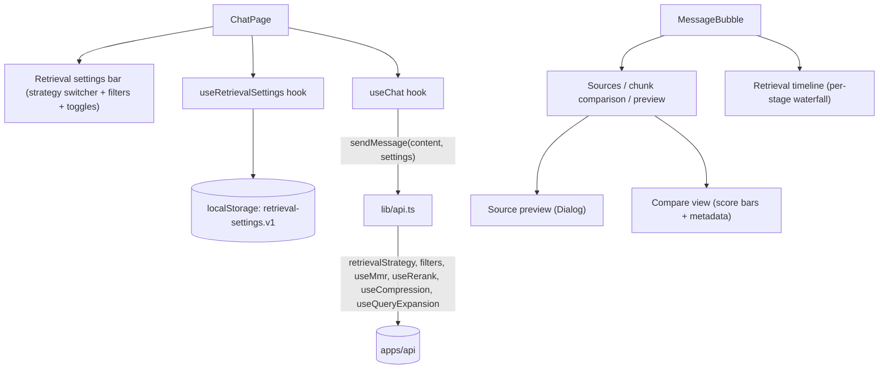

# Phase 2 — Advanced RAG UI

> Scope: `apps/web`. Extends the Phase 1 chat client with every Phase 2 UI
> goal from the roadmap: retrieval strategy switcher, chunk comparison,
> similarity scores, metadata filters, source preview, and retrieval
> timeline — all wired to the Phase 2 backend described in
> `phase-2-advanced-rag.md`.

## 1. New dependencies

- `@radix-ui/react-select`, `@radix-ui/react-switch`, `@radix-ui/react-dialog`,
  `@radix-ui/react-progress` — four new shadcn-style primitives
  (`Select`, `Switch`, `Dialog`, `Progress`) hand-authored the same way as the
  Phase 1 primitives (Radix + `cn()` + shadcn's `new-york` styling), added
  under `src/components/ui/`.

## 2. Architecture

- **`RetrievalSettingsBar`** (`src/components/chat/retrieval-settings-bar.tsx`):
  toggled from a header button, exposes the full `AdvancedRetrieveOptions`
  surface as UI controls — a strategy `Select` (dense / hybrid / multi-query /
  self-query / parent-document), four `Switch` toggles (MMR, rerank,
  compression, query expansion), and category/docType filter `Select`s. Toggle
  and filter availability is derived per-strategy from
  `src/lib/retrieval-options.ts` (mirroring which options each backend
  strategy actually reads in `create-advanced-retriever.ts`): MMR and query
  expansion are disabled outside dense/hybrid, and filters are hidden for
  self-query (auto-derived from the question) and parent-document (not
  supported).
- **`useRetrievalSettings`** (`src/hooks/use-retrieval-settings.ts`): owns and
  persists the `RetrievalSettings` state to `localStorage`
  (`atlas.retrieval-settings.v1`), the same pattern `useChat` uses for message
  history.
- **`SourcesPanel`** (`src/components/chat/sources-panel.tsx`, evolved from
  Phase 1): now renders similarity scores as a `Progress` bar in addition to
  the percentage badge, shows `category`/`docType` metadata badges per chunk,
  and adds a **list ↔ compare** view toggle. Compare mode
  (`ChunkComparisonGrid`) lays every retrieved chunk out in a grid so scores,
  metadata, and snippets can be scanned side by side, with the top-scoring
  chunk highlighted. Every chunk (either view) has an eye-icon button that
  opens a `SourcePreviewDialog` — a modal with the chunk's full,
  untruncated content plus its source, title, and metadata.
- **`RetrievalTimeline`** (`src/components/chat/retrieval-timeline.tsx`): a
  disclosure per assistant message rendering the backend's `retrieval.stages`
  timing data (`RetrievalStageTiming[]`) as a proportional color-coded
  waterfall bar plus a stage-by-stage duration list, with the active strategy
  and total time in the trigger row.

## 3. API/type changes required to power this UI

The Phase 2 backend already accepted `retrievalStrategy` / `filters` /
`useMmr` / `useRerank` / `useCompression` / `useQueryExpansion` on both chat
endpoints and returned `retrieval: { strategy, stages }`. Two gaps were
closed to make the UI meaningful:

- **`RetrievedChunk`** (`apps/api/src/langchain/retrievers/retriever.types.ts`)
  gained optional `category`/`docType` fields, threaded through
  `toRetrievedChunk`, the rerank/compression `chunkToDocument` bridge, and the
  multi-query retriever's document rewrap — previously these were dropped
  after the base strategy ran, so post-retrieval stages and non-dense
  strategies couldn't surface them.
- **`ChatCitation`** (`apps/api/src/modules/chat/chat.types.ts`) gained
  `category`, `docType`, and a full untruncated `content` field (alongside the
  existing 200-character `snippet`) — needed for the metadata badges and the
  source preview dialog, which shows the whole chunk, not just the snippet.

`src/types/chat.ts` mirrors all of this by hand, plus adds the UI-only
`RetrievalSettings` type and the `RetrievalStrategy` / `RetrievalInfo` /
`RetrievalStageTiming` / `MetadataFilter` types mirrored from
`apps/api/src/langchain/retrieval/retrieval-strategy.ts` and `chat.types.ts`.

## 4. Roadmap item → implementation mapping

| Roadmap UI goal | Implementation |
| --- | --- |
| Retrieval strategy switcher | `RetrievalSettingsBar`'s strategy `Select`, plus the MMR/rerank/compression/query-expansion `Switch` toggles |
| Chunk comparison | `SourcesPanel`'s compare view (`ChunkComparisonGrid`) — a grid of all retrieved chunks with score bars, metadata, and the top match highlighted |
| Similarity scores | `ScoreBar` (a `Progress` bar + percentage) in both the list and compare views, and in the source preview dialog |
| Metadata filters | `RetrievalSettingsBar`'s category/docType `Select`s, sent as `filters` to the backend; disabled/explained per-strategy |
| Source preview | `SourcePreviewDialog` — a modal showing a chunk's full content, source, title, score, and metadata |
| Retrieval timeline | `RetrievalTimeline` — per-stage duration waterfall + list, from the backend's `retrieval.stages` |

## 5. Notes and known limitations

- Scores are **not always a comparable 0–1 cosine similarity** (see
  `phase-2-advanced-rag.md` §"Score semantics") — e.g. cross-encoder rerank
  scores are raw logits and can be negative, self-query/parent-document use a
  rank-based placeholder. `ScoreBar` clamps to `[0, 100]%` so out-of-range
  scores still render sensibly instead of overflowing or going negative, but
  the percentage isn't a universal apples-to-apples similarity across
  strategies — this is a display simplification, not a bug.
- The retrieval settings bar's per-strategy toggle availability is UI-side
  policy that mirrors, but doesn't call, the backend's actual defaulting
  logic in `create-advanced-retriever.ts`. If that composition logic changes,
  `src/lib/retrieval-options.ts` needs a matching update.
- No dedicated "apply filters" step — changing the strategy switcher only
  takes effect on the *next* sent message, matching how the rest of the chat
  UI already works (settings aren't retroactively applied to past turns).

## 6. How to run

Same as Phase 1 — see `phase-1-web-ui.md` §5. No new environment variables;
the strategy switcher and filters are sent per-request, not configured via
`.env`.
