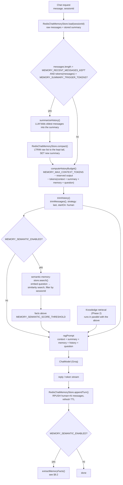
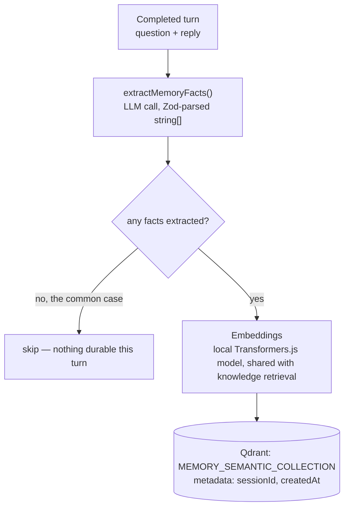

# Phase 3 — Memory (Backend)

> Scope: `apps/api`. Extends the Phase 1/2 chat backend with a persistent,
> budget-aware, and semantically-searchable memory system: conversation
> memory, token budgeting, context trimming, conversation summaries,
> long-term memory, semantic memory, and vector memory (the seven backend
> items under "Phase 3 — Memory" in `Atlas-AI-Roadmap.md`). Everything below
> describes what was actually built, the same way
> `phase-1-langchain-foundation.md` and `phase-2-advanced-rag.md` do for
> their phases — §11's file layout and §10's commands are exact, not
> illustrative.

## 0. Where this phase starts from

Phase 1 shipped the simplest possible thing that could be called "memory":
`InMemoryChatHistoryStore` wraps LangChain's `InMemoryChatMessageHistory`,
keyed by `sessionId`, and `ChatService` reads the full history on every
turn and appends the new turn at the end. Three problems, by design, were
deferred to this phase (see `phase-1-langchain-foundation.md` §5):

- **Not persistent.** It's a `Map` in process memory — restart the server,
  lose every conversation.
- **Unbounded.** Nothing ever trims or summarizes it. A long enough
  conversation would eventually not fit in the model's context window.
- **No memory beyond the raw transcript.** There's no notion of "durable
  facts" that survive independent of whether the exact messages that stated
  them are still in the window.

Everything below replaces or extends that one class.

## 1. Vocabulary: seven terms, three underlying mechanisms

The roadmap lists seven items. They aren't seven independent systems —
they're three mechanisms, each solving a different failure mode of "just
keep appending messages forever":

| # | Term | Question it answers | Mechanism |
| --- | --- | --- | --- |
| 1 | **Conversation memory** (short-term) | What did we just say to each other, verbatim? | A persisted, per-session message list (§2) |
| 2 | **Token budgeting** | How many tokens can history actually use this turn, given everything else competing for the model's context window? | Arithmetic over the model's context size (§3) |
| 3 | **Context trimming** | Given that budget, which messages do we keep vs. drop? | `trimMessages()` (§4) |
| 4 | **Conversation summaries** | Instead of just dropping old messages, can we keep their *gist*? | A rolling LLM-maintained summary (§5) |
| 5 | **Long-term memory** | Does any of this survive a restart or a day of inactivity? | Persistence (Redis) + TTL applied to #1 and #4 (§6) — not a fourth mechanism |
| 6 | **Semantic memory** | What durable facts about the user/conversation are worth remembering *by meaning*, independent of whether the exact message is still in the window? | LLM fact extraction + similarity retrieval (§7) |
| 7 | **Vector memory** | How is "remembering by meaning" actually implemented? | The embedding + vector-store mechanics semantic memory runs on (§7) |

So: #1–#4 are about managing the *raw transcript* within a single
conversation. #5 is a property (persistence), not a new data structure. #6–#7
are one feature — a durable, meaning-searchable memory that outlives what's
still in the raw transcript — described from two angles ("what" vs. "how").

### Short-term vs. long-term, precisely

- **Short-term memory** = the current session's raw recent turns, kept
  verbatim, addressed by `sessionId`. This is what §2–§4 manage.
- **Long-term memory** = the same session's data (raw tail + rolling
  summary), except it survives process restarts and idle time (§6) — still
  scoped to that one `sessionId`, just durable.
- **Semantic memory** (§7) is a *different kind* of durable data: not "this
  session's transcript," but individual extracted facts, retrieved by
  relevance to the current question rather than by recency. It's built on
  vector memory (embeddings + a vector store), reusing the exact mechanism
  Phase 1/2 already use for knowledge retrieval — just pointed at a
  different collection.

## 2. Conversation memory (short-term) — persisted per-session history

| | |
| --- | --- |
| **What** | The raw, ordered list of `HumanMessage`/`AIMessage` turns for a `sessionId`, kept verbatim (no summarization applied to the tail — see §5 for what happens to the *head*). |
| **Storage** | Redis, replacing the in-process `Map`. One Redis **list** per session (`RPUSH` per message), not a single JSON blob — lists support cheap, atomic appends and, critically, `LTRIM` for compaction (§5) without a read-modify-write round trip. |
| **Key** | `${MEMORY_HISTORY_REDIS_PREFIX}:{sessionId}` (default prefix `atlas:chat:messages`). |
| **Serialization** | `mapChatMessagesToStoredMessages()` / `mapStoredMessagesToChatMessages()` (`@langchain/core/messages`) — the same round-trip LangChain's own persisted-history integrations use, so `HumanMessage`/`AIMessage` survive the JSON hop without hand-rolled (de)serialization. |
| **Lifetime** | `MEMORY_HISTORY_TTL_SECONDS` (default 7 days), refreshed (`EXPIRE`) on every append — a **sliding** window, so active conversations never expire mid-use, but abandoned ones eventually get reclaimed instead of accumulating in Redis forever. |
| **Replaces** | `modules/chat/infrastructure/in-memory-chat-history-store.ts` → `redis-chat-memory-store.ts`. |

This alone (persistence) is most of what "long-term memory" (#5) means for
the raw transcript — see §6.

## 3. Token budgeting

**What**: before deciding what history to send the model, compute how many
tokens are actually *available* for it. Every chat turn's prompt competes
for the same fixed context window across several things — the system
prompt + retrieved knowledge context (`{context}`, Phase 1/2), the running
summary (`{summary}`, §5), retrieved semantic-memory facts (`{memory}`,
§7), the conversation history (`{history}`), the user's question, and
headroom for the model's own reply. Token budgeting is that arithmetic,
done once per turn, *before* trimming runs:

```
historyBudgetTokens = MEMORY_MAX_CONTEXT_TOKENS
                     - MEMORY_RESERVED_OUTPUT_TOKENS
                     - tokens(systemPromptTemplate + context + summary + memory)
                     - tokens(question)
```

- **`MEMORY_MAX_CONTEXT_TOKENS`** — the active model's real context window.
  Default `131072`, matching `openai/gpt-oss-120b`'s documented limit on
  Groq. There's no per-model lookup table (yet — `getModelContextSize()`
  exists in `@langchain/core` for well-known OpenAI/Anthropic model names,
  but doesn't recognize Groq's model IDs), so this is a manually-set env
  var, not auto-derived from `GROQ_MODEL`. Overriding it is required if
  `CHAT_PROVIDER`/`GROQ_MODEL` ever changes to a smaller-context model.
- **`MEMORY_RESERVED_OUTPUT_TOKENS`** — default `8192`, matching Groq's max
  completion length for this model. Reserved *before* history gets a
  budget, so a long reply can never get truncated by history eating its
  headroom.
- **Token counting**: no JS tokenizer exists for Groq's `gpt-oss` models.
  `token-counter.ts` uses `js-tiktoken`'s `cl100k_base` encoding (OpenAI's
  GPT-3.5/4 tokenizer) as an approximation — closer to real subword
  tokenization than a `chars / 4` heuristic, but still **not** exact for
  this model family. `js-tiktoken` is already a transitive dependency of
  `@langchain/core` (it's how `@langchain/core/utils/tiktoken` works); this
  phase adds it as a direct dependency of `apps/api` since memory code
  imports it directly, the same reasoning that put `peggy` in
  `package.json` explicitly for self-query (Phase 2 §3.4). This
  approximation is a documented limitation, not a silent one (§12).

**Why this matters at all for a 131K-token model**: it mostly doesn't, at
this project's demo scale — a typical conversation will never get close to
131K tokens. The mechanism exists to be *correct* and *demonstrable*
regardless of scale, which is the actual point of this phase; §5's trigger
constants are deliberately set low (thousands, not hundreds of thousands of
tokens) so summarization and trimming are things you can actually observe
happen in a short demo conversation, not just unreachable code. A
production deployment tuned to a smaller-context model would scale
`MEMORY_SUMMARY_TRIGGER_TOKENS` accordingly.

**Implementation**: `langchain/memory/token-counter.ts`,
`langchain/memory/token-budget.ts`.

## 4. Context trimming

**What**: given the budget from §3, decide which history messages actually
get sent this turn. This phase uses LangChain's own `trimMessages()`
(`@langchain/core/messages`) rather than a hand-rolled slice — it already
handles the fiddly parts (partial-message truncation, keeping a
well-formed message sequence) that a naive "drop until it fits" loop would
have to reimplement:

```ts
trimMessages(history, {
  maxTokens: historyBudgetTokens,
  tokenCounter,          // §3's counter
  strategy: 'last',      // keep the most recent messages, drop the oldest
  startOn: 'human',      // never start the trimmed list on a dangling AI turn
  includeSystem: false,  // history here is HumanMessage/AIMessage only — §5/§7's
                          // summary and memory are separate prompt variables,
                          // not messages mixed into this list (see below)
});
```

**Why summary/memory aren't `SystemMessage`s inside `history`**: an earlier
version of this design injected the rolling summary as a `SystemMessage`
appended into the `history` array passed to `MessagesPlaceholder('history')`
— appealing because `trimMessages`' `includeSystem` option exists
specifically to protect a leading system message from being trimmed away.
But `ragPrompt` already has one top-level `['system', SYSTEM_PROMPT]`
message ahead of `history`, and a *second* system-role message later in the
sequence is an unusual shape for a chat-completions API to receive — some
providers tolerate it, some don't, and it's not worth the portability risk
(`createChatModel()`'s whole design, Phase 1 §6, is about not hard-coding
provider quirks in application code). Instead, the summary and retrieved
memory facts become two more plain string variables in the *one* system
prompt template, right alongside `{context}` — see §8.

**Where it runs**: every turn, after §5's summarization check (so trimming
only ever has to handle whatever didn't get folded into the summary) and
right before building the prompt.

**Implementation**: `langchain/memory/trim-history.ts`.

## 5. Conversation summaries

**What**: rather than letting old messages just fall off the end once
they're trimmed (§4), periodically fold them into a running summary that's
kept indefinitely — the classic "buffer + rolling summary" pattern (what
older LangChain called `ConversationSummaryBufferMemory`, before memory
classes were deprecated in favor of hand-orchestrated state — this project
follows that same "explicit, not a magic memory class" philosophy already
established for retrieval orchestration, Phase 1 §2.1).

**Trigger**: checked at the *start* of a turn, before retrieval or
generation — so summarizing is based on history *as of the previous turn*,
never including the message the user just sent:

```
if messages.length > MEMORY_RECENT_MESSAGES_KEPT
   AND tokens(messages) > MEMORY_SUMMARY_TRIGGER_TOKENS:
     summarize
```

**What happens on trigger**:

1. Split the raw history into `toSummarize` (everything except the last
   `MEMORY_RECENT_MESSAGES_KEPT` messages) and `toKeep` (that tail).
2. One LLM call: the existing stored summary (empty on the first run) plus
   `toSummarize`, rendered compactly via `getBufferString()`
   (`@langchain/core/messages` — the same helper LangChain's own
   summarization middleware uses, to avoid inflating the prompt with
   message-object metadata), asks the model to produce an updated running
   summary that folds the new messages in.
3. Persist the new summary string (Redis `SET`, no TTL beyond the session's
   own — see §6).
4. **Compact the raw list in place**: `LTRIM key -MEMORY_RECENT_MESSAGES_KEPT -1`
   — an atomic, in-place trim, not a delete-and-rewrite. This is the actual
   mechanism that keeps a long-running session's Redis footprint and token
   cost bounded over time, rather than growing forever.

**Where the summary re-enters the prompt**: as a plain string,
`{summary}`, in the system prompt template (§8) — never re-injected into
`history` itself.

**Cost**: one extra (short) LLM call, but only on the turn that crosses the
trigger — most turns pay nothing extra. The summarization prompt is a
small, single-purpose one (not a full RAG chain invocation), a similar
shape to Phase 2's query-expansion/multi-query LLM calls.

**Implementation**: `langchain/memory/summarize-history.ts`.

## 6. Long-term memory

There's no separate "long-term memory" module. It's the combination of:

- §2's persistence (Redis, not in-process) — a conversation survives a
  server restart.
- §5's summarization — a conversation's *gist* survives even once the raw
  messages that established it have been compacted away (§5 step 4).
- §2's TTL — "long-term" still means "for the lifetime of this session,"
  not "forever." `MEMORY_HISTORY_TTL_SECONDS` bounds it deliberately;
  §7 is the mechanism for anything meant to outlive a single session.

Calling this out as its own roadmap item (rather than folding it silently
into §2) matters because it's a common point of confusion: "long-term"
here describes a *durability* property of the conversation's own data, not
a second, independent memory of facts — that's semantic memory (§7).

## 7. Semantic memory & vector memory

These are one feature described from two angles: semantic memory is *what*
gets remembered and *why* (durable, meaning-addressable facts); vector
memory is *how* that's actually stored and searched (embeddings + a vector
store — the exact mechanism Phase 1 already uses for knowledge retrieval,
pointed at a new collection).

### 7.1 What gets remembered

**What**: after a turn completes, one LLM call looks at the exchange
(question + reply) and extracts any durable facts worth remembering beyond
this conversation's raw transcript — stated preferences, identity, ongoing
goals ("I'm allergic to shellfish," "I'm evaluating this for a 50-person
team") — returned as a JSON array of short fact strings (`[]` if nothing
durable came up, which is the common case for most turns). Parsed with a
Zod schema, matching how this codebase already validates structured
LLM-shaped output.

**Why extraction is conservative, not automatic**: most turns don't contain
anything worth remembering long-term ("what's the refund policy?" isn't a
fact about the user). Running extraction on every turn and storing
whatever comes back — rather than gating on "did the model actually find
something" — would flood the memory collection with near-duplicate,
low-value entries and degrade retrieval quality for the facts that *do*
matter.

**Scoping caveat**: there's no authentication/user-identity system yet
(that's Phase 11's `Authentication` item) — so facts are stored and
retrieved scoped to `sessionId`, not a durable user identity. A fact
extracted in one session isn't visible in another. This is a deliberate,
documented limitation (the same "design so it slots in later" approach
taken with Redis for BM25 in Phase 2): the metadata schema includes a
`sessionId` field now specifically so a `userId` field can be added
alongside it later without a schema migration, once auth exists.

**Cost/gating**: one extra LLM call per turn, so this is **off by default**
(`MEMORY_SEMANTIC_ENABLED=false`) — the same "expensive, opt-in" treatment
Phase 2 gives reranking/compression/query-expansion.

**Where it runs — not awaited**: extraction kicks off *after* the turn's
reply is already being returned/streamed to the client, and is
deliberately **not awaited** — `ChatService` fires it, attaches a
`.catch()` that logs failures, and moves on. An extra LLM call for a
feature that's off by default should never add latency to the chat
response itself; a missed fact (or an extraction that fails outright) is a
far smaller problem than that.

**Failure handling**: extraction is best-effort end to end — a malformed
or non-JSON model response is caught and treated as "no facts this turn"
(`[]`) rather than thrown, and a rejected background call is logged, never
surfaced to the client.

**Implementation**: `langchain/memory/semantic/extract-memory-facts.ts`,
called from `ChatService.extractSemanticMemoryInBackground()`.

### 7.2 How it's stored & retrieved (vector memory)

**What**: extracted facts are embedded with the **same local Transformers.js
embedding model** already created for knowledge retrieval (`createEmbeddings()`
— no second model to load) and upserted into a dedicated Qdrant collection,
`MEMORY_SEMANTIC_COLLECTION` (default `atlas_semantic_memory`), separate
from the knowledge base collections so memory and knowledge never mix in
one similarity search. Metadata per fact: `sessionId`, `createdAt`.

**Retrieval**: at the start of a turn (in parallel with knowledge
retrieval, §3 of Phase 2), the current question is embedded and searched
against that collection, filtered to the current `sessionId`, keeping the
top `MEMORY_SEMANTIC_TOP_K` results whose similarity clears
`MEMORY_SEMANTIC_SCORE_THRESHOLD`. Matches become `{memory}` in the system
prompt (§8) — a block distinct from `{context}` (retrieved knowledge)
because they answer different questions ("what do we know about the
world" vs. "what do we know about this user").

**Why not just put facts in the knowledge collection**: filtering,
lifecycle, and failure modes are all different — memory facts are
per-session, written continuously from live conversations (no
`knowledge:index` CLI step, no `--reset`), and should never surface as a
numbered citation `[1]` the way a knowledge chunk does. Keeping them in a
separate collection keeps both simple; searching two small collections
costs about the same as searching one bigger, mixed one.

**Implementation**: `langchain/memory/semantic/create-semantic-memory-store.ts`
(collection factory), `langchain/memory/semantic/semantic-memory-store.ts`
(`save()` / `search()`).

## 8. Chat API

All fields below are additive — a request that omits every new field
behaves exactly like Phase 2 (memory features run with their env-var
defaults; semantic memory is off by default so its absence changes
nothing).

### Prompt template changes

`langchain/prompts/rag-prompt.ts` gains two more system-prompt variables
alongside the existing `{context}`:

```
Context:
{context}

Summary of earlier conversation (empty if none yet):
{summary}

Known facts about this user/conversation (empty if none yet):
{memory}
```

`{history}` (`MessagesPlaceholder`) keeps carrying only the trimmed raw
`HumanMessage`/`AIMessage` tail (§4) — never the summary or memory facts.

### `POST /api/v1/chat` / `GET /api/v1/chat/stream`

Request shape is unchanged (no new request fields — memory isn't something
a client opts into per-request the way retrieval strategy is; it's always
on for conversation memory/budgeting/trimming/summarization, and
env-controlled for semantic memory).

Response gains a `memory` block, parallel to Phase 2's `retrieval` block:

```json
{
  "sessionId": "…",
  "reply": "…",
  "model": "openai/gpt-oss-120b",
  "citations": [ /* … */ ],
  "retrieval": { "strategy": "hybrid", "stages": [ /* … */ ] },
  "memory": {
    "historyMessageCount": 8,
    "historyTokens": 512,
    "summarized": true,
    "summary": "The user asked about the refund window for electronics and confirmed they bought a laptop 10 days ago.",
    "tokenBudget": {
      "maxContextTokens": 131072,
      "reservedOutputTokens": 8192,
      "promptOverheadTokens": 340,
      "historyBudgetTokens": 122540,
      "historyTokensUsed": 512
    },
    "semanticFacts": [
      { "text": "User purchased a laptop 10 days ago.", "score": 0.78 }
    ]
  },
  "usage": { "input_tokens": 412, "output_tokens": 96, "total_tokens": 508 }
}
```

- `summarized` is `true` only on the turn where §5's trigger actually fired
  — most turns will show `false` with `summary` carrying forward whatever
  was already stored (or omitted if there's no summary yet).
- `semanticFacts` is `[]` when `MEMORY_SEMANTIC_ENABLED=false` or nothing
  cleared the similarity threshold.
- This is exactly the information the Phase 3 UI's memory inspector,
  summary viewer, context-window visualization, and token-budget panel
  need — designed for that up front, the same way Phase 2's `retrieval`
  block was designed for a retrieval-timeline UI it didn't yet have
  (Phase 2 §7).

The SSE `citations` event (sent before generation starts) will **not**
carry `memory` — token/budget/summary numbers aren't final until the turn
actually completes (the new turn's tokens count toward next turn's budget).
`memory` is only ever attached to the `done` event.

## 9. Architecture

### 9.1 Per-turn memory flow



### 9.2 Semantic memory extraction (post-turn)



Note what's *not* in either diagram: there's no CLI step, unlike Phase 2's
`knowledge:index`. Memory has no batch-ingestion phase — it's written
continuously as a side effect of live conversations, so "ingestion" and
"serving" aren't separable the way they are for the knowledge base.

## 10. How to run

No new infrastructure beyond what Phase 2 already requires — conversation
memory reuses the same Redis instance BM25/parent-document already persist
to (a different key prefix, §2), and semantic memory reuses the same
Qdrant instance knowledge retrieval already uses (a different collection,
§7.2):

```bash
docker compose up -d qdrant
# Redis: point REDIS_URL (.env.example) at any already-running instance,
# same as Phase 2 — still not provisioned by docker-compose.yml.
```

```bash
# Semantic memory is off by default (MEMORY_SEMANTIC_ENABLED=false) —
# no setup needed to try conversation memory / budgeting / trimming /
# summarization on their own.
pnpm --filter @atlas/api dev
```

```bash
# Enable semantic memory (adds one extraction LLM call per turn):
# MEMORY_SEMANTIC_ENABLED=true in apps/api/.env, then restart the server.
# The MEMORY_SEMANTIC_COLLECTION Qdrant collection is created on first use —
# there's no separate index-build step (§9.2's note).
```

## 11. Implementation notes (actual file layout)

```
apps/api/src/langchain/memory/
  token-counter.ts                    # js-tiktoken (cl100k_base) token counting — §3
  token-budget.ts                     # computeHistoryBudget() — §3
  trim-history.ts                     # trimHistory(), wraps trimMessages() — §4
  summarize-history.ts                # summarizeHistory(), rolling summary LLM call — §5
  memory.types.ts                     # MemoryInfo, TokenBudgetPlan/Info, SemanticFact
  index.ts

apps/api/src/langchain/memory/semantic/
  create-semantic-memory-store.ts     # Qdrant collection factory — §7.2
  extract-memory-facts.ts             # LLM extraction + Zod parse — §7.1
  semantic-memory-store.ts            # save() / search() — §7.2
  semantic-memory.types.ts
  index.ts

apps/api/src/modules/chat/infrastructure/
  redis-chat-memory-store.ts          # replaces in-memory-chat-history-store.ts — §2, §5

apps/api/src/langchain/prompts/
  rag-prompt.ts                       # + {summary}, {memory} variables — §8
```

`ChatService` (`modules/chat/chat.service.ts`) is where all of the above
actually gets orchestrated, per turn — `prepareMemoryContext()` (load,
maybe summarize/compact, semantic-memory search), `computeBudget()` +
`trimHistory()`, then `buildMemoryInfo()` to assemble the response's
`memory` block. This keeps the same "explicit orchestration, not a magic
memory class" shape `ChatService` already used for retrieval (Phase 1 §2.1,
Phase 2 §8.2) — `token-budget.ts`/`trim-history.ts`/`summarize-history.ts`
are composable helpers it calls, not a class that owns the whole flow.

`config/env.ts` additions:

```
# Conversation memory persistence (§2)
MEMORY_HISTORY_REDIS_PREFIX=atlas:chat:messages
MEMORY_SUMMARY_REDIS_PREFIX=atlas:chat:summary
MEMORY_HISTORY_TTL_SECONDS=604800        # 7 days, sliding

# Token budgeting (§3)
MEMORY_MAX_CONTEXT_TOKENS=131072         # openai/gpt-oss-120b's real context window
MEMORY_RESERVED_OUTPUT_TOKENS=8192       # Groq's max completion length for this model

# Conversation summarization (§5)
MEMORY_RECENT_MESSAGES_KEPT=6            # always kept verbatim, never summarized away
MEMORY_SUMMARY_TRIGGER_TOKENS=2000       # deliberately low — see §3's callout

# Semantic / vector memory (§7) — off by default, extra LLM call per turn
MEMORY_SEMANTIC_ENABLED=false
MEMORY_SEMANTIC_COLLECTION=atlas_semantic_memory
MEMORY_SEMANTIC_TOP_K=3
MEMORY_SEMANTIC_SCORE_THRESHOLD=0.5
```

`js-tiktoken` is a direct dependency of `apps/api/package.json` (§3) — it's
also present transitively via `@langchain/core`, but memory code imports it
directly rather than reaching into another package's dependency tree.

## 12. What's intentionally out of scope here

- **Exact token counts for Groq's models.** `js-tiktoken`'s `cl100k_base`
  is an approximation (§3) — there's no published JS tokenizer for
  `gpt-oss`. `usage.total_tokens` in the API response (Phase 1) remains the
  source of truth for actual billed tokens; the budgeting/trimming
  machinery here only needs to be consistent with *itself*, not
  bit-for-bit accurate to the provider.
- **Cross-session / cross-user semantic memory.** Facts are scoped to
  `sessionId` (§7.1) until Phase 11 adds authentication and a real user
  identity to scope them to instead.
- **Sharded/scaled semantic memory storage.** One Qdrant collection, no
  per-user sharding, no eviction/decay policy for stale facts — the same
  "documented simplification, not an accident" treatment Phase 2 §5 gives
  ingestion at scale. A production system would eventually want fact
  expiry/consolidation (deduplicating or merging near-identical facts over
  time) so the collection doesn't grow unbounded either.
- **A memory-management CLI.** Unlike knowledge indexing, there's no batch
  step to trigger from a CLI — memory is written continuously by live
  chat traffic (§9.2's note). Inspecting a session's memory happens via the
  chat API's `memory` block (§8), which is what the Phase 3 UI (memory
  inspector, summary viewer) will read from.
- **Structured output, JSON mode, few-shot prompting** → Phase 4 (Prompt
  Engineering).
- **Cost tracking, tracing, prompt inspection dashboards** → later
  Observability phase.
