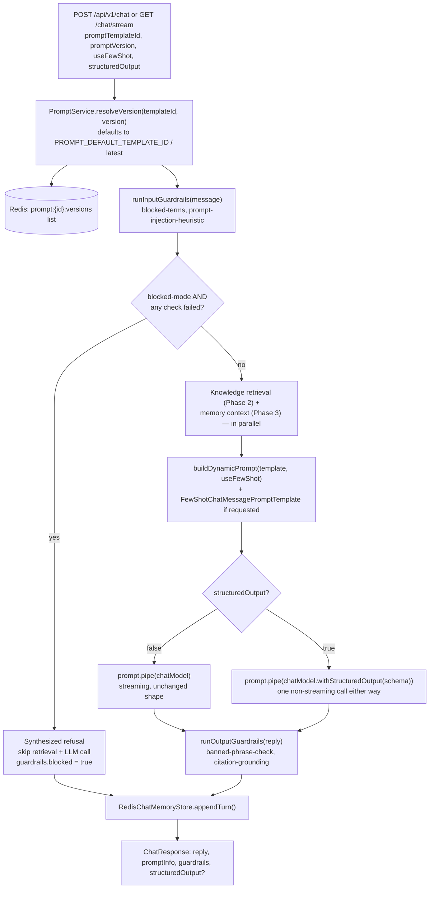

# Phase 4 — Prompt Engineering (Backend)

> Scope: `apps/api`. Extends the Phase 1-3 chat backend with a versioned
> prompt-template registry, dynamic prompt selection, few-shot examples,
> structured output (JSON mode + output parsing), and input/output
> guardrails — the seven backend items under "Phase 4 — Prompt Engineering"
> in `Atlas-AI-Roadmap.md`. Everything below describes what was actually
> built, the same way `phase-2-advanced-rag.md` and `phase-3-memory.md` do
> for their phases — §9's file layout and §8's commands are exact, not
> illustrative.

## 0. Where this phase starts from

Phases 1-3 hardcode exactly one system prompt: `ragPrompt`, built once at
module load from a fixed `SYSTEM_PROMPT` string
(`langchain/prompts/rag-prompt.ts`), piped straight into the chat model in
`ChatService`'s constructor. That's fine for a single, unchanging prompt,
but it can't do any of:

- **Try a different system prompt without redeploying** — the text is a
  TypeScript string literal.
- **Compare two prompt variants side by side** — there's only ever one.
- **Demonstrate few-shot prompting** — no mechanism to splice example
  input/output pairs into the prompt.
- **Guarantee a machine-parseable reply shape** — `response.text` is always
  free-form prose; a caller that wants `{ answer, confidence, sources }` has
  to parse it out of prose itself.
- **Refuse or flag obviously bad input/output** — nothing inspects the
  message or the reply before/after the model call.

This phase replaces the fixed `ragPrompt` with a small, versioned registry
of templates that `ChatService` selects from per-request, and adds three
independent features around that: few-shot examples, structured output,
and guardrails.

## 1. Vocabulary: seven terms, four things being built

The roadmap lists seven items. Three of them (`Structured output`,
`JSON mode`, `Output parsers`) describe one mechanism from three angles;
the other four are genuinely separate:

| # | Term | Question it answers | Where |
| --- | --- | --- | --- |
| 1 | **Prompt versioning** | How do we change a prompt's text over time without losing the old version or breaking an in-flight comparison? | A Redis-backed registry, versions are append-only (§2) |
| 2 | **Dynamic prompts** | Which system-prompt text actually renders for *this* request? | Per-request template selection (§2, §3) |
| 3 | **Few-shot** | Can we show the model example input/output pairs instead of just describing the desired style in prose? | `FewShotChatMessagePromptTemplate` (§3) |
| 4 | **Structured output** | How do we get a reply shaped like `{ answer, confidence, sources, ... }` instead of free-form prose? | `withStructuredOutput()` (§4) |
| 5 | **JSON mode** | What's the wire-level mechanism that makes structured output reliable? | The model provider's native JSON-schema/JSON-object response format (§4) |
| 6 | **Output parsers** | Once the model returns JSON text, how does it become a typed, validated object? | Zod schema validation, layered on top of JSON mode by the same call (§4) |
| 7 | **Guardrails** | What stops obviously bad input from reaching the model, or obviously bad output from reaching the client? | Input/output checks, configurable block vs. observe (§5) |

So: #1-#3 are about *which prompt* runs. #4-#6 are one feature — a
reliable, typed reply — described from three angles ("what" vs. "wire
mechanism" vs. "validation layer"). #7 is unrelated to prompt selection at
all; it wraps the turn on both sides.

## 2. Prompt registry & versioning

| | |
| --- | --- |
| **What** | A named collection of prompt **templates** (`default`, `concise`, ...), each with an append-only history of immutable **versions**. Editing a template never overwrites anything — it adds a new version with the next sequential number. |
| **Storage** | Redis, reusing the same instance Phase 3 uses for conversation memory. An **index hash** (`${PROMPT_REDIS_PREFIX}index`) maps template id → `{name, description, createdAt}`, plus one Redis **list** per template (`${PROMPT_REDIS_PREFIX}{id}:versions`, `RPUSH` per version) holding every version ever saved, oldest first — the same index-hash-plus-per-key-list shape Phase 3's `RedisChatMemoryStore` uses for history/summary. |
| **A version's shape** | `{ version, systemPrompt, fewShotExamples: {input, output}[], createdAt }` — see §3 for how `systemPrompt`/`fewShotExamples` actually render. |
| **"Latest version"** | `LINDEX -1` on the versions list — the registry never needs a separate "current pointer" field, since versions are always appended in order. |
| **Seeding** | `PromptService.seedBuiltInTemplatesIfMissing()` runs once at boot (`application.factory.ts`), idempotently: creates `default` (byte-for-byte the old fixed `SYSTEM_PROMPT`, so a fresh boot behaves identically to before this phase) and `concise` (a terser style, shipped with two few-shot examples so §3 is demonstrable without using the editor first) — only if they don't already exist. |
| **Implementation** | `modules/prompts/infrastructure/redis-prompt-store.ts` (`RedisPromptStore`), `modules/prompts/prompt.service.ts` (`PromptService`), `modules/prompts/built-in-templates.ts` (seed content). |

**Why Redis, not a config file or a database table**: this reuses
infrastructure Phase 3 already requires (no new service to run), matches
this project's existing "small, explicit stores over an ORM" pattern
(`RedisChatMemoryStore`, `RedisPromptStore` share the same shape), and
versioning-by-append maps directly onto a Redis list without any extra
bookkeeping.

**Known limitation, documented not fixed**: computing the next version
number is a `LLEN` read followed by an `RPUSH`, not a single atomic
operation — two concurrent "save a new version" requests for the same
template could theoretically both read the same length and both write,
producing a duplicate version number. Acceptable for a single-operator
prompt-editing workflow (this is an internal tool, not a multi-writer
system); a production system with concurrent editors would use a Lua
script or `WATCH`/`MULTI` transaction here.

## 3. Dynamic prompts & few-shot

**What "dynamic" means here, precisely**: which system-prompt text runs,
and whether few-shot examples are spliced in, is decided **per request**
from the registry (§2) — not which *variables* are available. Every
template still only ever receives the same four things `ChatService`
always supplies: `{context}` (Phase 1/2's retrieved knowledge),
`{summary}`/`{memory}` (Phase 3's rolling summary / semantic facts), and
`{question}` (in the trailing human message, not the system prompt). A
custom template can use any subset of these — the `concise` seed template,
for instance, omits none of them but instructs the model to answer in one
or two sentences instead of Phase 1-3's more thorough style — but can't
introduce a new variable name, since nothing else would ever fill it in.

```ts
// langchain/prompts/render-prompt.ts
buildDynamicPrompt(template, { useFewShot }): ChatPromptTemplate
```

replaces the old module-level `ragPrompt` constant. Built fresh per turn
from whichever `PromptTemplateVersion` `PromptService.resolveVersion()`
resolved:

1. `['system', template.systemPrompt]` — the selected version's text.
2. **If** `useFewShot` is `true` **and** the template has examples: a
   `FewShotChatMessagePromptTemplate` — each `{input, output}` pair
   becomes a `human`/`ai` message pair, spliced in right after the system
   message and before the real conversation. This is the actual mechanism
   behind "few-shot": showing the model example *behavior*, not describing
   it in prose.
3. `MessagesPlaceholder('history')`, `['human', '{question}']` — unchanged
   from Phase 1-3.

**Resolving which template/version**: `promptTemplateId`/`promptVersion`
on the chat request (§6) are both optional. `PromptService.resolveVersion()`
falls back to `PROMPT_DEFAULT_TEMPLATE_ID` (default `"default"`) and that
template's latest version when omitted — so a request that specifies
neither behaves exactly like Phase 1-3's fixed prompt.

**Token budgeting, per template**: Phase 3's token budget (§3 there) used
to subtract a module-level constant — the fixed `SYSTEM_PROMPT`'s token
count, computed once at load. Since the system prompt now varies per
request, `ChatService.promptOverheadTokens()` recomputes it every turn from
the *selected* template's static text (placeholders stripped, same as
before), plus the token cost of any few-shot examples actually spliced in.

**Implementation**: `langchain/prompts/render-prompt.ts`
(`buildDynamicPrompt`), `langchain/prompts/prompt-template.types.ts`
(`RenderablePromptTemplate` — the minimal shape `render-prompt.ts` needs,
kept in `langchain/` so it never depends on the `modules/prompts`
application layer), `langchain/prompts/rag-prompt.ts` (now just holds
`DEFAULT_SYSTEM_PROMPT`, the seed text for the `default` template).

## 4. Structured output, JSON mode & output parsers

**What**: an optional per-request `structuredOutput: true` flag (§6) that
makes `ChatService` demand a reply matching a fixed schema instead of free
prose:

```ts
// langchain/parsers/structured-answer-schema.ts
STRUCTURED_ANSWER_SCHEMA = z.object({
  answer: z.string(),
  confidence: z.enum(['low', 'medium', 'high']),
  sources: z.array(z.number().int()),        // indices into the numbered context
  followUpQuestions: z.array(z.string()).max(3),
});
```

**One LangChain call demonstrates all three roadmap items together**:

```ts
prompt.pipe(chatModel.withStructuredOutput(STRUCTURED_ANSWER_SCHEMA, { includeRaw: true }))
```

- **Structured output** is the outcome: the `Runnable`'s result is a typed
  `{ answer, confidence, sources, followUpQuestions }`, not a string.
- **JSON mode** is the wire-level mechanism `withStructuredOutput` picks to
  get there. `@langchain/groq`'s implementation auto-selects a method per
  model: on `openai/gpt-oss-*` models (this project's default `GROQ_MODEL`)
  it uses Groq's native `response_format: { type: "json_schema", json_schema: {...} }`
  — the model is constrained server-side to emit valid JSON matching the
  exact schema, the strictest form of "JSON mode." On models without that
  support it falls back to tool/function-calling (still JSON under the
  hood, via a synthetic tool call) — the method is never hardcoded here,
  specifically so this keeps working if `GROQ_MODEL` changes.
- **Output parsers** are the validation layer: the raw JSON text response
  is parsed and checked against the Zod schema before `ChatService` ever
  sees it. `extract-memory-facts.ts` (Phase 3 §7.1) is the hand-rolled,
  lower-level equivalent already elsewhere in this codebase — regex-extract
  a JSON blob, `JSON.parse`, then `zodSchema.parse()` by hand;
  `withStructuredOutput` is the same idea, done for you by the library and
  backed by the provider's native enforcement instead of hoping the model
  free-form-writes valid JSON.

**Reply shape**: `reply` (the field every other turn also returns) becomes
`data.answer` — the human-readable text — so the chat bubble always shows
sensible prose regardless of mode. The full structured object lives in a
separate `structuredOutput` response field (§6), for a Structured Output
Viewer UI to render as JSON, distinct from the prose reply.

**Failure handling**: `withStructuredOutput`'s `Runnable` throws if the
model's response can't be parsed/validated. `ChatService.generateStructured()`
catches this, fails closed with `structuredOutput.valid: false` and a short
apology as `reply` — a malformed structured response degrades to an error
message, never a 500.

**Streaming trade-off**: structured output can't be safely streamed
token-by-token — the JSON isn't valid (or parseable against the schema)
until the final token arrives. `ChatService.stream()` special-cases this:
one non-streaming `withStructuredOutput` call happens internally, then the
whole answer is emitted as a single `token` SSE event, then `done` —
`citations → token → done` stays the same event sequence a client already
handles, just with exactly one `token` event instead of many.

**Implementation**: `langchain/parsers/structured-answer-schema.ts`,
`ChatService.generate()` / `generateStructured()`.

## 5. Guardrails

**What**: lightweight, rule-based checks that run before the model call
(on the raw user message) and after it (on the generated reply) — not a
second LLM call, deliberately, so guardrails never add model latency or
cost to a turn.

| Side | Check | What it catches |
| --- | --- | --- |
| Input | `blocked-terms` | The message contains a term from `PROMPT_GUARDRAILS_BLOCKED_TERMS` (a comma-separated env list). |
| Input | `prompt-injection-heuristic` | The message matches a small set of common prompt-injection phrasings (e.g. "ignore all previous instructions", "reveal your system prompt"). A heuristic, not a defense against a determined attacker. |
| Output | `banned-phrase-check` | The generated reply itself contains a blocked term (reuses the same list). |
| Output | `citation-grounding` | Context was retrieved for this turn, but the reply cites no `[n]` source — soft signal that the model may be answering from outside the provided context. Skipped when `structuredOutput` was used, since those replies cite via the `sources` field instead of bracketed text. |

**Enforcement mode — `PROMPT_GUARDRAILS_MODE`**:

- **`block`** (default): if *any* input check fails, `ChatService`
  short-circuits before retrieval or the LLM call, returns a synthesized
  refusal as `reply`, and reports `guardrails.blocked: true`. The refusal
  still gets appended to conversation history like any other turn (§2 of
  Phase 3), so the session stays consistent for the next message.
- **`observe`**: every check still runs and is reported, but nothing ever
  blocks — generation always proceeds normally. Useful for seeing what
  *would* have been flagged without changing behavior.

**Output checks are always observe-only** — by the time a check runs, the
LLM call has already happened, so there's nothing left to block; results
are purely informational (`guardrails.output`). There's no
regenerate-on-fail loop — a failing `citation-grounding` check doesn't
retry the model with a stricter instruction, it just gets reported. This is
a deliberate scope limit for this phase, not an oversight.

**Implementation**: `langchain/guardrails/input-guardrails.ts`,
`langchain/guardrails/output-guardrails.ts`, `langchain/guardrails/guardrail.types.ts`.

## 6. Chat API

All fields below are additive — a request that omits every new field
behaves exactly like Phase 3 (`default` template, no few-shot, prose
reply, guardrails still run and are reported, but nothing new can trip
since there's no blocklist match in ordinary use).

### `POST /api/v1/chat` / `GET /api/v1/chat/stream`

New optional request fields (JSON body / query string, same convention as
Phase 2's retrieval overrides):

| Field | Type | Default when omitted |
| --- | --- | --- |
| `promptTemplateId` | `string` | `PROMPT_DEFAULT_TEMPLATE_ID` (`"default"`) |
| `promptVersion` | `number` | That template's latest version |
| `useFewShot` | `boolean` | `false` |
| `structuredOutput` | `boolean` | `false` (normal prose reply) |

Response gains `promptInfo` and `guardrails` blocks (always present), plus
an optional `structuredOutput` block:

```json
{
  "sessionId": "…",
  "reply": "Acme Corp offers 20 accrued PTO days per year… [1]",
  "model": "openai/gpt-oss-120b",
  "citations": [ /* … */ ],
  "retrieval": { "strategy": "dense", "stages": [ /* … */ ] },
  "memory": { /* Phase 3 … */ },
  "promptInfo": {
    "templateId": "concise",
    "templateName": "Concise",
    "version": 1,
    "usedFewShot": true,
    "variables": {
      "context": "[1] (source: employee-handbook.md)\n…",
      "summary": "None yet — this is a new conversation.",
      "memory": "None recorded.",
      "question": "What is the PTO policy?"
    }
  },
  "guardrails": {
    "input": [
      { "name": "blocked-terms", "passed": true },
      { "name": "prompt-injection-heuristic", "passed": true }
    ],
    "output": [
      { "name": "banned-phrase-check", "passed": true },
      { "name": "citation-grounding", "passed": true }
    ],
    "blocked": false
  },
  "structuredOutput": {
    "schemaName": "structured_answer",
    "data": { "answer": "…", "confidence": "high", "sources": [1], "followUpQuestions": ["…"] },
    "valid": true
  },
  "usage": { "input_tokens": 412, "output_tokens": 96, "total_tokens": 508 }
}
```

- `promptInfo.variables` is the **authoritative, resolved** set of
  variables that actually went into this turn's prompt — a Variable
  Inspector UI reads this directly instead of reconstructing/guessing it
  client-side.
- `promptInfo.usedFewShot` is `true` only when `useFewShot` was requested
  **and** the resolved template actually has examples — requesting
  few-shot on a template with none is a no-op, reported honestly.
- `structuredOutput` is present only when the request asked for it —
  omitted entirely on a normal prose turn.
- `guardrails.blocked: true` means `reply` is the synthesized refusal
  (§5), not a real model response — `citations`/`retrieval` are empty and
  `structuredOutput` is never present on a blocked turn.

The SSE `citations` event carries the (possibly empty, on a blocked turn)
retrieval info up front; `promptInfo`, `guardrails`, and `structuredOutput`
are only ever attached to the `done` event — same reasoning as Phase 3's
`memory` block (nothing about the turn is final until it completes).

### Prompt registry API

```
GET  /api/v1/prompts                  # list all templates (summaries)
GET  /api/v1/prompts/:id[?version=n]  # one template, all versions (or just one)
POST /api/v1/prompts                  # create a new template (id, name, description, systemPrompt, fewShotExamples?)
POST /api/v1/prompts/:id/versions     # save a new version of an existing template
```

`POST /api/v1/prompts` returns `409` if `id` already exists (creation is
one-time; use the versions endpoint after that). `POST .../versions`
returns `404` if `id` doesn't exist yet.

## 7. Architecture



## 8. How to run

No new infrastructure beyond what Phase 3 already requires — the prompt
registry reuses the same Redis instance conversation memory persists to (a
different key prefix, §2):

```bash
docker compose up -d qdrant
# Redis: point REDIS_URL (.env.example) at any already-running instance,
# same as Phase 2/3.
pnpm --filter @atlas/api dev
```

On first boot, `seedBuiltInTemplatesIfMissing()` creates the `default` and
`concise` templates automatically — nothing else to run.

```bash
# Default template, unchanged behavior:
curl -X POST http://localhost:3000/api/v1/chat \
  -H 'Content-Type: application/json' \
  -d '{"message": "What is the PTO policy?"}'

# A different template, with few-shot examples spliced in:
curl -X POST http://localhost:3000/api/v1/chat \
  -H 'Content-Type: application/json' \
  -d '{"message": "What is the PTO policy?", "promptTemplateId": "concise", "useFewShot": true}'

# Structured output:
curl -X POST http://localhost:3000/api/v1/chat \
  -H 'Content-Type: application/json' \
  -d '{"message": "What is the PTO policy?", "structuredOutput": true}'

# Create a new template, then a new version of it:
curl -X POST http://localhost:3000/api/v1/prompts \
  -H 'Content-Type: application/json' \
  -d '{"id": "formal", "name": "Formal", "description": "…", "systemPrompt": "…{context}…{summary}…{memory}…"}'
curl -X POST http://localhost:3000/api/v1/prompts/formal/versions \
  -H 'Content-Type: application/json' \
  -d '{"systemPrompt": "…a revised version…"}'
```

```bash
# Guardrail block mode is the default — try a message containing a blocked
# term (PROMPT_GUARDRAILS_BLOCKED_TERMS in .env.example) and the response
# comes back with guardrails.blocked: true and a refusal `reply`, no LLM
# call made. Switch PROMPT_GUARDRAILS_MODE=observe to see checks reported
# without ever blocking.
```

## 9. Implementation notes (actual file layout)

```
apps/api/src/langchain/prompts/
  prompt-template.types.ts      # RenderablePromptTemplate, FewShotExample — §3
  render-prompt.ts               # buildDynamicPrompt() — §3
  rag-prompt.ts                  # DEFAULT_SYSTEM_PROMPT (seed text only) — §2
  index.ts

apps/api/src/langchain/parsers/
  structured-answer-schema.ts    # STRUCTURED_ANSWER_SCHEMA (Zod) — §4
  index.ts

apps/api/src/langchain/guardrails/
  guardrail.types.ts             # GuardrailResult, GuardrailReport
  input-guardrails.ts            # runInputGuardrails() — §5
  output-guardrails.ts           # runOutputGuardrails() — §5
  index.ts

apps/api/src/modules/prompts/
  prompt.types.ts                 # PromptTemplateVersion/Summary/Detail — §2
  built-in-templates.ts           # seed content for `default` + `concise` — §2
  prompt.service.ts               # PromptService: list/get/resolve/create/addVersion/seed
  prompt.schema.ts                # zod request validation
  prompt.controller.ts
  prompt.route.ts                 # GET/POST /api/v1/prompts — §6
  infrastructure/
    redis-prompt-store.ts         # RedisPromptStore — §2
  index.ts
```

`ChatService` (`modules/chat/chat.service.ts`) is where all of the above
gets orchestrated per turn, the same "explicit orchestration, not a magic
class" shape used for retrieval (Phase 1/2) and memory (Phase 3):
`resolveVersion()` → `runInputGuardrails()` → (blocked short-circuit, or)
retrieval + memory context in parallel → `buildDynamicPrompt()` →
`generate()`/`generateStructured()` → `runOutputGuardrails()` →
`buildPromptInfo()` to assemble the response.

`config/env.ts` additions:

```
# Prompt registry (§2)
PROMPT_REDIS_PREFIX=atlas:prompts:
PROMPT_DEFAULT_TEMPLATE_ID=default

# Guardrails (§5)
PROMPT_GUARDRAILS_MODE=block             # block | observe
PROMPT_GUARDRAILS_BLOCKED_TERMS=kill someone,make a bomb,how to hack
```

## 10. What's intentionally out of scope here

- **Concurrent-write safety for versioning.** §2's documented `LLEN`-then-
  `RPUSH` race — acceptable for a single-operator editing workflow, not
  safe for concurrent editors of the same template without a Lua script.
- **Arbitrary custom prompt variables.** Templates can use any subset of
  `{context}`/`{summary}`/`{memory}`/`{question}`, never a new variable
  name — extending this would mean `ChatService` accepting an arbitrary
  variable-value map from the client, a much larger (and riskier) surface
  than this phase covers.
- **Regenerate-on-fail for guardrails.** Output checks (§5) only ever
  report; there's no automatic retry-with-a-stricter-prompt loop when
  `citation-grounding` fails.
- **Semantic/ML-based guardrails.** Both input and output checks are
  rule-based (keyword/regex) — no moderation-model call, no embedding-
  similarity check for injection detection. Deliberately kept latency-free
  and dependency-free for this phase; a production system would likely add
  a moderation API call as a third, slower-but-stronger check.
- **A `functionCalling`/`jsonMode` override for structured output.** The
  method `withStructuredOutput` uses is left to auto-detect per model
  (§4) rather than hardcoded, trading a small amount of "always exactly
  this wire format" precision for resilience to `GROQ_MODEL` changes.
- **Example-selector-based few-shot.** Examples are a fixed list per
  template version, always all included when `useFewShot` is on — no
  `SemanticSimilarityExampleSelector` that picks the *most relevant* k
  examples per question. Overkill for a demo-sized template registry.
