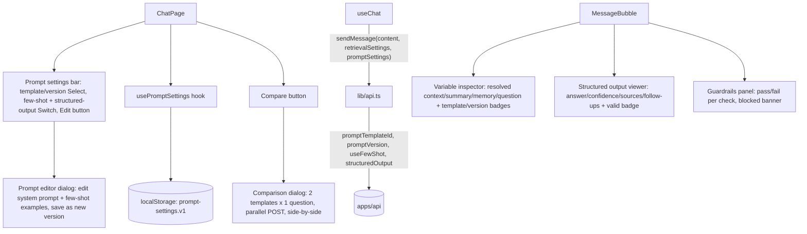

# Phase 4 — Prompt Engineering UI

> Scope: `apps/web`. Extends the Phase 1-3 chat client with every Phase 4 UI
> goal from the roadmap: prompt editor, prompt comparison, variable
> inspector, and structured output viewer — all wired to the Phase 4 backend
> described in `phase-4-prompt-engineering.md`. A guardrails panel was added
> alongside these four, since the backend's `guardrails` block (and its
> `blocked: true` refusal path) has no other UI surface otherwise.

## 1. New dependencies

None. Every new component is built from the same shadcn-style primitives
Phases 1-2 already added (`Dialog`, `Select`, `Switch`, `Collapsible`,
`Badge`, `Button`, `Textarea`) — no new Radix package or UI primitive was
required for prompt editing, comparison, or the new per-message panels.

## 2. Architecture

- **`PromptSettingsBar`** (`src/components/chat/prompt-settings-bar.tsx`):
  toggled from a second header button (next to Phase 2's "Retrieval"
  button), following the exact same layout family as
  `retrieval-settings-bar.tsx`. Exposes a template `Select` (populated from
  `GET /api/v1/prompts`), a version `Select` (populated from the selected
  template's version list), a "Few-shot" `Switch`, a "Structured output"
  `Switch`, and an "Edit" button that opens the `PromptEditorDialog` for
  the currently-selected template/version.
- **`usePromptSettings`** (`src/hooks/use-prompt-settings.ts`): owns and
  persists `PromptSettings { templateId, version?, useFewShot,
  structuredOutput }` to `localStorage` (`atlas.prompt-settings.v1`), the
  same pattern `useRetrievalSettings` uses.
- **`PromptEditorDialog`** (`src/components/chat/prompt-editor-dialog.tsx`):
  a `Dialog` with a `Textarea` for the system prompt and a repeatable
  few-shot example list editor (add/remove `{input, output}` pairs, up to
  10). Two modes: editing an existing template (loads its latest version via
  `GET /api/v1/prompts/:id`, "Save" calls `POST /api/v1/prompts/:id/versions`
  to append a new version) or creating a brand-new template (id/name/
  description fields plus the same prompt/few-shot editor, "Save" calls
  `POST /api/v1/prompts`). On save, the parent settings bar is told which
  `templateId`/`version` to select next and its template list is refreshed.
- **`PromptComparisonDialog`** (`src/components/chat/prompt-comparison-dialog.tsx`):
  opened from a standalone "Compare" header button (not the settings bar —
  it's a one-off tool, not a persistent setting). A single question
  `Textarea`, two independent template `Select` + few-shot `Switch` pickers
  ("Prompt A" / "Prompt B"), and a "Run comparison" button that fires two
  parallel, non-streaming `sendChatMessage` calls with **no `sessionId`**
  (`Promise.allSettled`, so one side failing doesn't hide the other's
  result) — a deliberately isolated one-off request that never touches the
  real conversation's session or memory. Results render side by side as two
  cards, each showing the resolved template/version badge, a "Few-shot"
  badge when it actually applied, a "Blocked" badge if that side's
  guardrails tripped, and the reply text.
- **`VariableInspectorPanel`** (`src/components/chat/variable-inspector-panel.tsx`):
  a per-message disclosure (same `Collapsible` trigger-badge pattern as
  `memory-panel.tsx`) showing the backend's authoritative
  `promptInfo.variables` — `question`, `context`, `summary`, `memory` — each
  in its own pre-formatted block, plus template name/version and a
  "Few-shot" badge in the trigger row. Reads `promptInfo` directly rather
  than reconstructing it client-side, unlike Phase 1's `prompt-preview-panel.tsx`
  (kept, unmodified, for citation-only prompt preview).
- **`StructuredOutputViewer`** (`src/components/chat/structured-output-viewer.tsx`):
  a per-message disclosure, only rendered when `structuredOutput` is present
  on the message (i.e. that turn requested it). Shows a "Valid"/"Invalid"
  badge, a confidence badge (`low`/`medium`/`high`, color-coded via the
  existing `Badge` variants), the schema name, and the full parsed object
  pretty-printed in a `<pre>` block — plus any parse errors when
  `valid: false`.
- **`GuardrailsPanel`** (`src/components/chat/guardrails-panel.tsx`): a
  per-message disclosure listing every input/output check
  (`guardrails.input`/`guardrails.output`) with a pass/fail icon and the
  failure message when present. When `guardrails.blocked: true`, an
  always-visible (non-collapsed) banner is shown above the trigger
  explaining that the reply is a synthesized refusal and no model call was
  made — this is the only new panel that isn't purely opt-in disclosure,
  since a blocked turn is a meaningfully different kind of reply.

## 3. API/type changes required to power this UI

The Phase 4 backend already accepted `promptTemplateId` / `promptVersion` /
`useFewShot` / `structuredOutput` on both chat endpoints and returned
`promptInfo` / `guardrails` / `structuredOutput?`. No backend changes were
needed to power this UI; `src/types/chat.ts` mirrors all of it by hand:

- `PromptTemplateSummary` / `PromptTemplateDetail` / `PromptTemplateVersion`
  / `PromptFewShotExample` — mirrored from `modules/prompts/prompt.types.ts`,
  used by the settings bar, editor dialog, and comparison dialog.
- `PromptInfo` / `PromptVariablesSnapshot` — mirrored from
  `chat.types.ts`'s `PromptInfo`, consumed by `VariableInspectorPanel`.
- `GuardrailResult` / `GuardrailReport` — mirrored from
  `langchain/guardrails/guardrail.types.ts`, consumed by `GuardrailsPanel`.
- `StructuredAnswer` / `StructuredOutputInfo` — mirrored from
  `langchain/parsers/structured-answer-schema.ts` and `chat.types.ts`,
  consumed by `StructuredOutputViewer`.
- `PromptSettings { templateId, version?, useFewShot, structuredOutput }` —
  a new UI-only type, the Phase 4 sibling of Phase 2's `RetrievalSettings`.
- `ChatResponse` / `StreamChunk` / `ChatMessage` each gained optional
  `promptInfo` / `guardrails` / `structuredOutput` fields, the same way
  Phase 3 added `memory`.

`src/lib/prompts-api.ts` (new) wraps the four `/api/v1/prompts*` endpoints
(`listPromptTemplates`, `getPromptTemplate`, `createPromptTemplate`,
`addPromptVersion`). `src/lib/api.ts`'s `sendChatMessage` /
`streamChatMessage` each gained an optional trailing `promptSettings`
parameter, added to the JSON body / query string via a `buildPromptFields`
helper mirroring Phase 2's `buildFilters`.

## 4. Roadmap item → implementation mapping

| Roadmap UI goal | Implementation |
| --- | --- |
| Prompt editor | `PromptEditorDialog` — edit an existing template's system prompt + few-shot examples and save as a new version, or create a brand-new template from scratch |
| Prompt comparison | `PromptComparisonDialog` — one question, two template/few-shot picks, parallel isolated requests, side-by-side reply cards |
| Variable inspector | `VariableInspectorPanel` — the backend's resolved `context`/`summary`/`memory`/`question` for that exact turn, plus template/version/few-shot badges |
| Structured output viewer | `StructuredOutputViewer` — pretty-printed `{answer, confidence, sources, followUpQuestions}` with a valid/invalid badge |
| *(not on the roadmap list, added for completeness)* | `GuardrailsPanel` — per-check pass/fail results and a blocked-turn banner, since `guardrails`/`blocked` otherwise has no UI surface |

## 5. Notes and known limitations

- **Prompt comparison is fully isolated by design** — no `sessionId` is
  sent, so neither side sees conversation history or Phase 3 memory. This
  matches the plan's explicit choice (a dedicated side-by-side tool, not a
  variant of the live chat) but means comparison results can differ from
  what the same templates would produce mid-conversation.
- **The comparison dialog always runs non-streaming, non-structured
  requests.** It compares prompt *text and few-shot* effects specifically;
  toggling structured output there was left out as out-of-scope for a
  "compare the prose reply" tool, consistent with the plan's stated scope.
- **The editor's variable-name scope limit is not re-validated client-side.**
  The backend documents (phase-4-prompt-engineering.md §3) that custom
  templates can only use the four pre-supplied `{context}`/`{summary}`/
  `{memory}`/`{question}` placeholders; the `PromptEditorDialog`'s
  `Textarea` doesn't lint for stray `{other}` placeholders before saving —
  a template using one will simply render that placeholder literally at
  chat time, since nothing ever fills it in.
- **No dedicated "apply" step**, matching the rest of the settings-bar
  pattern (Phase 2's retrieval bar works the same way): changing the
  template/version/few-shot/structured-output toggles only takes effect on
  the *next* sent message, not retroactively on past turns.
- **`GuardrailsPanel`'s blocked banner and `StructuredOutputViewer` never
  co-occur on the same message** — a blocked turn's response never includes
  a `structuredOutput` field (the backend skips generation entirely), so
  the two panels are mutually exclusive in practice even though both are
  always rendered unconditionally when their respective data is present.

## 6. How to run

Same as Phase 1 — see `phase-1-web-ui.md` §5. No new environment variables;
prompt template/version selection, few-shot, and structured-output are sent
per-request, not configured via `.env`. The prompt registry itself is
served by the Phase 4 API (`phase-4-prompt-engineering.md` §8) — start that
before opening the "Prompt" settings bar or the editor dialog, or the
template `Select` will simply come back empty.
