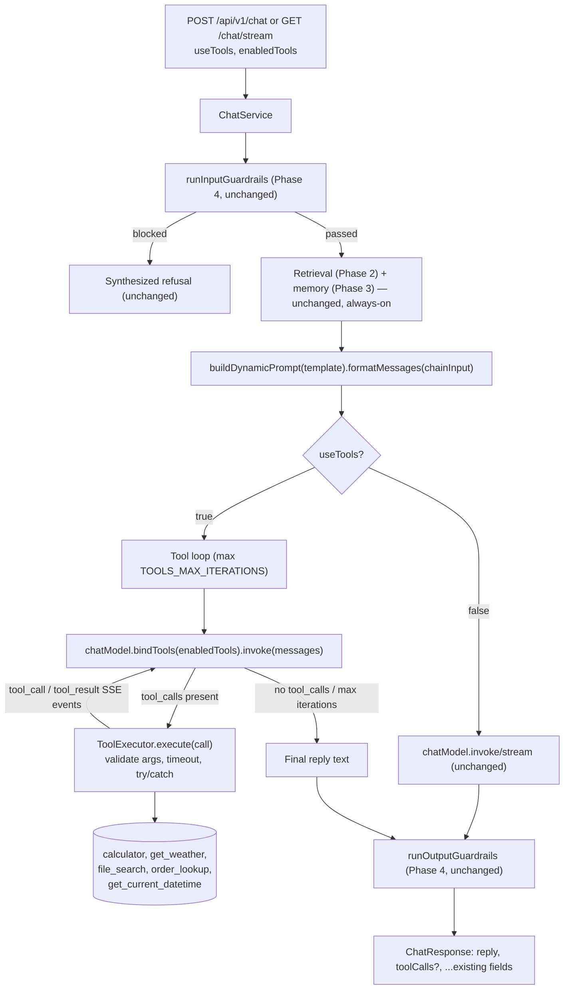

# Phase 5 — Tools (Backend)

> Scope: `apps/api`. Adds LangChain tool-calling (`bindTools`) to the chat
> backend: five tools (calculator, weather, file search, an order-lookup
> "database" tool, and a datetime tool demonstrating custom-tool
> extensibility), a bounded execute-loop, and error handling — the "Tools"
> section of `Atlas-AI-Roadmap.md`. Everything below describes what was
> actually built, the same way `phase-2-advanced-rag.md`,
> `phase-3-memory.md`, and `phase-4-prompt-engineering.md` do for their
> phases — §8's file layout and §7's commands are exact, not illustrative.

## 0. Where this phase starts from

Phases 1-4's chat model only ever does one thing per turn: read whatever
context/history/prompt `ChatService` assembled, and produce a reply. It has
no way to *act* — look something up live, run a calculation, or query a
system that isn't the knowledge base. That's fine for "answer from
retrieved documents," but it can't do any of:

- **Compute an exact answer** — asking "what's 15% of 240?" gets a
  free-form guess from the model's own arithmetic, not a guaranteed-correct
  calculation.
- **Fetch live, real-world data** — the model's knowledge is frozen at
  training time; it has no way to check today's weather.
- **Re-query the knowledge base mid-answer** — Phase 1/2's retrieval runs
  exactly once per turn, before the model sees the question; the model
  itself can't decide "actually, let me search for something more
  specific."
- **Look up structured records** — the knowledge base is markdown prose;
  there's no way to answer "what's the status of order #1042?" from it.

This phase gives the model a bounded set of **tools** it can *choose* to
call mid-turn, and a loop that executes them and feeds the results back —
still one chat turn, not a multi-step autonomous agent (that's Phase 6).

## 1. Vocabulary: seven roadmap items, three things being built

| # | Term | Question it answers | Where |
| --- | --- | --- | --- |
| 1 | **Calculator tool** | How does the model get an exact arithmetic answer instead of guessing? | A hand-rolled expression evaluator (§2) |
| 2 | **Weather tool** | How does the model get live, real-world data it was never trained on? | Open-Meteo geocoding + forecast (§2) |
| 3 | **File search** | Can the model re-query the knowledge base itself, with a different query than the original question? | Wraps the same `RetrievalPipeline` Phase 1/2 already built (§2) |
| 4 | **Database tool** | Can the model look up structured records, not just prose? | A seeded in-memory order dataset (§2) |
| 5 | **Custom tools** | How hard is it to add a brand-new tool? | `get_current_datetime` — the same five-piece pattern as every other tool, nothing special-cased (§2) |
| 6 | **Tool execution** | How does a tool call actually get run once the model asks for one? | `ToolExecutor` + the loop in `ChatService` (§3, §4) |
| 7 | **Error handling** | What happens when a tool fails, times out, or the model loops without ever finishing? | Timeouts, try/catch, iteration cap — all degrade gracefully, never a 500 (§3, §4) |

So: #1-#5 are the five actual tools (what the model can call). #6-#7 are
one mechanism — safely running whatever the model asks for — described
from two angles ("how it runs" vs. "how it fails safely").

## 2. The five tools

Every tool is a plain `execute(args): Promise<unknown>` function plus a
Zod args schema plus a name/description, wrapped once via
`@langchain/core/tools`' `tool()` so `chatModel.bindTools()` can offer it to
the model. `ToolExecutor` (§3) never calls the wrapped version directly —
it validates args against the same schema and calls `execute()` itself, so
timeout/error handling is centralized in one place instead of copied into
every tool.

| Tool | Args | What it does | Why it's built this way |
| --- | --- | --- | --- |
| `calculator` | `{ expression: string }` | Evaluates arithmetic: `+ - * / % ^`, parens, unary minus. | A hand-rolled tokenizer + recursive-descent parser — **deliberately not `eval`/`new Function`**. The model, not a trusted developer, controls `expression`; this grammar can only ever produce a number, never execute arbitrary code. |
| `get_weather` | `{ location: string }` | Current temperature, humidity, wind, conditions for a place name. | [Open-Meteo](https://open-meteo.com) — free, keyless (no `WEATHER_API_KEY`-style secret to provision, unlike most weather APIs). Two calls: geocoding (`name` → lat/lon) then forecast (lat/lon → `current=temperature_2m,relative_humidity_2m,wind_speed_10m,weather_code`), via global `fetch` — no new HTTP dependency. |
| `file_search` | `{ query: string }` | Searches the knowledge base and returns matching excerpts. | Wraps the exact same `RetrievalPipeline` (Phase 1/2) that already injects always-on context every turn — but as a tool the model can *choose* to call again with a refined query. That always-on injection keeps happening unchanged every turn regardless of `useTools`; this is a second, independent, explicit re-query. |
| `order_lookup` | `{ orderId?, customerEmail?, status? }` | Looks up Apex Retail customer orders (item, amount, status, dates). | A small **seeded in-memory dataset** (~12 fake orders) — not a real SQL engine (a real Postgres-backed tool stays a stretch goal). Deliberately pairs with the existing `knowledge/refund-policy.md`: a question like "is order ORD-1004 still eligible for a refund?" exercises RAG (policy text, always-on) *and* this tool (actual order data) together. |
| `get_current_datetime` | `{ timezone? }` | Current date/time, optionally in an IANA timezone. | The concrete answer to "custom tools": adding it required nothing beyond `execute()` + a Zod schema + registering it in `tool-registry.ts` — the same five-piece pattern as the other four, proving none of them are special-cased. |

**Implementation**: `apps/api/src/langchain/tools/{calculator,weather,file-search,database,datetime}-tool.ts`,
each exporting a `createXTool()` factory; `tool-registry.ts` builds all
five at boot.

## 3. Tool execution & error handling

**What `ToolExecutor` does** (`langchain/tools/tool-executor.ts`), for
every tool call regardless of which tool:

1. Look up the tool by name — **unknown tool name** → `status: 'error'`
   immediately, no execution attempted.
2. `schema.safeParse(args)` — **invalid/missing arguments** (the model
   didn't comply with the schema) → `status: 'error'` with the validation
   message, no execution attempted.
3. Run `execute(parsedArgs)` under a `Promise.race` **timeout**
   (`TOOLS_EXECUTION_TIMEOUT_MS`, default 10s) — a slow/hung tool (e.g. a
   stalled network call) degrades to a timeout error instead of hanging
   the whole turn.
4. Any thrown error inside `execute()` (a bad order id, an unparsable
   expression, an unknown weather location, an unknown timezone, a network
   failure) is caught → `status: 'error'` with the error's message.

**`ToolExecutor.execute()` always resolves, never throws** — the four
cases above and the success case all produce a `ToolCallInfo`
(`{id, name, args, status, output?, error?, durationMs}`). This is the
concrete mechanism behind "error handling": one failing tool never fails
the chat turn. The failure is fed back to the model as a normal
`ToolMessage` (§4), so the model can explain the failure or try something
else, exactly like a successful result.

`getBindableTools(names?)` filters the registry to the request's
`enabledTools` (§5) — unknown names are silently ignored, an omitted/empty
list means "every registered tool."

## 4. The tool-calling loop (`ChatService`)

**What "bind-tools execute-loop" means, precisely**: not a multi-step
ReAct/planning agent (no explicit "thought" trace) — just
*decide → execute → feed results back → repeat*, bounded by
`TOOLS_MAX_ITERATIONS` (default 3). Phase 6 builds the reasoning layer on
top of this.

```
1. buildDynamicPrompt(template).formatMessages(chainInput)  → BaseMessage[]
2. loop (up to TOOLS_MAX_ITERATIONS):
     response = chatModel.bindTools(enabledTools).invoke(messages)
     messages.push(response)
     if response has no tool_calls:  →  response.text is the final reply, stop
     for each tool_call in response.tool_calls:
       execute it via ToolExecutor (§3)
       messages.push(new ToolMessage({ content: JSON.stringify(output) or "Error: …", tool_call_id, name }))
     (loop again — the model sees the tool results and decides what to do next)
3. if the loop exhausts TOOLS_MAX_ITERATIONS without a final answer:
     fall back to the last response's text, or a canned
     "couldn't reach a final answer" message if that's also empty
```

**Runaway-loop guard**: `TOOLS_MAX_ITERATIONS` bounds how many times the
model can ask for more tool calls in a single turn — the other half of
"error handling," distinct from a single tool's own failure (§3).

**Always non-streaming internally, same trade-off as Phase 4's structured
output**: intermediate tool-decision responses (`response.tool_calls`
requests) aren't meaningful to stream token-by-token, so the whole loop
runs via `.invoke()`, not `.stream()`. Once the final answer is known,
it's emitted as one `token` SSE event.

**Live progress, unlike structured output**: the loop is implemented as an
async generator (`ChatService.generateWithTools()`) that `yield`s a
`tool_call` event the instant the model decides to call a tool (before
execution) and a `tool_result` event right after that call finishes. The
streaming path (`GET /chat/stream`) forwards both as SSE events (§5); the
non-streaming path (`POST /chat`) just drains the generator and keeps its
final return value.

**Interaction with output guardrails (Phase 4 §5)**: `citation-grounding`
(soft-flags a reply that cites no `[n]` source when context was retrieved)
is skipped whenever this turn made any tool calls, the same way it's
already skipped for `structuredOutput` — a tool-answered reply doesn't
necessarily cite bracketed context either, so the check would just be
noise.

**Mutual exclusivity with structured output**: `useTools` and
`structuredOutput` are mutually exclusive per turn — if both are requested,
`useTools` wins. Combining forced-JSON output with tool-calling is out of
scope for this phase (§9).

**Implementation**: `modules/chat/chat.service.ts` —
`generateWithTools()` (the loop itself), `generate()` (routes to it when
`useTools` is set), `stream()` (drives the generator and forwards live
events).

## 5. Chat API

All fields below are additive — a request that omits every new field
behaves exactly like Phase 4 (no tools bound, unchanged reply/response
shape).

### `POST /api/v1/chat` / `GET /api/v1/chat/stream`

New optional request fields (JSON body / query string, same convention as
every previous phase's overrides):

| Field | Type | Default when omitted |
| --- | --- | --- |
| `useTools` | `boolean` | `false` (no tools bound, behavior unchanged) |
| `enabledTools` | `string[]` (comma-joined on the query string, e.g. `calculator,get_weather`) | All five registered tools |

Response gains an optional `toolCalls` array — present only when
`useTools` was requested (even if the model ended up calling zero tools,
in which case it's `[]`):

```json
{
  "sessionId": "…",
  "reply": "Order ORD-1004 is currently delivered [order_lookup]. The refund policy allows returns within 30 days [4]…",
  "model": "openai/gpt-oss-120b",
  "citations": [ /* … */ ],
  "retrieval": { "strategy": "dense", "stages": [ /* … */ ] },
  "memory": { /* Phase 3 … */ },
  "promptInfo": { /* Phase 4 … */ },
  "guardrails": { /* Phase 4 … */ },
  "toolCalls": [
    {
      "id": "fc_37045634-…",
      "name": "order_lookup",
      "args": { "orderId": "ORD-1004" },
      "status": "success",
      "output": { "count": 1, "orders": [ /* … */ ] },
      "durationMs": 1
    },
    {
      "id": "fc_05ce426a-…",
      "name": "get_current_datetime",
      "args": { "timezone": "UTC" },
      "status": "success",
      "output": { "timezone": "UTC", "datetime": "…", "iso": "…" },
      "durationMs": 31
    }
  ],
  "usage": { "input_tokens": 812, "output_tokens": 96, "total_tokens": 908 }
}
```

A failing tool call looks the same shape, just `status: "error"`:

```json
{
  "id": "fc_753aee7f-…",
  "name": "get_weather",
  "args": { "location": "Xyzzyxqplonkville" },
  "status": "error",
  "error": "Could not find a location matching \"Xyzzyxqplonkville\".",
  "durationMs": 543
}
```

**Two new SSE event types**, alongside `citations | token | done | error`:

| Event | When | Payload |
| --- | --- | --- |
| `tool_call` | The instant the model decides to call a tool, before execution (implicitly "running"). | `toolCall: {id, name, args}` |
| `tool_result` | Right after that call finishes. | `toolResult: {id, name, args, status, output?, error?, durationMs}` |

This is a deliberate, called-out exception to "only attach new fields on
`done`" (Phase 3/4's convention) — it's the only way the UI gets a genuine
live timeline instead of a static post-hoc list. `done` still also carries
the full aggregated `toolCalls` array, as a reconciliation source of truth:

```
event: citations
data: {"type":"citations","sessionId":"…","citations":[],"retrieval":{...}}

event: tool_call
data: {"type":"tool_call","sessionId":"…","toolCall":{"id":"fc_…","name":"calculator","args":{"expression":"0.15 * 240"}}}

event: tool_result
data: {"type":"tool_result","sessionId":"…","toolResult":{"id":"fc_…","name":"calculator","args":{...},"status":"success","output":{"expression":"0.15 * 240","result":36},"durationMs":0}}

event: token
data: {"type":"token","sessionId":"…","text":"15% of 240 is **36**."}

event: done
data: {"type":"done","sessionId":"…","model":"…","memory":{...},"promptInfo":{...},"guardrails":{...},"toolCalls":[{"id":"fc_…", …}]}
```

### Tool listing API

```
GET /api/v1/tools   # { tools: [{ name, description }] } — sourced from ToolExecutor.listDefinitions()
```

No CRUD — unlike `modules/prompts/`, tools are only ever defined in code
(`langchain/tools/`), not authored at runtime. This endpoint exists purely
so a settings-bar UI doesn't have to hardcode tool names.

## 6. Architecture



## 7. How to run

No new infrastructure — tools call out to Open-Meteo (public, keyless) and
reuse the existing `RetrievalPipeline`; everything else is in-process.

```bash
docker compose up -d qdrant
# Redis: point REDIS_URL at any already-running instance, same as Phase 2-4.
pnpm --filter @atlas/api dev
```

```bash
# List registered tools:
curl http://localhost:3000/api/v1/tools

# Calculator:
curl -X POST http://localhost:3000/api/v1/chat \
  -H 'Content-Type: application/json' \
  -d '{"message": "what is (12+8)*3?", "useTools": true}'

# Weather (real Open-Meteo call):
curl -X POST http://localhost:3000/api/v1/chat \
  -H 'Content-Type: application/json' \
  -d '{"message": "what is the weather in Tokyo right now?", "useTools": true}'

# File search (explicit re-query, separate from the always-on RAG context):
curl -X POST http://localhost:3000/api/v1/chat \
  -H 'Content-Type: application/json' \
  -d '{"message": "Use file search to look up the restocking fee for opened electronics.", "useTools": true}'

# Order lookup + refund policy together (RAG context + tool, same turn):
curl -X POST http://localhost:3000/api/v1/chat \
  -H 'Content-Type: application/json' \
  -d '{"message": "What is the status of order ORD-1004, and is it still eligible for a return under the refund policy?", "useTools": true}'

# Datetime (custom-tool example):
curl -X POST http://localhost:3000/api/v1/chat \
  -H 'Content-Type: application/json' \
  -d '{"message": "What is the current date and time in Asia/Tokyo?", "useTools": true}'

# Failure case — unknown location degrades gracefully instead of 500ing:
curl -X POST http://localhost:3000/api/v1/chat \
  -H 'Content-Type: application/json' \
  -d '{"message": "What is the weather in Xyzzyxqplonkville right now?", "useTools": true}'

# enabledTools filtering — only calculator is bound, so a weather question can't be answered via tools:
curl -X POST http://localhost:3000/api/v1/chat \
  -H 'Content-Type: application/json' \
  -d '{"message": "What is the weather in Paris?", "useTools": true, "enabledTools": ["calculator"]}'

# Streaming, with live tool_call/tool_result events:
curl -N "http://localhost:3000/api/v1/chat/stream?message=What%20is%2015%25%20of%20240%2C%20using%20the%20calculator%3F&useTools=true"
```

## 8. Implementation notes (actual file layout)

```
apps/api/src/langchain/tools/
  tool.types.ts          # RegisteredTool, ToolCallInfo, ToolCallStart — §2, §3
  calculator-tool.ts      # hand-rolled expression evaluator — §2
  weather-tool.ts          # Open-Meteo geocoding + forecast — §2
  file-search-tool.ts      # wraps RetrievalPipeline — §2
  database-tool.ts         # seeded order dataset (order_lookup) — §2
  datetime-tool.ts         # get_current_datetime — §2
  tool-registry.ts         # createToolRegistry() — builds all five
  tool-executor.ts         # ToolExecutor: validate/timeout/error-handle — §3
  index.ts

apps/api/src/modules/tools/
  tools.controller.ts      # GET /api/v1/tools — §5
  tools.route.ts
  index.ts
```

`ChatService` (`modules/chat/chat.service.ts`) is where the loop is
orchestrated, the same "explicit orchestration, not a magic class" shape
used for retrieval (Phase 1/2), memory (Phase 3), and prompts (Phase 4):
`generate()`/`stream()` branch on `useTools` → `generateWithTools()` (the
bind → invoke → execute → feed-back loop, §4) → `runOutputGuardrails()`
(with the tool-call-aware `isStructuredOutput` flag, §4) →
`ChatResponse`/`StreamChunk` assembly.

`application.factory.ts` builds the tool registry once at boot (same
"build everything up front, branch per-request" shape as the Phase 2
retrieval pipeline) and wires the resulting `ToolExecutor` into both
`ChatService` and `ToolsController`.

`config/env.ts` additions:

```
# Tools (§3, §4)
TOOLS_MAX_ITERATIONS=3
TOOLS_EXECUTION_TIMEOUT_MS=10000

# Weather tool — Open-Meteo, free and keyless (§2)
TOOLS_WEATHER_GEOCODING_URL=https://geocoding-api.open-meteo.com/v1/search
TOOLS_WEATHER_FORECAST_URL=https://api.open-meteo.com/v1/forecast

# file_search tool's own top-k for its explicit re-query (§2)
TOOLS_FILE_SEARCH_TOP_K=4
```

## 9. What's intentionally out of scope here

- **A reasoning/planning agent.** The loop is decide → execute → repeat,
  with no explicit "thought" trace and no ability to plan multiple steps
  ahead — that's Phase 6.
- **Token-streamed tool decisions.** The whole loop runs via `.invoke()`,
  never `.stream()` — same accepted trade-off as Phase 4's structured
  output, for the same reason (intermediate responses aren't meaningful to
  stream token-by-token).
- **Combining `useTools` with `structuredOutput` in one turn.** They're
  mutually exclusive per turn (§4); `useTools` wins if both are set.
- **A real database.** `order_lookup` is a seeded in-memory array, not SQL
  against Postgres — that stays a stretch goal.
- **A general-purpose expression language.** The calculator supports a
  fixed grammar (`+ - * / % ^`, parens, unary minus) — not variables,
  functions, or arbitrary JS.
- **Live tool-timeline updates on the non-streaming endpoint.** `POST
  /api/v1/chat` only ever returns the final aggregated `toolCalls` array —
  same as it always returns fully-formed responses; only `GET
  /chat/stream` gets live `tool_call`/`tool_result` events.
- **Cross-turn tool-call memory.** Each turn's tool calls are independent;
  a tool result from a previous turn isn't automatically available to a
  later turn (only whatever ended up in the reply text, via normal
  conversation history).
