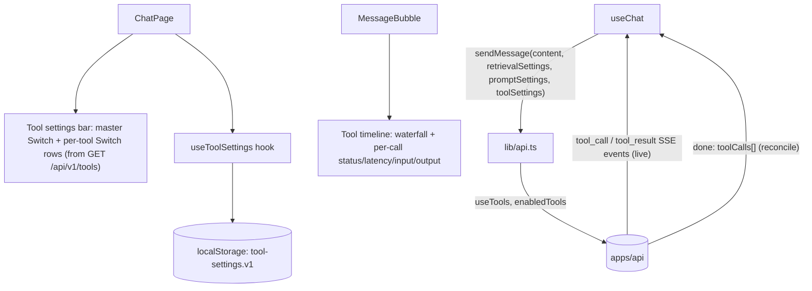

# Phase 5 — Tools UI

> Scope: `apps/web`. Extends the Phase 1-4 chat client with every Phase 5 UI
> goal from the roadmap: tool timeline, tool input/output, tool latency, and
> tool status — all wired to the Phase 5 backend described in
> `phase-5-tools.md`. All four roadmap items are covered by one component,
> `ToolTimeline`, the same way `GuardrailsPanel` covers both input and
> output checks in Phase 4.

## 1. New dependencies

None. `ToolSettingsBar` and `ToolTimeline` are built from the same
shadcn-style primitives already in the project (`Switch`, `Tooltip`,
`Badge`, `Collapsible`, `Button`) — no new Radix package or UI primitive
was required.

## 2. Architecture

- **`ToolSettingsBar`** (`src/components/chat/tool-settings-bar.tsx`):
  toggled from a third header button (next to Phase 2's "Retrieval" and
  Phase 4's "Prompt" buttons), following the exact same layout family as
  `prompt-settings-bar.tsx`. A master "Tools" `Switch` (`useTools`), and —
  only shown once tools are enabled — one `Switch` row per tool fetched
  from `GET /api/v1/tools`, each with an info tooltip showing that tool's
  description so the settings bar never hardcodes tool names or
  descriptions client-side.
- **`useToolSettings`** (`src/hooks/use-tool-settings.ts`): owns and
  persists `ToolSettings { useTools, enabledTools }` to `localStorage`
  (`atlas.tool-settings.v1`), the same pattern `usePromptSettings` and
  `useRetrievalSettings` use.
- **`ToolTimeline`** (`src/components/chat/tool-timeline.tsx`): a
  per-message disclosure, only rendered when a message has `toolCalls`.
  Mirrors `RetrievalTimeline`'s proportional-waterfall-bar shape (colored
  by status instead of stage), with each row individually expandable
  (nested `Collapsible`, the same pattern `GuardrailsPanel`'s rows use) to
  show pretty-printed `args`/`output`/`error`. This one component covers
  all four roadmap UI items:
  - **Tool status** — a spinning icon while `running`, check/cross once
    `success`/`error`, plus a "N running" / "N failed" badge in the header.
  - **Tool latency** — each bar segment is sized proportionally to
    `durationMs`; the header shows the turn's total.
  - **Tool input/output** — each row expands to show `args` and
    `output`/`error` as pretty-printed JSON.
  - **Tool timeline** — the waterfall itself, updated **live**: rows
    appear the instant a `tool_call` SSE event arrives (as `running`, no
    duration yet) and update in place when the matching `tool_result`
    arrives, then get reconciled against the authoritative array on
    `done`.

## 3. API/type changes required to power this UI

The Phase 5 backend already accepted `useTools` / `enabledTools` on both
chat endpoints, returned `toolCalls` on `POST`/`done`, and added the
`tool_call`/`tool_result` SSE event types. No backend changes were needed
to power this UI; `src/types/chat.ts` mirrors all of it by hand:

- `ToolDefinition { name, description }` — mirrors the `GET /api/v1/tools`
  response shape, consumed by `ToolSettingsBar`.
- `ToolCallInfo` / `ToolCallStart` — mirror `chat.types.ts`'s wire shapes
  for a finished/starting tool call.
- `ToolCallDisplay` — a **UI-only** superset of `ToolCallInfo` that adds a
  `'running'` status (between the `tool_call` and `tool_result` events,
  before `durationMs`/`output`/`error` are known) — there's no backend
  equivalent, since the backend only ever reports calls that have already
  started or finished.
- `ToolSettings { useTools, enabledTools }` — a new UI-only type, the Phase
  5 sibling of Phase 2's `RetrievalSettings` and Phase 4's `PromptSettings`.
  `enabledTools: []` means "every registered tool," mirroring the
  backend's own "omitted/empty means all" convention for the request
  field.
- `ChatResponse` / `StreamChunk` gained an optional `toolCalls` field;
  `StreamChunk` also gained `toolCall` (for the `tool_call` event) and
  `toolResult` (for `tool_result`); `StreamChunkType` gained
  `'tool_call' | 'tool_result'`. `ChatMessage.toolCalls` is typed as
  `ToolCallDisplay[]` (not `ToolCallInfo[]`), since it's built up live from
  both event types before being reconciled on `done`.

`src/lib/tools-api.ts` (new) wraps `GET /api/v1/tools` (`listTools`).
`src/lib/api.ts`'s `sendChatMessage` / `streamChatMessage` each gained an
optional trailing `toolSettings` parameter, added to the JSON body / query
string via a `buildToolFields` helper mirroring Phase 4's
`buildPromptFields` (comma-joined on the query string, the same convention
Phase 2's `filters` JSON-encoding and Phase 4 already established for
values a query string can't express natively). `streamChatMessage` also
gained `onToolCall`/`onToolResult` handlers alongside the existing
`onCitations`/`onToken`/`onDone`/`onError`.

`src/hooks/use-chat.ts`'s `sendMessage` gained a `toolSettings` parameter;
its `onToolCall` handler appends a new `running` row to the assistant
message's `toolCalls`, `onToolResult` finds that row by `id` and merges in
the final `status`/`output`/`error`/`durationMs`, and `onDone` overwrites
`toolCalls` with the authoritative array from the backend (only when
present, i.e. only when `useTools` was actually requested) as a final
reconciliation step.

## 4. Roadmap item → implementation mapping

| Roadmap UI goal | Implementation |
| --- | --- |
| Tool timeline | `ToolTimeline` — live waterfall of every tool call this turn made, updated in place as `tool_call`/`tool_result` SSE events arrive |
| Tool input/output | Each `ToolTimeline` row expands to show pretty-printed `args` and `output`/`error` |
| Tool latency | Waterfall bar segments sized by `durationMs`, plus a total in the header |
| Tool status | Per-row running/success/error icon, plus running/failed count badges in the header |

## 5. Notes and known limitations

- **Live updates only exist on the streaming path.** `POST /api/v1/chat`
  only ever returns the final, already-complete `toolCalls` array — there
  are no intermediate SSE-style events to react to on that endpoint, same
  as it always returns fully-formed responses. `ToolTimeline` still
  renders correctly either way, since it just reads whatever `toolCalls`
  ended up on the message; only the "watch it happen live" quality is
  streaming-only.
- **No dedicated "apply" step**, matching the rest of the settings-bar
  pattern (Phase 2/4's bars work the same way): toggling `useTools` or a
  specific tool only takes effect on the *next* sent message, not
  retroactively on past turns.
- **`enabledTools`'s "empty means all" convention is UI-internal, not just
  a wire convention.** The settings bar itself treats an empty
  `enabledTools` array as "every tool checked" for rendering purposes, and
  collapses back to `[]` if a user re-enables every tool individually —
  so the persisted `localStorage` state stays minimal (an explicit list
  only when some tools are actually excluded) instead of always listing
  every known tool name.
- **The tools settings bar's tool list depends on the Phase 5 API being
  up.** If `GET /api/v1/tools` fails, the bar shows an inline error message
  and the master `useTools` switch still works, but no per-tool rows
  render (there's nothing to filter by) — `enabledTools` stays whatever
  was last persisted.
- **No tool call ever appears from a past, already-rendered turn
  retroactively.** Each message's `toolCalls` is scoped to that one
  turn — there's no cross-message tool-call history view.

## 6. How to run

Same as Phase 1 — see `phase-1-web-ui.md` §5. No new environment variables;
`useTools`/`enabledTools` are sent per-request, not configured via `.env`.
The tool registry itself is served by the Phase 5 API
(`phase-5-tools.md` §7) — start that before opening the "Tools" settings
bar, or the per-tool `Switch` rows will simply come back empty (the master
`useTools` toggle still works, it just won't bind any tools since none are
known to filter by).
