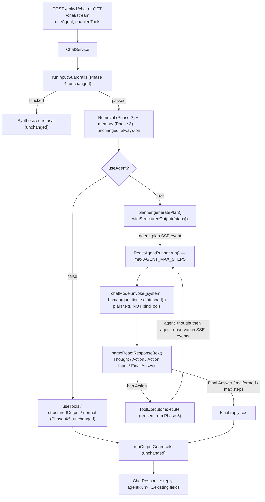

# Phase 6 — Agents (Backend)

> Scope: `apps/api`. Adds a classic text-based ReAct agent
> (Thought/Action/Action Input/Observation, hand-parsed) with an upfront
> planning step, reusing Phase 5's `ToolExecutor`/tool registry for actual
> execution — the "Agents" section of `Atlas-AI-Roadmap.md`. Everything
> below describes what was actually built, the same way
> `phase-2-advanced-rag.md` through `phase-5-tools.md` do for their
> phases — §7's file layout and §6's commands are exact, not illustrative.

## 0. What is an "agent", precisely?

Every previous phase's `ChatService` call is fundamentally **one shot**:
gather context (retrieval, memory, prompt), make (at most, in Phase 5) a
small bounded number of tool round-trips, produce one reply. The model
never decides *how many* steps the turn takes, never revisits its own
plan, and never explicitly narrates its reasoning anywhere the system
inspects.

An **agent**, in the sense this phase (and the "Phase 6 — Agents" roadmap
section) uses the term, is a loop where the model itself drives an
open-ended sequence of decisions toward a goal: at each step it looks at
everything it knows so far (the question, its own prior reasoning, any
results it's already seen), decides what to do next — call a tool, or
conclude — and that decision changes what it sees on the *next* step. The
system stops when the model itself decides it's done (or a safety cap is
hit), not after a fixed number of round-trips. That's the qualitative
difference from Phase 5's tool loop: Phase 5 bounds "the model may ask for
more tool calls" as a defensive cap on what's still fundamentally a
single-shot request/response; Phase 6 is built, from the ground up, around
the idea that the number and sequence of steps *is* the model's decision
to make, and the loop exists to support that.

Concretely here, "the agent" is `ReactAgentRunner` — it owns the
loop-until-the-model-says-it's-done control flow; `ChatService` calls it
exactly once per turn (when `useAgent: true`) the same way it calls the
single `chatModel.invoke()` for a normal turn.

### 0.1 What is ReAct, and why this shape?

**ReAct** stands for **Rea**soning + **Act**ing — the name of both a 2022
research paper ([Yao et al., *ReAct: Synergizing Reasoning and Acting in
Language Models*](https://arxiv.org/abs/2210.03629)) and the pattern it
introduced, which early LangChain shipped almost verbatim as
`ZeroShotAgent`. Its core idea, and the reason it mattered enough to name:
prior approaches did *either* "let the model think out loud, then answer"
(chain-of-thought — reasoning with no ability to act on the world) *or*
"let the model call tools with no visible reasoning" (plain function-
calling). ReAct **interleaves** the two, one step at a time — think a
little, act a little, observe the result, think again — so each new
thought is grounded in the *actual* result of the previous action instead
of the model having to guess ahead of time what a tool will return. That
interleaving is also what makes an agent's behavior *inspectable*: every
decision the model made, and why, exists as text you can read back, not
just the final answer.

Concretely, ReAct fixes a strict alternating text format the model must
reply in:

```
Thought: <reasoning about what to do next>
Action: <tool name>
Action Input: <JSON args>
```

...repeated as many times as needed, ending with:

```
Thought: <final reasoning>
Final Answer: <the answer to the user's question>
```

This is **deliberately not** how Phase 5 gives the model tool access.
Phase 5 uses `chatModel.bindTools()` — a native, provider-level
function-calling API: the model returns a structured `tool_calls` array,
enforced by the provider's own schema validation, with no visible "why."
Phase 6's ReAct format is plain text the model has to get right on its
own, hand-parsed by `react-parser.ts` (§2) — strictly less reliable *by
construction* (a stray word can break the format; there's no schema
enforcement backing it), but that's the trade being made deliberately:
reliability for legibility. Building it this way, side by side with
Phase 5, is what makes the two approaches directly comparable — see §5 for
the point-by-point contrast.

### 0.2 Why build this second, less-reliable mechanism at all?

Phase 5 already gave the model tool access and already covers "the model
can act" in the way any production system would actually want to ship it.
Phase 6 exists because the roadmap's "Agents" section — ReAct, Planning,
Observation, Multi-tool agents — is about a genuinely different way of
structuring that same capability, one worth understanding on its own
terms (it's the pattern most "agent" tutorials and older frameworks
still teach), and one that's only interesting to compare *because* Phase 5
already exists as the modern baseline.

## 1. Vocabulary: four roadmap items, one mechanism

The roadmap lists four items. All four describe facets of **one loop**
(`ReactAgentRunner.run()`) rather than four separate features — each
subsection below gives that term's general meaning, why it matters for an
agent specifically, and exactly where it's implemented here.

| # | Term | Where |
| --- | --- | --- |
| 1 | **ReAct** | `react-prompt.ts` (format + tool descriptions) + `react-parser.ts` (extracts the next step) — §0.1, §2 |
| 2 | **Planning** | `planner.ts` — one upfront `withStructuredOutput` call before the loop starts — §1.2, §2 |
| 3 | **Observation** | Appended as an `Observation:` line to the scratchpad, re-sent every step (`react-agent-runner.ts`) — §1.3, §2 |
| 4 | **Multi-tool agents** | Reuses Phase 5's `ToolExecutor`/tool registry unfiltered (or filtered by `enabledTools`) — §1.4 |

### 1.1 ReAct

Already defined in full in §0.1 — it's the reasoning-then-acting text
format and parsing loop that everything else in this phase runs inside
of. The other three terms below are all things that happen *within* one
ReAct loop.

### 1.2 Planning

**General meaning**: whether an agent decomposes a goal into an ordered
sequence of intended steps *before* attempting any of them, versus being
purely **reactive** — deciding only "what's the very next single action?"
at each step with no look-ahead at all. Planning doesn't have to be
correct or binding; even a rough, revisable plan changes an agent's
behavior, because it gives later steps something to check progress
against.

**Why it matters for an agent specifically**: a purely reactive loop can
wander — solve a sub-problem, forget why, retry the wrong thing — because
nothing it decided is ever written down as an *intended path*, only as
what it already did. An explicit plan is a cheap way to bias the loop
toward a coherent multi-step strategy up front, without having to make
every single step provably correct.

**Here**: `planner.ts`'s `generatePlan()` makes one `withStructuredOutput`
call (the exact mechanism Phase 4 introduced for `structuredOutput`,
reused here) *before* the ReAct loop's first step, asking the model for a
short ordered list of intended high-level steps. That plan is then
rendered into the ReAct system prompt as a **suggestion, not a
constraint** — deliberately non-binding, per the general meaning above:
the loop doesn't enforce it, and the model may deviate step by step once
it sees real observations the plan couldn't have accounted for.

### 1.3 Observation

**General meaning**: the feedback an agent receives from its environment
(here, a tool's result) after taking an action — the "what actually
happened" that closes the loop between deciding and knowing. Without
observations feeding back in, an agent would be planning blind: every
step after the first would be reasoning from what it *expected* a tool to
return, not what it *actually* returned.

**Why it matters for an agent specifically**: this is the literal
mechanism that makes multi-step reasoning possible at all — step 2 can
only meaningfully build on step 1 if step 2's model call actually sees
step 1's result. This is also precisely the second half of ReAct's name:
"Act" only pays off if the result of acting is legible to the next
"Reason."

**Here**: after `ToolExecutor.execute()` (Phase 5's existing, reused
execution path — §2) runs an action, its result is serialized as an
`Observation: ...` (or `Error: ...`) line and appended to a growing
plain-text **scratchpad** string, which is re-sent as part of the human
message on every subsequent step. The model literally reads its own past
thought/action/observation history back on every step it takes.

### 1.4 Multi-tool agents

**General meaning**: whether an agent is limited to one specific
capability, or can choose among several different kinds of tools within
the same run, picking whichever fits the sub-problem in front of it at
that moment.

**Why it matters for an agent specifically**: a real question often
needs more than one *kind* of lookup or computation (e.g. "look up this
order, then calculate a percentage of its amount") — an agent that can
only ever call one fixed tool can't compose capabilities like that within
a single turn.

**Here**: this means the agent can choose among *any* of Phase 5's five
registered tools, one at a time, sequentially, filtered by the same
`enabledTools` convention Phase 5 already uses — **not** concurrent/
parallel tool calls within a single step (classic ReAct is one action per
step, by construction: the format only ever has room for one `Action:`
block before the next `Observation:` is needed). No new tools were built
for this phase — reusing Phase 5's registry unfiltered is the entire
point, since the interesting difference in Phase 6 is *how* the agent
decides to call a tool, not *which* tools exist.

## 2. The ReAct loop, piece by piece

**Tool descriptions, as plain text, not a function-calling schema.**
`react-prompt.ts`'s `describeTools()` takes Phase 5's `RegisteredTool[]`
(the same objects `ToolExecutor` already holds) and renders each one as
`name{argsHint}: description`, e.g.:

```
- calculator{ expression: string }: Evaluates arithmetic expressions...
- order_lookup{ orderId?: string, customerEmail?: string, status?: string }: Looks up Apex Retail customer orders...
```

`argsHint` comes from Zod v4's built-in `z.toJSONSchema()` on the tool's
existing schema — no new schema authored, just a different rendering of
the one Phase 5 already has.

**The planning step.** Before the ReAct loop starts, `planner.ts`'s
`generatePlan()` makes one `withStructuredOutput({ steps: string[] })`
call (the exact mechanism Phase 4 introduced for `structuredOutput`,
reused here) asking the model for a short ordered list of intended
high-level steps, e.g.:

```json
{ "steps": [
  "Use order_lookup to retrieve the details of order ORD-1004, including its total amount.",
  "Calculate 15% of the retrieved amount using the calculator tool.",
  "Provide the computed restocking fee to the user."
] }
```

This plan is rendered into the ReAct system prompt as a *suggestion, not a
constraint* — the loop below doesn't enforce it; the model may deviate
step by step. If the structured call fails for any reason, planning fails
open to a single generic step rather than failing the whole turn.

**The format.** `react-prompt.ts`'s fixed `FORMAT_INSTRUCTIONS` (not
sourced from Phase 4's prompt-template registry — see §8) tells the model
to reply with exactly one `Thought:`/`Action:`/`Action Input:` block per
turn, or — once it knows the answer — `Thought:`/`Final Answer:`. It
includes one short worked example, matching the original ReAct paper's
style, to improve format compliance.

**The parser.** `react-parser.ts`'s `parseReactResponse()` is a small
line-based parser: it scans for `Thought:`/`Action:`/`Action Input:`/
`Final Answer:` labels (each section may span multiple lines, running
until the next label), and JSON-parses the `Action Input:` text into args.
**If neither `Action:` nor `Final Answer:` is found anywhere in the
text**, the whole response is treated as an implicit final answer — no
format-correction retry (a documented limitation, §8, not a bug).

**The loop, and observation.** `react-agent-runner.ts`'s
`ReactAgentRunner.run()`:

```
1. tools = toolExecutor.getRegisteredTools(enabledTools)   → reused from Phase 5, unfiltered or scoped
2. plan = generatePlan(chatModel, question, tools)          → yield agent_plan
3. loop up to AGENT_MAX_STEPS:
     response = chatModel.invoke([SystemMessage(reactPrompt), HumanMessage(question + scratchpad)])
                                                              ↑ plain .invoke(), NOT .bindTools() — the deliberate contrast with Phase 5
     parsed = parseReactResponse(response.text)
     if no Action (explicit or implicit Final Answer):
       yield agent_thought (no action → this is the terminal step)
       stop, return parsed.finalAnswer
     yield agent_thought  { index, thought, action, actionInput }
     result = toolExecutor.execute({ name: action, args: actionInput })   → Phase 5's validate/timeout/error-handling, reused as-is
     scratchpad += "Thought: …\nAction: …\nAction Input: …\nObservation: " + result
     yield agent_observation  { index, status, observation?, error?, durationMs }
     (loop again — the model sees the observation and decides what to do next)
4. if the loop exhausts AGENT_MAX_STEPS without a final answer:
     fall back to the last step's thought text, or a canned
     "couldn't reach a final answer" message if that's also empty
```

This is a deliberately different execution shape from Phase 5's
`generateWithTools()`: Phase 5 sends the *same, growing message array*
(with real `AIMessage`/`ToolMessage`s) back to `bindTools()` every
iteration; this loop instead re-renders one fixed system prompt each step
and grows a single **plain-text scratchpad** string that gets appended to
the human message — because there's no native tool-call/tool-result
message pair here, just text.

**Reused verbatim from Phase 5, no new logic**: argument validation,
execution timeout (`TOOLS_EXECUTION_TIMEOUT_MS`), and try/catch error
handling all come from calling `ToolExecutor.execute()` — the exact same
method `generateWithTools()` calls. An unknown/hallucinated tool name
degrades to `status: 'error'` the same way it always has; it never crashes
the loop.

**Implementation**: `apps/api/src/langchain/agents/{agent.types,
react-prompt, react-parser, planner, react-agent-runner}.ts`.

## 3. Chat API

All fields below are additive — a request that omits every new field
behaves exactly like Phase 5 (no agent loop, unchanged reply/response
shape).

### `POST /api/v1/chat` / `GET /api/v1/chat/stream`

New optional request field (JSON body / query string, same convention as
every previous phase's overrides):

| Field | Type | Default when omitted |
| --- | --- | --- |
| `useAgent` | `boolean` | `false` (no agent loop, behavior unchanged) |

Reuses Phase 5's `enabledTools` field to scope which tools the agent may
use (unknown names ignored, omitted/empty means "all registered tools").

**Precedence when multiple modes are requested in one turn**: `useAgent` >
`useTools` > `structuredOutput`. Agent mode wins if it's set, regardless of
the other two flags — mixing the ReAct loop with native tool-calling or
forced-JSON output in the same turn is out of scope (§8).

Response gains an optional `agentRun` object — present only when
`useAgent` was requested:

```json
{
  "sessionId": "…",
  "reply": "A 15% restocking fee on order ORD-1004's amount of $214 would be $32.10.",
  "model": "openai/gpt-oss-120b",
  "citations": [ /* … */ ],
  "retrieval": { "strategy": "dense", "stages": [ /* … */ ] },
  "memory": { /* Phase 3 … */ },
  "promptInfo": { /* Phase 4 … */ },
  "guardrails": { /* Phase 4 … */ },
  "agentRun": {
    "plan": [
      "Use order_lookup to retrieve the details of order ORD-1004, including its total amount.",
      "Calculate 15% of the retrieved amount using the calculator tool.",
      "Provide the computed restocking fee to the user."
    ],
    "steps": [
      {
        "index": 0,
        "thought": "I need to retrieve the details of order ORD-1004, including its total amount, so I will use the order_lookup tool.",
        "action": "order_lookup",
        "actionInput": { "orderId": "ORD-1004" },
        "status": "success",
        "observation": { "count": 1, "orders": [ { "orderId": "ORD-1004", "amount": 214, "status": "delivered" } ] },
        "durationMs": 1711
      },
      {
        "index": 1,
        "thought": "15% of $214 is $32.10.",
        "status": "final",
        "durationMs": 964
      }
    ]
  },
  "usage": { "input_tokens": 1204, "output_tokens": 187, "total_tokens": 1391 }
}
```

A failed step's `status` is `"error"` with an `error` string instead of
`observation` — same shape Phase 5's `toolCalls` already uses, since both
ultimately come from `ToolExecutor.execute()`.

**Three new SSE event types**, alongside `citations | token | tool_call |
tool_result | done | error`:

| Event | When | Payload |
| --- | --- | --- |
| `agent_plan` | Once, right after the upfront planning call. | `agentPlan: string[]` |
| `agent_thought` | Per step, the instant the model's `Thought:`/`Action:` (or terminal `Final Answer:`) is parsed — before execution. A step with no `action` is the terminal one. | `agentStep: {index, thought, action?, actionInput?}` |
| `agent_observation` | Right after a non-terminal step's tool call finishes. | `agentObservation: {index, thought, action, actionInput, status, observation?, error?, durationMs}` |

Same deliberate exception to "only attach new fields on `done`" that
Phase 5 already established for `tool_call`/`tool_result` — it's the only
way the UI gets a genuine live reasoning timeline. `done` still also
carries the full `agentRun` (plan + every step), as a reconciliation
source of truth:

```
event: citations
data: {"type":"citations","sessionId":"…","citations":[...],"retrieval":{...}}

event: agent_plan
data: {"type":"agent_plan","sessionId":"…","agentPlan":["Use the order_lookup tool to retrieve details for order ID ORD-1002.","Extract the status field from the returned order information.","Provide the order status to the user."]}

event: agent_thought
data: {"type":"agent_thought","sessionId":"…","agentStep":{"index":0,"thought":"Use order_lookup to get details for order ORD-1002.","action":"order_lookup","actionInput":{"orderId":"ORD-1002"}}}

event: agent_observation
data: {"type":"agent_observation","sessionId":"…","agentObservation":{"index":0,"thought":"...","action":"order_lookup","actionInput":{"orderId":"ORD-1002"},"status":"success","observation":{"count":1,"orders":[...]},"durationMs":1522}}

event: agent_thought
data: {"type":"agent_thought","sessionId":"…","agentStep":{"index":1,"thought":"Order ORD-1002 is currently shipped."}}

event: token
data: {"type":"token","sessionId":"…","text":"Order ORD-1002 is currently shipped."}

event: done
data: {"type":"done","sessionId":"…","model":"…","memory":{...},"promptInfo":{...},"guardrails":{...},"agentRun":{"plan":[...],"steps":[...]}}
```

**Interaction with output guardrails (Phase 4 §5)**: `citation-grounding`
is skipped whenever `agentRun` is present, the same way it's already
skipped for `structuredOutput`/tool calls — an agent's answer doesn't
necessarily cite bracketed `[n]` context either.

**Always non-streaming internally, same trade-off as Phase 4/5**: every
model call inside the loop (planning + each ReAct step) runs via
`.invoke()`, never `.stream()` — intermediate reasoning text isn't
meaningful to stream token-by-token given the strict format it has to
follow. Once the final answer is known, it's emitted as one `token` SSE
event; live progress instead comes from the three new SSE events above.

**Implementation**: `modules/chat/chat.service.ts` —
`generateWithAgent()` (drains `ReactAgentRunner.run()`, mirroring
`generateWithTools()`'s shape), `generate()`/`stream()` (branch on
`useAgent` *before* `useTools`/`structuredOutput`).

## 4. Architecture



## 5. Contrast with Phase 5, side by side

| | Phase 5 (`useTools`) | Phase 6 (`useAgent`) |
| --- | --- | --- |
| How the model is told about tools | Native `bindTools()` — structured JSON-Schema function definitions | Plain text in the system prompt (§2) |
| How the model asks to call one | Structured `response.tool_calls` | A parsed `Action:`/`Action Input:` text block |
| How a result gets back in | A real `ToolMessage` appended to the message array | An `Observation:` line appended to a text scratchpad |
| Explicit reasoning trace | No — the model may reason internally, but nothing is surfaced | Yes — every `Thought:` is captured and returned (`agentRun.steps[].thought`) |
| Upfront planning | No | Yes — one `withStructuredOutput` call before the loop starts |
| Format reliability | High — enforced by the provider's function-calling API | Lower by design — a malformed reply just becomes an implicit final answer, no retry |
| Iteration cap | `TOOLS_MAX_ITERATIONS` (default 3) | `AGENT_MAX_STEPS` (default 6) — a separate knob, since this is a conceptually different loop |
| Tool execution/timeout/error handling | `ToolExecutor.execute()` | The exact same `ToolExecutor.execute()` — reused, not reimplemented |

## 6. How to run

No new infrastructure — the agent loop reuses Phase 5's tools and
`ToolExecutor` in-process; everything else is unchanged.

```bash
docker compose up -d qdrant
# Redis: point REDIS_URL at any already-running instance, same as Phase 2-5.
pnpm --filter @atlas/api dev
```

```bash
# No tool needed — straight to a Final Answer after a one-step plan:
curl -X POST http://localhost:3000/api/v1/chat \
  -H 'Content-Type: application/json' \
  -d '{"message": "What is the return policy for final sale items?", "useAgent": true}'

# Multi-step: order_lookup then reasoning about the retrieved amount:
curl -X POST http://localhost:3000/api/v1/chat \
  -H 'Content-Type: application/json' \
  -d '{"message": "Look up order ORD-1004 and then tell me what a 15% restocking fee on its amount would be.", "useAgent": true}'

# Single-step calculator:
curl -X POST http://localhost:3000/api/v1/chat \
  -H 'Content-Type: application/json' \
  -d '{"message": "What is 235 * 18?", "useAgent": true, "enabledTools": ["calculator"]}'

# enabledTools filtering — order_lookup isn't offered, so the agent explains it can't help:
curl -X POST http://localhost:3000/api/v1/chat \
  -H 'Content-Type: application/json' \
  -d '{"message": "Look up order ORD-1004 for me.", "useAgent": true, "enabledTools": ["calculator"]}'

# Streaming, with live agent_plan/agent_thought/agent_observation events:
curl -N "http://localhost:3000/api/v1/chat/stream?message=Look%20up%20order%20ORD-1002%20and%20tell%20me%20its%20status.&useAgent=true"
```

## 7. Implementation notes (actual file layout)

```
apps/api/src/langchain/agents/
  agent.types.ts           # AgentStepInfo, AgentRunInfo, AgentLoopEvent, ReactParseResult, AgentToolDescriptor — §2, §3
  react-prompt.ts           # buildReactSystemPrompt(), describeTools() — §2
  react-parser.ts           # parseReactResponse() — §2
  planner.ts                 # generatePlan() — §2
  react-agent-runner.ts      # ReactAgentRunner: the loop itself — §2
  index.ts

apps/api/src/langchain/tools/
  tool-executor.ts          # + getRegisteredTools() — the one addition here, so react-prompt.ts
                             #   can render each tool's schema as plain text (§2); execution
                             #   itself is untouched
```

`ChatService` (`modules/chat/chat.service.ts`) is where the loop is
orchestrated, the same "explicit orchestration, not a magic class" shape
used for retrieval (Phase 1/2), memory (Phase 3), prompts (Phase 4), and
tools (Phase 5): `generate()`/`stream()` branch on `useAgent` (checked
*before* `useTools`/`structuredOutput`) → `generateWithAgent()` (drains
`ReactAgentRunner.run()`, §2/§3) → `runOutputGuardrails()` (with the
agent-aware `isStructuredOutput` flag, §3) → `ChatResponse`/`StreamChunk`
assembly.

`application.factory.ts` builds one `ReactAgentRunner` at boot,
constructor-injected with the same `chatModel` and `toolExecutor` every
other phase already wired up — no new external dependency.

`config/env.ts` additions:

```
# Agents (§2)
AGENT_MAX_STEPS=6
AGENT_PLAN_MAX_STEPS=5
```

## 8. What's intentionally out of scope here

- **Format-correction retries.** A malformed response (no `Action:`/
  `Final Answer:` found) is treated as an implicit final answer and the
  loop stops, rather than re-prompting the model to fix its format (§2).
- **Concurrent/parallel tool calls within one step.** "Multi-tool agents"
  means access to multiple *kinds* of tools across a run — one action per
  step, matching classic ReAct, not parallel execution.
- **Combining `useAgent` with `useTools` or `structuredOutput` in one
  turn.** `useAgent` wins if multiple are requested (§3).
- **Using Phase 4's prompt-template registry for the ReAct prompt.** The
  system prompt is fixed in code (`react-prompt.ts`) — mixing an
  arbitrary user-edited template with the strict Thought/Action/Action
  Input parsing contract this loop depends on is out of scope.
- **Token-streamed reasoning.** The whole loop (planning + every ReAct
  step) runs via `.invoke()`, never `.stream()` — same accepted trade-off
  as Phase 4/5's non-streamable intermediate steps.
- **Cross-turn agent memory.** Each turn's plan and steps are independent;
  a previous turn's reasoning trace isn't automatically available to a
  later turn — same limitation Phase 5 already documented for tool calls.
- **New tools, or new execution/timeout/error-handling logic.** The agent
  calls the exact same `ToolExecutor.execute()` Phase 5 built; the only
  change to `langchain/tools/` is one read-only getter
  (`getRegisteredTools()`) so the prompt can describe each tool's schema.
