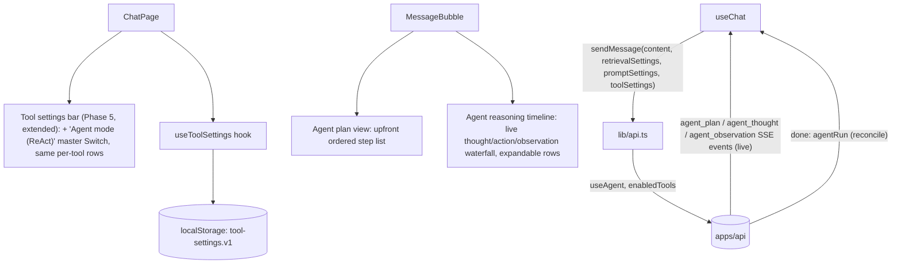

# Phase 6 — Agents UI

> Scope: `apps/web`. Extends the Phase 1-5 chat client with every Phase 6
> UI goal from the roadmap: agent reasoning timeline, planning view, and
> intermediate outputs — all wired to the Phase 6 backend described in
> `phase-6-agents.md`. The reasoning-timeline and intermediate-outputs
> goals are covered by one component, `AgentReasoningTimeline`, the same
> way `ToolTimeline` folded four Phase 5 roadmap bullets into one.

## 1. New dependencies

None. `AgentPlanView` and `AgentReasoningTimeline` are built from the same
shadcn-style primitives already in the project (`Collapsible`, `Badge`) —
no new Radix package or UI primitive was required.

## 2. Architecture

- **`ToolSettingsBar`** (`src/components/chat/tool-settings-bar.tsx`,
  extended, not duplicated): a second master `Switch` row, "Agent mode
  (ReAct)" (`useAgent`), directly beneath the existing "Tools" row —
  sharing the same per-tool `Switch` rows below (shown whenever *either*
  master switch is on) instead of a second, redundant settings bar with
  duplicate tool rows. An inline note calls out the precedence ("Wins
  over 'Tools' if both are on"), matching how the backend documents it.
- **`useToolSettings`** (`src/hooks/use-tool-settings.ts`, unchanged):
  `ToolSettings` now also carries `useAgent`, persisted to the same
  `atlas.tool-settings.v1` `localStorage` key alongside `useTools`/
  `enabledTools`.
- **`AgentPlanView`** (`src/components/chat/agent-plan-view.tsx`, new): a
  small disclosure — mirrors `VariableInspectorPanel`'s simplicity —
  rendering the upfront plan (`agentRun.plan` / the `agent_plan` SSE
  event) as a numbered list, shown above the reasoning timeline. This is
  the **Planning view** roadmap item.
- **`AgentReasoningTimeline`** (`src/components/chat/agent-reasoning-timeline.tsx`,
  new): a per-message disclosure, only rendered when a message has
  `agentSteps`. Mirrors `ToolTimeline`'s proportional-waterfall-bar shape
  (colored by status instead of stage), but with the **thought text shown
  inline** on every row (not just on expand — the model's reasoning is the
  whole point of this loop, unlike Phase 5's opaque tool decisions), plus
  an action name/badge and a status icon. Expanding a row (only rows that
  took an action are expandable) reveals pretty-printed `actionInput`/
  `observation`/`error`. This one component covers both remaining roadmap
  items:
  - **Agent reasoning timeline** — the waterfall itself, updated **live**:
    rows appear the instant an `agent_thought` SSE event arrives (as
    `acting` if it has an action, or `final` immediately if it doesn't —
    the terminal step needs no further update) and update in place when
    the matching `agent_observation` arrives, then get reconciled against
    the authoritative `agentRun.steps` on `done`.
  - **Intermediate outputs** — each acting row's `Action Input`/
    `Observation`/`Error` are the intermediate tool inputs/outputs the
    agent produced mid-reasoning, shown pretty-printed on expand.

## 3. API/type changes required to power this UI

The Phase 6 backend already accepted `useAgent` (reusing `enabledTools`)
on both chat endpoints, returned `agentRun` on `POST`/`done`, and added
the `agent_plan`/`agent_thought`/`agent_observation` SSE event types. No
backend changes were needed to power this UI; `src/types/chat.ts` mirrors
all of it by hand:

- `AgentStepInfo` / `AgentRunInfo` / `AgentStepStart` — mirror
  `chat.types.ts`'s wire shapes for a finished step, a full run, and a
  just-started step.
- `AgentStepDisplay` — a **UI-only** superset of `AgentStepInfo` that adds
  an `'acting'` status (between the `agent_thought` and
  `agent_observation` events, before `status`/`observation`/`durationMs`
  are known) — the same role `ToolCallDisplay`'s `'running'` status plays
  for Phase 5. A step with no `action` is inferred to already be
  `'final'` the moment its `agent_thought` event arrives, since there's
  no observation to wait for.
- `ToolSettings` gained `useAgent: boolean` — sharing the existing
  `enabledTools` field rather than introducing a parallel one.
- `ChatResponse` / `StreamChunk` gained an optional `agentRun` field;
  `StreamChunk` also gained `agentPlan` (for the `agent_plan` event),
  `agentStep` (for `agent_thought`), and `agentObservation` (for
  `agent_observation`); `StreamChunkType` gained `'agent_plan' |
  'agent_thought' | 'agent_observation'`. `ChatMessage` gained
  `agentPlan?: readonly string[]` and `agentSteps?: readonly
  AgentStepDisplay[]`, built up live from the three event types before
  being reconciled on `done`.

`src/lib/api.ts`'s `buildToolFields` helper now also sends
`useAgent`(JSON body) / `useAgent` (query string) alongside the existing
`useTools`/`enabledTools`. `streamChatMessage` gained
`onAgentPlan`/`onAgentThought`/`onAgentObservation` handlers alongside the
existing `onCitations`/`onToken`/`onToolCall`/`onToolResult`/`onDone`/
`onError`.

`src/hooks/use-chat.ts`'s `sendMessage` (unchanged signature — still just
takes `toolSettings`) gained three new handlers: `onAgentPlan` sets
`agentPlan` on the assistant message; `onAgentThought` appends a new
`AgentStepDisplay` row (`status: 'acting'` if the step has an `action`,
`'final'` otherwise); `onAgentObservation` finds that row by `index` and
merges in the final `status`/`observation`/`error`/`durationMs`; `onDone`
overwrites both `agentPlan` and `agentSteps` with the authoritative
`agentRun` from the backend (only when present, i.e. only when `useAgent`
was actually requested) as a final reconciliation step.

## 4. Roadmap item → implementation mapping

| Roadmap UI goal | Implementation |
| --- | --- |
| Agent reasoning timeline | `AgentReasoningTimeline` — live waterfall of every ReAct step this turn took, with the thought text shown inline on every row |
| Planning view | `AgentPlanView` — the upfront, numbered plan (`agentRun.plan` / `agent_plan` event), shown above the reasoning timeline |
| Intermediate outputs | Each acting row in `AgentReasoningTimeline` expands to show pretty-printed `actionInput`/`observation`/`error` |

## 5. Notes and known limitations

- **Live updates only exist on the streaming path**, same as Phase 5's
  tool timeline. `POST /api/v1/chat` only ever returns the final,
  already-complete `agentRun` — `AgentReasoningTimeline`/`AgentPlanView`
  still render correctly either way, since they just read whatever ended
  up on the message; only the "watch it reason live" quality is
  streaming-only.
- **No dedicated "apply" step**, matching the rest of the settings-bar
  pattern: toggling `useAgent` only takes effect on the *next* sent
  message, not retroactively on past turns.
- **`useAgent` wins over `useTools` if both are on** — the settings bar
  surfaces this with an inline note rather than disabling one switch,
  since a user might reasonably want to leave both configured and just
  flip between them.
- **The terminal step's "final" status is inferred client-side, not sent
  explicitly by the backend as a separate flag.** `onAgentThought` derives
  it purely from the absence of an `action` on that step's `agent_thought`
  payload — matches exactly how the backend's own `ReactAgentRunner`
  distinguishes an in-progress step from the concluding one (§2 of
  `phase-6-agents.md`).
- **No cross-message reasoning history view.** Each message's
  `agentPlan`/`agentSteps` is scoped to that one turn, same limitation
  Phase 5's `toolCalls` already has.

## 6. How to run

Same as Phase 1 — see `phase-1-web-ui.md` §5. No new environment
variables; `useAgent` is sent per-request, not configured via `.env`.
Open the "Tools" settings bar (same header button as Phase 5) and flip
the new "Agent mode (ReAct)" switch on, then send a message that needs a
tool (e.g. "Look up order ORD-1004 and tell me what a 15% restocking fee
on its amount would be.") to watch the plan appear first, followed by the
reasoning timeline populating step by step.
