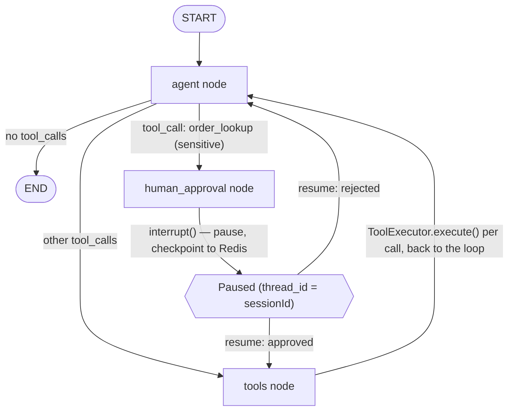
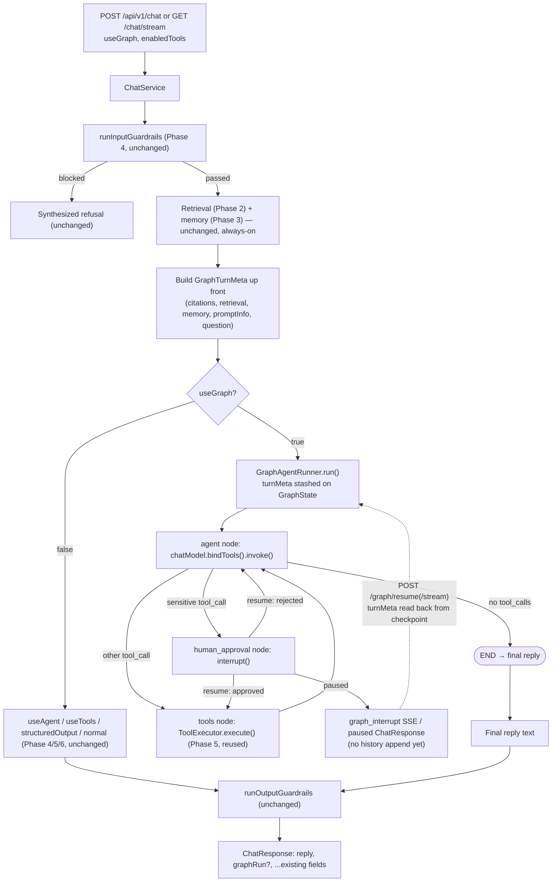
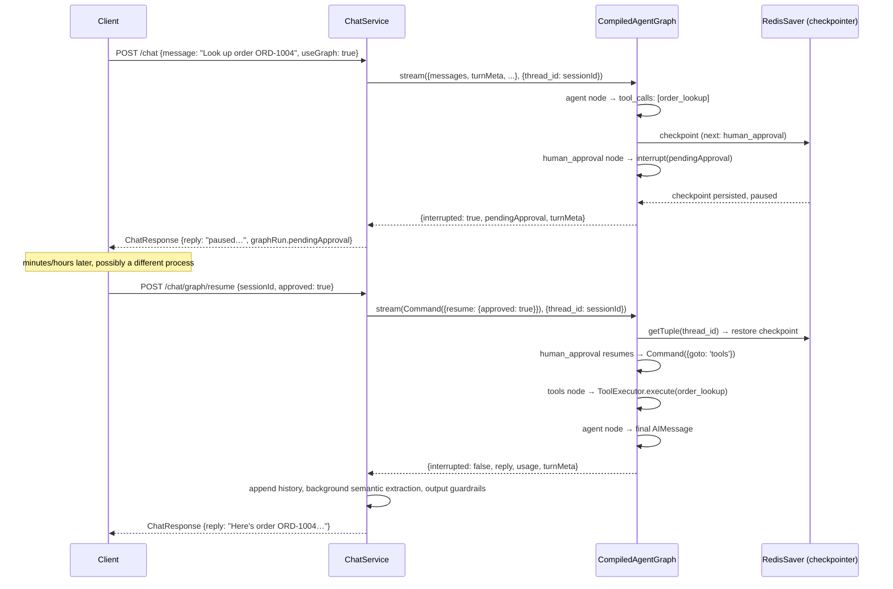

# Phase 7 — LangGraph (Backend)

> Scope: `apps/api`. Reimplements the agent<->tools loop as an explicit
> **LangGraph `StateGraph`** — `agent` → conditional → `tools` /
> `human_approval` / `END`; `human_approval` → conditional → `tools` / back
> to `agent`; `tools` → always back to `agent` — with Redis-backed
> checkpointing so a paused run survives across HTTP requests and process
> restarts. This is the "LangGraph" section of `Atlas-AI-Roadmap.md`.
> Everything below describes what was actually built, the same way
> `phase-2-advanced-rag.md` through `phase-6-agents.md` do for their
> phases — §6's file layout and §7's commands are exact, not illustrative.

## 0. What is LangGraph?

[LangGraph](https://docs.langchain.com/oss/javascript/langgraph/overview)
is a low-level orchestration library (from the LangChain team, but usable
without any other LangChain component) for building applications as
**explicit graphs of steps operating on a shared, typed state object**,
instead of a single linear chain or an implicit loop hidden inside a
runner class. Three things make it different from what Phases 5 and 6
already built:

1. **The control flow is data, not code you re-read to understand.** A
   graph's nodes and edges *are* the architecture — `compiledGraph.getGraph()`
   can return that topology at runtime (§5, §8 of `phase-7-web-ui.md`),
   which is what makes a visual graph diagram possible at all. Phase 5's
   `while` loop and Phase 6's `ReactAgentRunner.run()` loop have no such
   runtime-introspectable shape; you'd have to read the TypeScript to know
   what can happen next.
2. **Persistence is built in, not bolted on.** A **checkpointer** saves
   the full state after every "super-step" (§0.1), keyed by a `thread_id`.
   This is what makes **pausing mid-run and resuming later — potentially
   from a different process, arbitrarily long afterward — a supported,
   first-class operation**, via `interrupt()` (§0.1) instead of something
   you'd have to hand-roll with your own database table.
3. **Branching is a first-class primitive.** `addConditionalEdges()`
   (§0.1) makes "which node runs next depends on the state" a declared
   part of the graph, not an `if` buried inside a loop body.

None of this replaces the model's own reasoning (that's still `bindTools()`
+ the chat model, same mechanism as Phase 5) — LangGraph is purely the
**orchestration layer** around it: state, control flow, persistence,
interruption. That division of labor is exactly why it slots in as a
fourth `ChatService` generation mode alongside Phase 5/6's, instead of
replacing them.

**Official references** (JS/TS docs, since this is a Node/TypeScript
codebase):

- [LangGraph overview](https://docs.langchain.com/oss/javascript/langgraph/overview)
- [Graph API guide](https://docs.langchain.com/oss/javascript/langgraph/graph-api) — nodes, edges, conditional edges, `Command`
- [`StateGraph` API reference](https://reference.langchain.com/javascript/langchain-langgraph/index/StateGraph)
- [Persistence / checkpointers guide](https://docs.langchain.com/oss/javascript/langgraph/persistence)
- [Human-in-the-loop / interrupts guide](https://docs.langchain.com/oss/javascript/langgraph/interrupts)
- [Streaming guide](https://docs.langchain.com/oss/javascript/langgraph/streaming) (the `tasks` stream mode used in §3)

### 0.1 Core components glossary

Each entry: the general LangGraph concept, then exactly how/where it's
used in this codebase.

**State (`Annotation.Root`)** — the one object every node reads from and
returns partial updates to; LangGraph merges those updates back in
according to each field's **reducer** (how a new value combines with the
old one — e.g. "concatenate" for a running message list, "replace" for a
scalar). [Reference](https://reference.langchain.com/javascript/langchain-langgraph/index/Annotation).
Here: `graph-state.ts`'s `GraphState` — `messages` (concat reducer, the
growing conversation for this turn), `question`/`contextText`/
`summaryText`/`memoryText` (replace, the turn's RAG/memory/prompt inputs,
computed once by `ChatService` before the graph runs — §2), `stepCount`
(replace, the `agent`↔`tools` loop counter), `toolCallLog` (concat, every
tool call made this turn, mirroring Phase 5's `toolCalls`), `turnMeta`
(replace, an opaque bag — §4), `enabledToolNames` (replace, which
registered tools this turn may use).

**Nodes** — plain async functions `(state) => partialStateUpdate`, each
registered under a name via `.addNode(name, fn)`.
[Reference](https://docs.langchain.com/oss/javascript/langgraph/graph-api#nodes).
Here: `agent`, `human_approval`, `tools` (§1, §2) — the model call, the
approval gate, and tool execution, respectively.

**Edges** — fixed (`.addEdge(a, b)`: always go from `a` to `b`) or
conditional (`.addConditionalEdges(a, routingFn, pathMap)`: `routingFn(state)`
picks which of several possible next nodes to go to).
[Reference](https://docs.langchain.com/oss/javascript/langgraph/graph-api#edges).
Here: `tools → agent` is fixed; `agent → {tools | human_approval | END}`
and `human_approval → {tools | agent}` are conditional (§1) — the exact
mechanism the roadmap's "Conditional routing" item refers to.

**START / END** — sentinel pseudo-nodes marking the graph's entry point
and termination.
[Reference](https://docs.langchain.com/oss/javascript/langgraph/graph-api#start-node).
Here: `START → agent` (every turn begins at the model); `agent → END` when
the model's response has no `tool_calls` (§1) — the turn is done.

**Super-steps** — one "tick" of the graph: all nodes scheduled to run at
once execute (in this graph, always exactly one node per tick — no
parallel fan-out), then the checkpointer persists the resulting state
before the next tick begins. This checkpoint-after-every-tick behavior is
*why* pausing at an arbitrary node boundary and resuming later is safe —
there's always a durable, consistent state to resume from.

**Checkpointer** — the persistence layer. `MemorySaver` (in-process, gone
on restart — fine for prototyping) vs a durable backend.
[Reference](https://docs.langchain.com/oss/javascript/langgraph/persistence#checkpointer-libraries).
Here: `@langchain/langgraph-checkpoint-redis`'s `RedisSaver`, pointed at
the same `REDIS_URL` Phases 2–4 already reuse for the BM25 corpus,
parent-document store, conversation history, and prompt registry (§4) —
one more use of the one Redis instance, not a new piece of infrastructure.

**`interrupt()` / `Command({ resume })`** — the human-in-the-loop
primitive. Calling `interrupt(payload)` inside a node **pauses the graph
right there**, persists state via the checkpointer, and returns control to
the caller with `payload` attached to the checkpoint. Resuming later means
calling `.stream()`/`.invoke()` again with `new Command({ resume: value })`
instead of a fresh input — LangGraph replays the node from its start, and
every `interrupt()` call *within that same node* that already has a cached
resume value returns it immediately instead of pausing again (this is why
`humanApprovalNode`, §2, does nothing risky/non-idempotent before its
single `interrupt()` call — it may run more than once).
[Reference](https://docs.langchain.com/oss/javascript/langgraph/interrupts).
Here: `humanApprovalNode` (§2) is the only place `interrupt()` is called;
`GraphAgentRunner.resume()` (§3) is the only place `Command({ resume })` is
constructed.

### 0.2 Why LangGraph, given Phases 5 and 6 already exist

Phase 5's `generateWithTools()` and Phase 6's `ReactAgentRunner` both
already give the model the ability to act. LangGraph isn't a better way to
decide *whether to call a tool* — the `agent` node here still just calls
`chatModel.bindTools()`, the exact Phase 5 mechanism (§1). What it adds is
everything **around** that decision that neither prior phase has:

| Gap in Phase 5 (`useTools`) | Gap in Phase 6 (`useAgent`) | What LangGraph adds here |
| --- | --- | --- |
| The loop is a hidden `while` inside `generateWithTools()` — no runtime-inspectable shape. | Same — `ReactAgentRunner.run()` is a hidden loop over a text scratchpad. | An explicit graph object (`agent-graph.ts`) whose topology `getGraph()` can return at runtime (§5) — this is what makes a real graph-visualization UI possible at all (`phase-7-web-ui.md`). |
| No persistence — a turn that errors or the process restarting loses all progress. | Same. | A checkpoint after every node (§0.1) — a turn's state survives process restarts. |
| No way to pause mid-turn and ask a human something, then continue *later*, possibly from a different request/process. | Same. | `interrupt()`/`Command({resume})` (§0.1, §4) — the human-approval gate (§1) is the concrete demonstration. |
| Branching (approval-required vs not) would have to be hand-coded `if`s inside the loop. | Same. | `addConditionalEdges()` (§1) makes that branch a declared part of the graph. |

So this phase isn't "Phase 5/6, but better" — it's the same underlying
model capability (native tool-calling, same as Phase 5), wrapped in an
orchestration layer built for exactly the properties Phases 5/6
deliberately didn't need yet: inspectable topology, durable pause/resume,
and declared conditional branching. §5 has the full three-way comparison.

## 1. Graph topology



**`agent` node** (`agentNode` in `agent-graph.ts`) — the only node that
calls the model. Binds the tools scoped by `state.enabledToolNames` via
`chatModel.bindTools()` (identical mechanism to Phase 5's
`generateWithTools()` — *not* Phase 6's hand-rolled text ReAct), builds a
system prompt from `state.contextText`/`summaryText`/`memoryText`
(`graph-prompt.ts`), and calls `.invoke([system, ...state.messages])`. If
`state.stepCount` has already hit `AGENT_GRAPH_MAX_STEPS`, it short-circuits
to a canned "couldn't reach a final answer" message instead of calling the
model again — the graph's loop-exhaustion safety valve, the same shape as
Phase 5/6's own step caps.

**`human_approval` node** (`humanApprovalNode`) — reconstructs the pending
tool call(s) from the last `AIMessage`'s `tool_calls`, calls
`interrupt(pendingApprovalPayload)`, and on resume returns a
`Command({ goto: 'tools' })` if approved, or
`Command({ update: { messages: [rejectionToolMessages] }, goto: 'agent' })`
if rejected — a synthetic `ToolMessage` per rejected call so the model sees
*why* the action didn't happen, the same way a real tool error would
surface.

**`tools` node** (`toolsNode`) — executes every pending tool call via
`toolExecutor.execute()`, Phase 5's exact execution path (validation,
timeout, try/catch error handling — nothing reimplemented), appends the
results as `ToolMessage`s, and always routes back to `agent`.

**Conditional routing** (`routeAfterAgent`) — after `agent` runs, looks at
the last `AIMessage.tool_calls`: none → `END`; any call whose `name` is in
`AGENT_GRAPH_APPROVAL_TOOLS` (default just `order_lookup`, the database
tool) → `human_approval`; otherwise → `tools` directly. This is the
concrete implementation of the roadmap's "Human approval" and "Conditional
routing" items — sensitive tools get gated, everything else doesn't pay
the extra round-trip.

**Implementation**: `apps/api/src/langchain/graph/agent-graph.ts`
(`buildAgentGraph()` — builds and `.compile()`s the `StateGraph`).

## 2. State schema

`graph-state.ts`'s `GraphState = Annotation.Root({ ... })`:

| Field | Reducer | What it holds |
| --- | --- | --- |
| `messages` | concat | The turn's growing message list — starts as `[HumanMessage(question)]`, grows with every `AIMessage`/`ToolMessage` the loop produces. |
| `question` | replace | The user's message text, for reference. |
| `contextText` | replace | Retrieved RAG context (Phase 1/2), rendered into the system prompt every `agent` call. |
| `summaryText` | replace | Phase 3's conversation summary, same treatment. |
| `memoryText` | replace | Phase 3's semantic-memory facts, same treatment. |
| `enabledToolNames` | replace | Which registered tools this turn may use (`enabledTools` request field, or `undefined` = all). |
| `stepCount` | replace | Increments every `agent` call — compared against `AGENT_GRAPH_MAX_STEPS`. |
| `toolCallLog` | concat | Every `ToolCallInfo` produced by `tools`, mirroring Phase 5's `toolCalls` response field. |
| `turnMeta` | replace | An opaque `Record<string, unknown>` — see §4. |

Because this is checkpointed after every super-step (§0.1), all of the
above — including `turnMeta` — is exactly what's available again on
resume, from a brand-new HTTP request that otherwise has zero local
context about the original turn.

## 3. Driving the graph — `GraphAgentRunner`

`ChatService` never calls `compiledGraph.stream()`/`.invoke()` directly —
`graph-agent-runner.ts`'s `GraphAgentRunner` wraps that, exposing two
async generators with the same "yield live events, return a final result"
shape Phase 5's `generateWithTools()`/Phase 6's `ReactAgentRunner.run()`
already use:

- **`run(input, sessionId, enabledToolNames, turnMeta)`** — a fresh turn.
  Seeds `GraphState` (§2) and drives the graph with
  `{ configurable: { thread_id: sessionId } }` — the chat session ID
  doubles as LangGraph's thread ID, so the Redis checkpointer keys a
  paused run to the exact same identifier the rest of the app already uses
  to key conversation history (Phase 3) and prompt state.
- **`resume(sessionId, decision)`** — drives the *same* thread with
  `new Command({ resume: decision })` instead of a fresh state (§0.1).

Both funnel through a shared `driveGraph()`:

```
1. stream = compiledGraph.stream(input, { configurable: {thread_id}, streamMode: 'tasks' })
2. for each task-stream item:
     no `result` field  → yield graph_node_start { nodeId: item.name }
     has a `result` field → yield graph_node_end   { nodeId: item.name, status: 'success', durationMs }
3. after the stream ends: snapshot = compiledGraph.getState({configurable:{thread_id}})
4. if snapshot.next.length > 0 (paused on human_approval's interrupt()):
     yield graph_node_end { nodeId: 'human_approval', status: 'interrupted' }
     return { interrupted: true, nodes, pendingApproval, turnMeta }
   else:
     extract the final AIMessage from snapshot.values.messages as the reply
     return { interrupted: false, nodes, reply, usage, toolCallLog, turnMeta }
```

**Why `streamMode: 'tasks'`** rather than duplicating `routeAfterAgent`'s
predicate to predict node transitions ourselves: LangGraph's
[`tasks` stream mode](https://docs.langchain.com/oss/javascript/langgraph/streaming#stream-tasks)
already emits exactly one item when a node *starts* and one when it
*finishes*, keyed by a stable per-invocation `id` — using it directly means
`GraphAgentRunner` never has to re-derive "what runs next" logic that
already lives in the graph definition itself.

**Reconstructing `pendingApproval` without depending on the interrupt's
own persisted payload**: `getState()`'s `snapshot.tasks[].interrupts` is
*documented* to carry back the exact value passed to `interrupt()`, but
`@langchain/langgraph-checkpoint-redis@1.0.11`'s `putWrites()` only marks a
checkpoint's `has_writes` flag when that checkpoint document already
exists at write time — for the very checkpoint an interrupt pauses on,
that ordering doesn't hold in practice, so `getState()` reliably comes
back with `tasks[].interrupts: []` even though the write is sitting in
Redis (confirmed directly against the Redis keys during verification).
Since the tool call(s) awaiting approval are already sitting in
`snapshot.values.messages`' last `AIMessage.tool_calls` — no dependence on
that write path at all — `readPendingApproval()` rebuilds the identical
`{ toolCalls, reason }` payload from there instead. `humanApprovalNode`
still calls `interrupt()` for its actual job (pausing the graph and
persisting the checkpoint); this only changes how the *payload* gets read
back afterward.

**Implementation**: `apps/api/src/langchain/graph/graph-agent-runner.ts`.

## 4. `ChatService` integration and the `turnMeta` problem

`generate()`/`stream()` branch on mode with precedence
**`useGraph > useAgent > useTools > structuredOutput > normal`** — graph
mode wins over every other mode if requested, mirroring how `useAgent`
already won over `useTools`/`structuredOutput` in Phase 6.

**The problem a resume request has that a fresh request doesn't**: a
fresh `POST /api/v1/chat` computes citations, retrieval info, memory info,
prompt info, and the original question as local variables, then uses them
to build the final `ChatResponse` after the model finishes. A *resume*
request (`POST /api/v1/chat/graph/resume`) is a **brand-new HTTP call**
sent potentially minutes or hours later, maybe hitting a different
process — none of that context exists as a local variable anymore.

**The fix**: `invoke()` computes a `GraphTurnMeta` object (question,
citations, retrieval, memory, promptInfo, `hasContext`) up front, the same
values it would've used to build a normal response, and passes it into
`generateWithGraph()`, which stashes it as the opaque `turnMeta` field on
`GraphState` (§2) — so it rides along inside the graph's own checkpointed
state. When a resume request comes in, `generateWithGraphResume()` reads
`turnMeta` back off the *same* checkpoint (via `GraphAgentRunner.resume()`'s
returned `GraphRunResult.turnMeta`) and `requireResumedTurnMeta()` throws a
descriptive error if it's missing (session never existed, already
completed, or its checkpoint TTL — `GRAPH_CHECKPOINT_TTL_MINUTES` — expired)
rather than silently building a hollow response.

```
invoke()
  → computes turnMeta up front
  → generate() → generateWithGraph(chainInput, sessionId, graphSelection, turnMeta)
      → GraphAgentRunner.run(...) — turnMeta stashed on GraphState
      → interrupted?  → return early: reply = "paused" placeholder, no history append, no output guardrails
      → finished?     → normal finalization: append history, background semantic-fact extraction, output guardrails, build ChatResponse

invokeResume(sessionId, decision)
  → generateWithGraphResume(sessionId, decision) → GraphAgentRunner.resume(...)
  → requireResumedTurnMeta() — reconstructs turnMeta from the checkpoint, throws if absent
  → interrupted again (rejected → back to agent → asked for approval again)? → same early-return shape
  → finished? → same finalization tail as invoke(), using the recovered turnMeta instead of local variables
```

`streamResume()` follows the identical shape via SSE, forwarding
`graph_node_start`/`graph_node_end` live the same way `stream()` already
does for a fresh run.

**Implementation**: `apps/api/src/modules/chat/chat.service.ts` —
`toGraphSelection()`, `generateWithGraph()`, `generateWithGraphResume()`,
`toGraphLoopResult()`, `drainGraphLoop()`, `requireResumedTurnMeta()`.

## 5. Chat API surface

All fields below are additive — a request that omits every new field
behaves exactly like Phase 6 (no graph run, unchanged response shape).

### `POST /api/v1/chat` / `GET /api/v1/chat/stream`

New optional request field, same convention as every previous phase's
overrides:

| Field | Type | Default when omitted |
| --- | --- | --- |
| `useGraph` | `boolean` | `false` (no graph run, behavior unchanged) |

Reuses Phase 5/6's `enabledTools` field to scope which tools the graph's
`agent` node may bind.

**Precedence**: `useGraph > useAgent > useTools > structuredOutput`.

Response gains an optional `graphRun` object:

```json
{
  "sessionId": "…",
  "reply": "Here's the current information for order ORD-1004: …",
  "graphRun": {
    "nodes": [
      { "nodeId": "agent", "status": "success", "durationMs": 675 },
      { "nodeId": "tools", "status": "success", "durationMs": 1186 },
      { "nodeId": "agent", "status": "success", "durationMs": 541 }
    ],
    "interrupted": false,
    "threadId": "…"
  }
}
```

When a sensitive tool call needs approval, the same request instead comes
back **paused** — `reply` is a fixed placeholder string, and no `usage`/
history append/output-guardrail run has happened yet:

```json
{
  "sessionId": "…",
  "reply": "This turn is paused, waiting for approval on a sensitive action before it continues. Resume it via POST /api/v1/chat/graph/resume once you've decided.",
  "graphRun": {
    "nodes": [
      { "nodeId": "agent", "status": "success", "durationMs": 859 },
      { "nodeId": "human_approval", "status": "success", "durationMs": 1 },
      { "nodeId": "human_approval", "status": "interrupted" }
    ],
    "interrupted": true,
    "threadId": "…",
    "pendingApproval": {
      "toolCalls": [
        { "id": "fc_…", "name": "order_lookup", "args": { "orderId": "ORD-1004" } }
      ],
      "reason": "Approval required before executing: order_lookup."
    }
  }
}
```

**Three new SSE event types**, alongside the ones every prior phase added
(`citations | token | tool_call | tool_result | agent_plan | agent_thought
| agent_observation | done | error`):

| Event | When | Payload |
| --- | --- | --- |
| `graph_node_start` | A node begins executing. | `graphNode: { nodeId, status: 'running' }` |
| `graph_node_end` | A node finishes (`success`) or the run pauses on it (`interrupted`). | `graphNode: { nodeId, status, durationMs? }` |
| `graph_interrupt` | Fires **instead of `done`** when `human_approval` pauses the run. | `graphInterrupt: PendingApprovalInfo` |

```
event: graph_node_start
data: {"type":"graph_node_start","sessionId":"…","graphNode":{"nodeId":"agent","status":"running"}}

event: graph_node_end
data: {"type":"graph_node_end","sessionId":"…","graphNode":{"nodeId":"agent","status":"success","durationMs":606}}

event: graph_node_start
data: {"type":"graph_node_start","sessionId":"…","graphNode":{"nodeId":"human_approval","status":"running"}}

event: graph_node_end
data: {"type":"graph_node_end","sessionId":"…","graphNode":{"nodeId":"human_approval","status":"success","durationMs":0}}

event: graph_node_end
data: {"type":"graph_node_end","sessionId":"…","graphNode":{"nodeId":"human_approval","status":"interrupted"}}

event: graph_interrupt
data: {"type":"graph_interrupt","sessionId":"…","graphInterrupt":{"toolCalls":[{"id":"fc_…","name":"order_lookup","args":{"orderId":"ORD-1004"}}],"reason":"Approval required before executing: order_lookup."}}
```

No `done` event follows a `graph_interrupt` — the client must call the
resume endpoints below to continue the turn.

### `POST /api/v1/chat/graph/resume` / `GET /api/v1/chat/graph/resume/stream`

New endpoints for continuing a paused turn:

| Field | Type | Notes |
| --- | --- | --- |
| `sessionId` | `string` | Must match the thread that's actually paused. |
| `approved` | `boolean` | `true` → routes to `tools`; `false` → routes back to `agent` with a rejection `ToolMessage`. |
| `feedback` | `string` (optional) | Folded into the rejection message the model sees, when `approved: false`. |

`POST /graph/resume` mirrors `POST /` (full `ChatResponse`, once finished
— or another paused `graphRun` if the model tries the same sensitive tool
again). `GET /graph/resume/stream` mirrors `GET /stream` — same SSE event
set as above, resuming from wherever the graph left off.

```bash
curl -X POST http://localhost:3000/api/v1/chat/graph/resume \
  -H 'Content-Type: application/json' \
  -d '{"sessionId": "…", "approved": true}'
```

**Implementation**: `modules/chat/chat.controller.ts` (`resumeGraph`,
`streamResumeGraph`), `modules/chat/chat.route.ts`.

## 6. Read-only graph introspection — `modules/graph/`

A separate, small module (mirrors `modules/tools/`'s read-only shape) for
UI components that need the graph's *shape* and *history*, independent of
any particular chat turn:

- **`GET /api/v1/graph`** → `{ nodes, edges }` derived from
  `compiledGraph.getGraph()` — the static topology (§1), for a graph
  visualization to render once and then just highlight nodes against.
- **`GET /api/v1/graph/state/:sessionId`** → iterates
  `compiledGraph.getStateHistory({configurable:{thread_id: sessionId}})`
  and returns an ordered list of checkpoints (`checkpointId`, `next`,
  `createdAt`, `stepCount`, `messageCount`, `hasPendingApproval`) — the
  full history of super-steps for that thread, straight from Redis, for a
  state inspector / execution replay UI.

```bash
curl http://localhost:3000/api/v1/graph
curl http://localhost:3000/api/v1/graph/state/my-session-id
```

**Implementation**: `apps/api/src/modules/graph/{graph.controller,
graph.route}.ts`, mounted at `/api/v1/graph` in `http/app.ts`.

## 7. Architecture



### Interrupt → resume sequence



## 8. Comparison across Phases 5, 6, and 7

| | Phase 5 (`useTools`) | Phase 6 (`useAgent`) | Phase 7 (`useGraph`) |
| --- | --- | --- | --- |
| How the model is told about tools | Native `bindTools()` | Plain text in the system prompt | Native `bindTools()` (same as Phase 5) |
| Control flow | A hidden `while` loop in `generateWithTools()` | A hidden loop in `ReactAgentRunner.run()` | An explicit `StateGraph` — nodes/edges are data, introspectable via `getGraph()` |
| Persistence | None — an in-flight turn's state is only ever in memory | None | Checkpointed after every node, via Redis (`RedisSaver`) |
| Pause / resume | Not possible | Not possible | `interrupt()`/`Command({resume})` — a turn can pause and resume arbitrarily later, even from a different process |
| Human-in-the-loop / approval gate | None | None | `human_approval` node, conditionally routed to for sensitive tools |
| Conditional branching | Hand-coded `if`s inside the loop | Hand-coded `if`s inside the loop | `addConditionalEdges()` — a declared part of the graph |
| Iteration cap | `TOOLS_MAX_ITERATIONS` (default 3) | `AGENT_MAX_STEPS` (default 6) | `AGENT_GRAPH_MAX_STEPS` (default 6) — a separate knob, same "distinct loop, distinct cap" convention |
| Tool execution/timeout/error handling | `ToolExecutor.execute()` | Same, reused | Same, reused |
| Explicit reasoning trace | No | Yes (`agentRun.steps[].thought`) | No — the model's `bindTools()` response has no free-text reasoning field, same limitation as Phase 5 |

## 9. How to run

```bash
docker compose up -d qdrant
# Redis: point REDIS_URL at any already-running instance, same as Phase 2-6.
pnpm --filter @atlas/api dev
```

```bash
# No sensitive tool — completes in one pass, no approval needed:
curl -X POST http://localhost:3000/api/v1/chat \
  -H 'Content-Type: application/json' \
  -d '{"message": "What is the weather in Tokyo right now?", "useGraph": true}'

# Sensitive tool (order_lookup) — pauses for approval:
SESSION="graph-demo-$(date +%s)"
curl -X POST http://localhost:3000/api/v1/chat \
  -H 'Content-Type: application/json' \
  -d "{\"sessionId\": \"$SESSION\", \"message\": \"Look up the status of order ORD-1004.\", \"useGraph\": true}"

# Resume it — approved:
curl -X POST http://localhost:3000/api/v1/chat/graph/resume \
  -H 'Content-Type: application/json' \
  -d "{\"sessionId\": \"$SESSION\", \"approved\": true}"

# ...or rejected, with feedback the model sees:
curl -X POST http://localhost:3000/api/v1/chat/graph/resume \
  -H 'Content-Type: application/json' \
  -d "{\"sessionId\": \"$SESSION\", \"approved\": false, \"feedback\": \"Not authorized to share order details.\"}"

# Streaming, with live graph_node_start/graph_node_end/graph_interrupt events:
curl -N "http://localhost:3000/api/v1/chat/stream?sessionId=$SESSION&message=Look%20up%20order%20ORD-1004&useGraph=true"
curl -N "http://localhost:3000/api/v1/chat/graph/resume/stream?sessionId=$SESSION&approved=true"

# Static topology, and a thread's checkpoint history:
curl http://localhost:3000/api/v1/graph
curl http://localhost:3000/api/v1/graph/state/$SESSION
```

## 10. Implementation notes (actual file layout)

```
apps/api/src/langchain/graph/
  graph-state.ts        # GraphState (Annotation.Root) — §2
  graph.types.ts         # PendingApprovalInfo, GraphResumeDecision, GraphNodeInfo, GraphLoopEvent, GraphRunInfo — §5
  checkpointer.ts         # createGraphCheckpointer() — RedisSaver.fromUrl(REDIS_URL) — §0.1
  graph-prompt.ts         # buildGraphSystemPrompt() — the agent node's system prompt — §1
  agent-graph.ts          # buildAgentGraph() — StateGraph definition + compile() — §1
  graph-agent-runner.ts   # GraphAgentRunner: run()/resume()/driveGraph() — §3
  index.ts

apps/api/src/modules/graph/
  graph.controller.ts     # definition(), state() — §6
  graph.route.ts
  index.ts
```

`ChatService` (`modules/chat/chat.service.ts`) orchestrates the same way
it already does for retrieval (Phase 1/2), memory (Phase 3), prompts
(Phase 4), tools (Phase 5), and agents (Phase 6): `invoke()`/`stream()`
branch on `useGraph` (checked *before* `useAgent`/`useTools`/
`structuredOutput`) → `generateWithGraph()` → the same finalization tail
(history append, background semantic extraction, output guardrails,
response assembly) — except for an interrupted run, which short-circuits
before any of that (§4).

`application.factory.ts` builds the checkpointer, compiles the agent
graph (injecting the same `chatModel`/`toolExecutor` every other phase
already wired up, plus `AGENT_GRAPH_APPROVAL_TOOLS`/`AGENT_GRAPH_MAX_STEPS`),
constructs one `GraphAgentRunner`, and injects it into `ChatService` —
no new external dependency beyond the two new packages below.

`config/env.ts` additions:

```
# LangGraph (§1, §0.1)
AGENT_GRAPH_MAX_STEPS=6
AGENT_GRAPH_APPROVAL_TOOLS=order_lookup
GRAPH_CHECKPOINT_TTL_MINUTES=60
```

New dependencies: `@langchain/langgraph` (the `StateGraph`/`Annotation`/
`Command`/`interrupt` primitives, §0.1) and
`@langchain/langgraph-checkpoint-redis` (`RedisSaver`, §0.1).

## 11. What's intentionally out of scope here

- **Parallel/fan-out node execution.** This graph is a strict cycle
  (`agent` ↔ `tools`, with one optional detour through `human_approval`)
  — no node ever schedules multiple next-nodes to run concurrently in the
  same super-step, even though LangGraph supports that generally.
- **Combining `useGraph` with `useAgent`/`useTools`/`structuredOutput` in
  one turn.** `useGraph` wins if multiple are requested (§5).
- **Approval for anything beyond a configurable tool-name list.** There's
  no per-argument policy (e.g. "only approve `order_lookup` calls for
  orders under $100") — `AGENT_GRAPH_APPROVAL_TOOLS` is a flat allowlist of
  tool *names*.
- **Sub-graphs / multi-agent graphs.** One graph, three nodes — the
  roadmap's "Multi-Agent" ideas are Phase 8's concern, not this phase's.
- **Streaming intermediate model tokens.** Same trade-off as Phase 4/5/6:
  each node's model call runs via `.invoke()`; live progress during a run
  comes from `graph_node_start`/`graph_node_end`, not token-level
  streaming of the `agent` node's own reasoning.
- **Retrying `putWrites()`/working around the Redis checkpoint-saver's
  `has_writes` timing gap (§3) at the library level.** The workaround here
  is entirely in `readPendingApproval()` reading the tool calls back from
  already-checkpointed `messages` instead — the underlying package
  behavior itself is unpatched.
