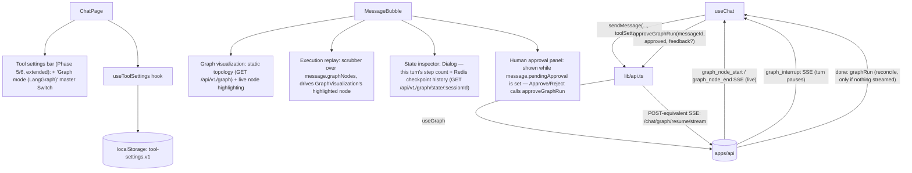

# Phase 7 — LangGraph UI

> Scope: `apps/web`. Extends the Phase 1-6 chat client with every Phase 7
> UI goal from the roadmap: graph visualization, node highlighting, state
> inspector, and execution replay — all wired to the Phase 7 backend
> described in `phase-7-langgraph.md`. A fifth component,
> `HumanApprovalPanel`, isn't a separate roadmap bullet but is the
> unavoidable UI counterpart of the backend's "Human approval" /
> "Interrupt/resume" items — without it there'd be no way to actually
> resume a paused thread from the browser.

## 1. New dependency

- **`@xyflow/react`** (`apps/web/package.json`) — renders `GraphVisualization`'s
  topology. The compiled graph has exactly five nodes and is fixed at
  server boot, so positions are hand-placed in
  `NODE_POSITIONS`/`NODE_LABELS` (`graph-visualization.tsx`) instead of
  pulling in an auto-layout package — the same "small, fixed shape, no
  extra dependency" call the plan made up front.

## 2. Architecture

- **`ToolSettingsBar`** (`src/components/chat/tool-settings-bar.tsx`,
  extended again, not duplicated): a *third* master `Switch` row, "Graph
  mode (LangGraph)" (`useGraph`), beneath the existing "Tools" and "Agent
  mode (ReAct)" rows, sharing the same per-tool rows below. The helper
  text states the full precedence inline: `useGraph` wins over both
  `useTools` and `useAgent` if more than one is on, matching
  `ChatService`'s `useGraph > useAgent > useTools > structuredOutput >
  normal` branch order (`phase-7-langgraph.md` §1).
- **`useToolSettings`** (`src/hooks/use-tool-settings.ts`, unchanged):
  `ToolSettings` now also carries `useGraph`, persisted to the same
  `atlas.tool-settings.v1` `localStorage` key.

## 3. New components

### `GraphVisualization` (`src/components/chat/graph-visualization.tsx`)

Renders the compiled graph's fixed topology with React Flow. The static
shape (`{ nodes, edges }`) is fetched once per page load — not once per
message — via `useGraphDefinition()` (`src/hooks/use-graph-definition.ts`),
a small hook that caches the `GET /api/v1/graph` promise at module scope so
mounting it on every assistant message doesn't refetch. Each node is drawn
in one of five states, driven by `message.graphNodes` and an `activeIndex`:

| Status | Style |
| --- | --- |
| `idle` (not reached yet) | neutral border |
| `visited` (reached earlier in the run, not current) | dim ring |
| `running` | blue, pulsing |
| `success` | emerald |
| `error` | red (destructive) |
| `interrupted` | amber |

`activeIndex` defaults to the *last* entry in `message.graphNodes` (i.e.
"follow the live edge" while a turn is streaming) and is overridden by
`GraphExecutionReplay`'s scrubber. This one component satisfies both the
**Graph visualization** and **Node highlighting** roadmap items — the
highlighting is a prop-driven concern of the same component, not a
separate one, the same way `ToolTimeline` folded four Phase 5 bullets into
one.

### `GraphExecutionReplay` (`src/components/chat/graph-execution-replay.tsx`)

A `Collapsible` scrubber (prev/next buttons + a range input) over
`message.graphNodes` — the **Execution replay** roadmap item. It doesn't
re-run anything; it walks the already-recorded node-by-node timeline and
reports the selected index back up via `onActiveIndexChange`, which
`MessageBubble` feeds into `GraphVisualization`'s `activeIndex` so
scrubbing re-highlights the corresponding node. `activeIndex === undefined`
means "live" (tracks the newest node automatically); scrubbing pins to an
explicit step until the "Live" button is pressed again.

### `GraphStateInspector` (`src/components/chat/graph-state-inspector.tsx`)

The **State inspector** roadmap item — a `Dialog` combining:

- this turn's live step count (`message.graphNodes.length`) and whether
  it's currently awaiting approval, and
- the thread's full Redis-backed checkpoint history, fetched lazily on
  open from `GET /api/v1/graph/state/:sessionId` (`GraphController.state`,
  `phase-7-langgraph.md` §1) via `getGraphStateHistory()`.

The checkpoint list is the concrete, inspectable proof that this turn's
state isn't just in-memory — every super-step actually persisted to Redis
and survives a paused thread being resumed from a completely different
request (or, in principle, a server restart). Rows show each
checkpoint's id, `next` (which node is queued to run), step/message
counts, and whether it's the paused-for-approval checkpoint.

### `HumanApprovalPanel` (`src/components/chat/human-approval-panel.tsx`)

Rendered whenever `message.pendingApproval` is set (the `graph_interrupt`
event). Unlike every other panel in `MessageBubble`, which are read-only
reconciliations of an already-finished turn, this one is the *only* path
forward for a paused turn — nothing else can progress the conversation
until Approve or Reject is pressed. It shows the proposed tool call(s)
(name + args, pretty-printed) and the backend's `reason` string, plus an
optional feedback `Textarea` whose contents are threaded through
unchanged as `GraphResumeDecision.feedback` (surfaced back to the model
via the `human_approval` node on rejection — see `phase-7-langgraph.md`
§1). Both buttons disable while the resumed run is in flight
(`message.isStreaming`) so a double click can't fire two resumes against
the same paused thread.

## 4. `use-chat.ts` wiring

- **`reduceGraphNodes`** — appends a new row for `graph_node_start`, or
  fills in the most recent `running` row's final status for
  `graph_node_end`. The one wrinkle: `human_approval`'s *interrupted*
  status arrives as a **second** `graph_node_end` for the same node (the
  first marks the node itself as having run successfully; the second
  reports that the graph as a whole is now paused there), with no
  `graph_node_start` of its own. `reduceGraphNodes` handles this by
  falling back to appending a fresh row whenever the most recent row
  isn't `running` — see the function's doc comment and
  `phase-7-langgraph.md` §1 for why the backend emits it this way.
- **`createStreamHandlers`** (shared by `sendMessage` and
  `approveGraphRun`) gained `onGraphNodeStart`/`onGraphNodeEnd`/
  `onGraphInterrupt`, which call `reduceGraphNodes` and set/clear
  `pendingApproval` respectively. Because both the initial (paused) run
  and its resume stream onto the *same* assistant message id through the
  same handler factory, `graphNodes` accumulates continuously across the
  pause — the timeline shown in `GraphVisualization`/`GraphExecutionReplay`
  after an approve/reject covers the *entire* run, not just the
  post-resume half.
- **`onDone`'s `graphRun` reconciliation is intentionally conservative**:
  `chunk.graphRun.nodes` only covers whichever single `driveGraph()` call
  produced that `done` (the initial run, *or* the resume — never both), so
  blindly overwriting `graphNodes` with it after a resume would silently
  drop every pre-interrupt node. `onDone` only falls back to
  `chunk.graphRun.nodes` when nothing was live-streamed at all
  (`msg.graphNodes` is empty); otherwise it trusts the already-accumulated,
  strictly more complete live timeline.
- **`approveGraphRun(messageId, approved, feedback?)`**: closes any
  existing stream, flips that message back to `isStreaming: true` and
  clears `pendingApproval`, then calls `resumeGraphRun()` with the *same*
  `createStreamHandlers(messageId, startedAt)` used for the initial send —
  so a resume is handled by exactly the same event-reconciliation code
  path as a fresh turn, just re-entered partway through.

## 5. API client changes (`src/lib/api.ts`)

- `buildToolFields` sends `useGraph` alongside `useTools`/`useAgent`/
  `enabledTools`.
- `attachGraphListeners(source, handlers)` — a small helper shared by
  `streamChatMessage()` and `resumeGraphRun()` so the three graph SSE
  event listeners (`graph_node_start`/`graph_node_end`/`graph_interrupt`)
  aren't duplicated across both call sites. `graph_interrupt` closes the
  `EventSource` itself (the turn is paused, there's nothing more to
  stream) instead of waiting for a `done` that will never arrive.
- `resumeGraphRun(sessionId, approved, feedback, handlers)` — opens a new
  `EventSource` against `GET /api/v1/chat/graph/resume/stream`, wires the
  same graph listeners plus `token`/`done`/`error`, and returns a closer
  function exactly like `streamChatMessage()` does.
- `getGraphDefinition()` / `getGraphStateHistory(sessionId)` — thin typed
  fetch wrappers around `GET /api/v1/graph` and
  `GET /api/v1/graph/state/:sessionId`.

## 6. Type changes (`src/types/chat.ts`)

- `PendingApprovalToolCall` / `PendingApprovalInfo` — mirror the backend's
  `graph.types.ts` shapes 1:1.
- `GraphNodeInfo` — mirrors the wire `GraphNodeInfo` (`nodeId`, `status`,
  optional `durationMs`).
- `GraphRunInfo` — mirrors the wire `graphRun` response field (`nodes`,
  `interrupted`, `threadId`, optional `pendingApproval`).
- `GraphNodeDisplay` — the **UI-only** superset of `GraphNodeInfo` that
  adds `step` (position in the sequence, since the same `nodeId` can
  legitimately repeat — `agent` runs both before and after `tools`), the
  same role `ToolCallDisplay`/`AgentStepDisplay` play for their phases.
- `StreamChunkType` gained `'graph_node_start' | 'graph_node_end' |
  'graph_interrupt'`; `StreamChunk` gained `graphNode?`, `graphInterrupt?`,
  `graphRun?`.
- `ToolSettings` gained `useGraph: boolean`.
- `ChatMessage` gained `graphNodes?: readonly GraphNodeDisplay[]` and
  `pendingApproval?: PendingApprovalInfo`.

## 7. Roadmap item → implementation mapping

| Roadmap UI goal | Implementation |
| --- | --- |
| Graph visualization | `GraphVisualization` — React Flow render of the static topology from `GET /api/v1/graph` |
| Node highlighting | Same component — colors the current/visited nodes from `message.graphNodes` + `activeIndex` |
| State inspector | `GraphStateInspector` — this turn's state plus the Redis checkpoint history from `GET /api/v1/graph/state/:sessionId` |
| Execution replay | `GraphExecutionReplay` — scrubber over `message.graphNodes` that drives `GraphVisualization`'s highlight |
| *(supporting, not a separate roadmap bullet)* | `HumanApprovalPanel` — the Approve/Reject UI for the backend's human-approval/interrupt-resume items |

## 8. Notes and known limitations

- **Live updates only exist on the streaming path**, same as every prior
  phase's timeline UI. `POST /api/v1/chat`/`POST /api/v1/chat/graph/resume`
  only ever return the final `graphRun`; `GraphVisualization` and
  `GraphExecutionReplay` still render correctly from that (via the `onDone`
  fallback described in §4) — only the "watch each node light up live"
  quality is streaming-only.
- **No dedicated "apply" step for `useGraph`**, matching the rest of the
  settings-bar pattern: toggling it only affects the *next* sent message.
- **`useGraph` wins over `useTools`/`useAgent`** if more than one is on —
  surfaced as an inline note in the settings bar, mirroring how Phase 6
  documented `useAgent` winning over `useTools`.
- **`GraphExecutionReplay`'s scrubber is per-message, not global** — each
  assistant message keeps its own `graphActiveIndex` state in
  `MessageBubble`; switching which message you're looking at doesn't
  carry the scrub position over, which matches every other message-scoped
  panel in this file.
- **`GraphStateInspector`'s checkpoint history is fetched once per dialog
  open**, not kept live — if you resume a paused run while the dialog from
  before the pause is still open, reopen it (or close/reopen) to see the
  new checkpoints.
- **The five graph node positions are hand-placed, not computed.** If the
  backend's topology ever grows beyond `agent`/`tools`/`human_approval`
  (plus `__start__`/`__end__`), `NODE_POSITIONS`/`NODE_LABELS` in
  `graph-visualization.tsx` need a matching entry, or that node falls back
  to a default position (won't crash, but won't be laid out sensibly
  either).

## 9. How to run

Same as Phase 1 — see `phase-1-web-ui.md` §5. No new environment
variables; `useGraph` is sent per-request, not configured via `.env`.
Open the "Tools" settings bar (same header button as Phases 5-6) and flip
the new "Graph mode (LangGraph)" switch on. Two flows to try:

- **Normal run** (no approval): ask something a non-sensitive tool can
  answer, e.g. "What's 15 times 6?" or "What's the weather in Paris?" —
  watch `agent` light up once in `GraphVisualization`, then `done`.
- **Approval-gated run**: ask "Look up order ORD-1002" (a sensitive
  `order_lookup` call, per `AGENT_GRAPH_APPROVAL_TOOLS`). The turn pauses
  with `HumanApprovalPanel` shown; open `GraphStateInspector` to see the
  checkpoint with `hasPendingApproval: true`. Press **Approve** to watch
  `human_approval → tools → agent` complete the loop, or **Reject** (with
  optional feedback) to watch the model acknowledge it and answer without
  the tool's result. Either way, scrub back through `GraphExecutionReplay`
  afterward to confirm the *entire* run — including the pre-pause steps —
  is still there.
