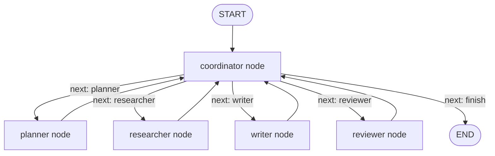
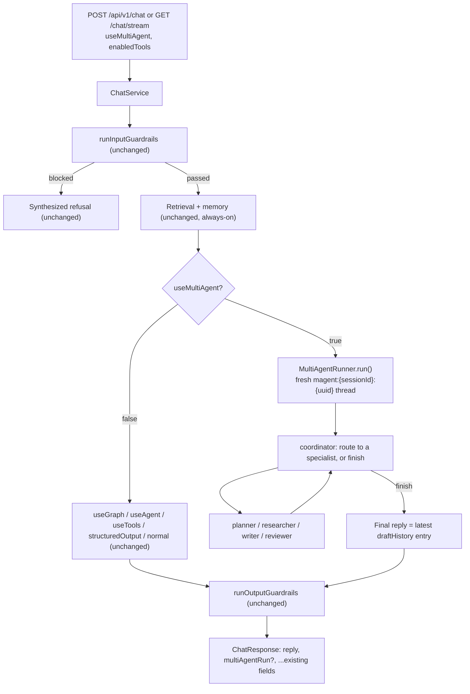
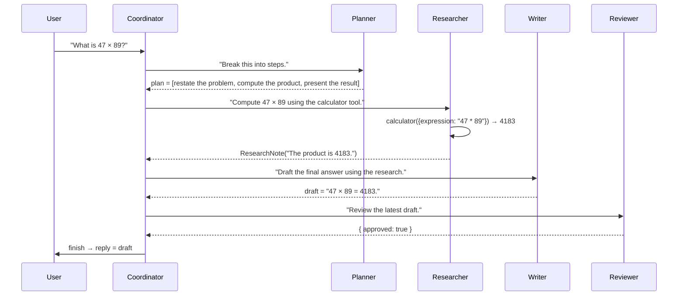
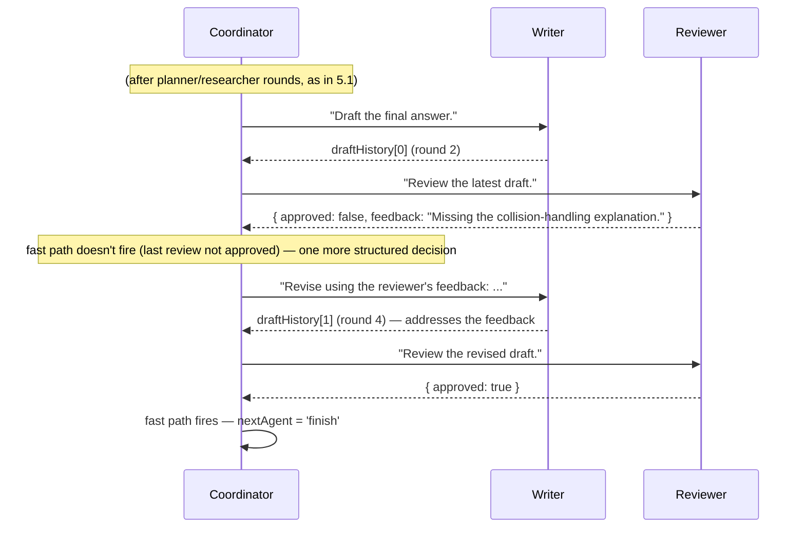
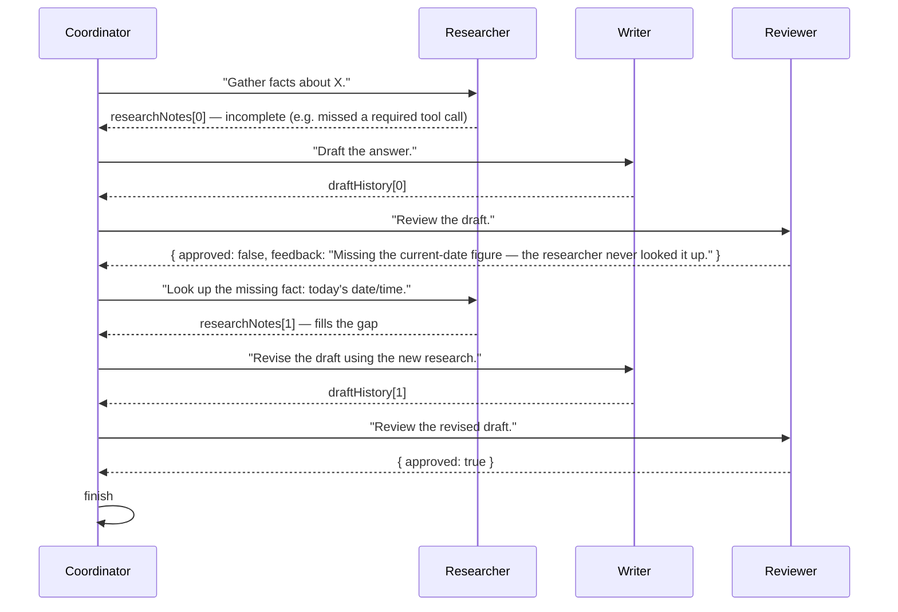
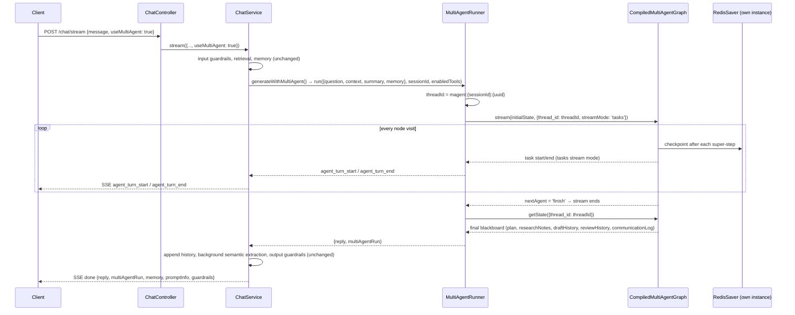

# Phase 8 — Multi-Agent (Backend)

> Scope: `apps/api`. Builds a **LangGraph supervisor graph** — a
> `coordinator` node that dynamically routes between `planner`,
> `researcher`, `writer`, and `reviewer` specialists over a shared
> "blackboard" state, up to a round cap — exposed as a new `useMultiAgent`
> chat mode with the **highest precedence** of every generation mode built
> so far. This is the "Multi-Agent" section of `Atlas-AI-Roadmap.md`.
> Everything below describes what was actually built, the same way
> `phase-2-advanced-rag.md` through `phase-7-langgraph.md` do for their
> phases — §7's file layout and §9's commands are exact, not illustrative.

## 0. What is a multi-agent supervisor pattern?

A **multi-agent system** splits one task across several specialized
agents instead of asking a single model+prompt to do everything. LangGraph's
own docs describe four broad topologies — **network** (any agent can call
any other), **supervisor** (every agent reports to one central router),
**hierarchical** (supervisors of supervisors), and **custom workflow**
(a hand-designed graph mixing deterministic and agentic steps). This phase
builds a **supervisor**: a `coordinator` node is the only one that decides
"who goes next," and every specialist always reports back to it —
structurally the same hub-and-spoke shape Phase 7's `human_approval` node
uses for its narrower approve/reject decision, just generalized to a
5-way routing choice made every round.

**Why hand-roll it with `StateGraph`/`Annotation.Root` instead of the
`@langchain/langgraph-supervisor` package**: that package (and the closely
related `create_supervisor` mentioned in LangChain's own migration guide)
wraps each worker as an opaque *tool call* returning a message, which fits
a shared **message transcript** state (Phase 7's `GraphState.messages`)
far better than this phase's actual state shape — a typed **blackboard**
with named fields (`plan`, `researchNotes`, `draftHistory`,
`reviewHistory`) that each specialist reads/writes directly, not a
conversation history to replay. Building the coordinator as a plain node
with `addConditionalEdges()` (exactly Phase 7's own primitives, just with
a 5-way instead of 3-way routing function) keeps that schema fully
explicit and inspectable, the same reasoning `phase-7-langgraph.md` §0.2
gives for using LangGraph over a hidden loop in the first place.

**Official references** (JS/TS docs where available; the conceptual
docs are shared across languages):

- [LangGraph overview](https://docs.langchain.com/oss/javascript/langgraph/overview) (same primitives as Phase 7 — `StateGraph`, `Annotation`, conditional edges)
- [Multi-agent concepts](https://langchain-ai.github.io/langgraphjs/concepts/multi_agent/) — network vs. supervisor vs. hierarchical vs. custom workflow
- [Supervisor tutorial](https://langchain-ai.github.io/langgraphjs/tutorials/multi_agent/agent_supervisor/) — the pattern this phase implements by hand
- [Multi-agent overview (concepts, cross-language)](https://docs.langchain.com/oss/python/langchain/multi-agent) — when a supervisor is worth the complexity over a single agent with more tools
- [`Command` / conditional routing](https://docs.langchain.com/oss/javascript/langgraph/graph-api#command) — same primitive Phase 7 uses for `human_approval`'s routing, used here for the coordinator's 5-way choice
- [Persistence / checkpointers guide](https://docs.langchain.com/oss/javascript/langgraph/persistence) — same `RedisSaver` mechanism as Phase 7, a second independent instance here

### 0.1 Core vocabulary

| Term | Meaning here |
| --- | --- |
| **Supervisor pattern** | One `coordinator` node makes every routing decision; specialists never talk to each other directly. |
| **Shared / blackboard state** | `MultiAgentState` (§2) — every specialist reads the same state object and writes back named fields (not messages) that persist for the rest of the turn. |
| **Specialist** | One of `planner`, `researcher`, `writer`, `reviewer` — a single-purpose node with its own prompt and (for `researcher`) its own tool-calling loop. |
| **Round** | One coordinator visit plus the specialist it dispatches to. `roundCount` increments once per coordinator visit; capped by `MULTI_AGENT_MAX_ROUNDS`. |
| **Communication log** | `communicationLog` — every coordinator→specialist dispatch and specialist→coordinator report, in order; the literal "conversation between agents" a UI renders. |
| **Deterministic fast path** | The coordinator skips its own LLM call and routes straight to `finish` when the latest draft is already approved, or the round cap is hit — avoiding a wasted model call on a decision that's already forced. |

### 0.2 Why multi-agent, given Phases 5–7 already exist

Phases 5–7 all answer *one* question with *one* reasoning process (native
tool-calling, ReAct text loop, or an explicit agent↔tools graph). None of
them separate "figure out a plan," "gather facts," "write the answer," and
"critique the answer" into different actors with different prompts and
different context windows — one model call (or one loop) does all of it
at once. Phase 8 is the first phase where:

| Gap in Phases 5–7 | What Phase 8 adds |
| --- | --- |
| One prompt has to be good at planning, researching, writing, *and* self-critiquing simultaneously. | Four focused prompts (`multi-agent-prompts.ts`), each scoped to one job — the same "smaller, focused prompt beats one do-everything prompt" reasoning behind splitting tools into single-purpose functions in Phase 5. |
| No structural place for "critique the draft, then redo it if it's not good enough." | A `reviewer` node whose rejection routes back to `writer` with concrete feedback — a real revision loop, not a retry of the same call. |
| Retrieval/tool-calling happens inline with answer generation — no separate "just gather facts" step. | `researcher` is a dedicated fact-gathering visit (its own bounded tool loop) whose output (`ResearchNote`) is consumed by `writer`, not by the same call that also drafts prose. |
| The "conversation" a UI can show is either a flat reply or a single reasoning trace (Phase 6's `agentRun.steps`). | `communicationLog` is a genuine multi-party conversation — who told whom what, across up to `MULTI_AGENT_MAX_ROUNDS` rounds. |

This isn't "Phase 7, but with more nodes" — it reuses the exact same
LangGraph primitives (§0 above) and the exact same `ToolExecutor` Phase
5–7 already built, but organizes them around **role separation** instead
of a single agent's tool-calling loop. §8 has the full four-way comparison.

## 1. Graph topology



Every specialist has exactly one outgoing edge, back to `coordinator` —
there is no specialist-to-specialist edge, which is what makes
`communicationLog` a coherent, one-hub conversation instead of a tangle.

**`coordinator` node** (`coordinatorNode`) — the only node with a
5-way decision to make:

1. **Deterministic fast path** (no LLM call): if the latest `reviewHistory`
   entry has `approved: true`, or `roundCount >= MULTI_AGENT_MAX_ROUNDS`,
   route straight to `finish`.
2. Otherwise, one `chatModel.withStructuredOutput({ next, instructions })`
   call (Phase 4's structured-output mechanism, same as Phase 6's
   `generatePlan()`), informed by a full rendering of the current
   blackboard (plan so far, research-note count/content, latest draft,
   latest review verdict — `buildCoordinatorHumanPrompt()`).
3. Appends a `communicationLog` entry (`{ from: 'coordinator', to: next,
   content: instructions }`) and increments `roundCount`.

**`planner` node** (`plannerNode`) — one `withStructuredOutput({ steps })`
call (identical mechanism to `langchain/agents/planner.ts`'s Phase 6
planner), informed by the coordinator's latest instructions and any
existing plan (so it can *revise* a plan, not just produce a first one).
Replaces `state.plan` (not concat — a later plan supersedes an earlier
one).

**`researcher` node** (`researcherNode`) — `toolExecutor.getBindableTools()`
+ `chatModel.bindTools()`, the same native tool-calling mechanism Phase
5/7 use, run in a bounded decide→execute→feed-results-back loop (up to
`MULTI_AGENT_RESEARCHER_MAX_TOOL_CALLS` iterations — its own knob, separate
from `TOOLS_MAX_ITERATIONS`/`AGENT_GRAPH_MAX_STEPS`, same "distinct loop,
distinct cap" convention every prior phase uses). The final text response
becomes a `ResearchNote { round, content, toolCalls }`.

**`writer` node** (`writerNode`) — a plain (no-tools) model call using the
plan, every research note so far, and — critically — the most recent
`reviewHistory` entry's feedback (if the coordinator sent it back for
revision) to draft or revise. Appends (never overwrites) to
`draftHistory`, so every version stays available for comparison.

**`reviewer` node** (`reviewerNode`) — one `withStructuredOutput({
approved, feedback })` call grading the *latest* draft against the
question, plan, and research notes. Appends to `reviewHistory`.

**Conditional routing** (`routeAfterCoordinator`) — reads
`state.nextAgent` (written by `coordinatorNode` in the same super-step,
since a conditional-edge function can't itself carry extra state — the
same pattern Phase 7's `routeAfterAgent` uses reading `state.messages`)
and maps it to the matching node, or `END` for `finish`.

**Implementation**: `apps/api/src/langchain/multi-agent/multi-agent-graph.ts`
(`buildMultiAgentGraph()`).

## 2. State schema

`multi-agent-state.ts`'s `MultiAgentState = Annotation.Root({ ... })` —
deliberately **not** a growing `messages` transcript like Phase 7's
`GraphState`. Each specialist reads/writes a small set of explicitly
named, typed fields instead of one shared conversation:

| Field | Reducer | What it holds |
| --- | --- | --- |
| `question` / `contextText` / `summaryText` / `memoryText` | replace | The turn's RAG/memory inputs, computed once by `ChatService` before the graph runs — identical role to Phase 7's fields of the same names. |
| `enabledToolNames` | replace | Which registered tools the `researcher` may use. |
| `plan` | replace | The planner's latest ordered steps — a later plan supersedes an earlier one. |
| `researchNotes` | concat | Every `researcher` visit's `{ round, content, toolCalls }`, oldest first. |
| `draftHistory` | concat | Every `writer` visit's `{ round, content }` — powers the Output Comparison UI. |
| `reviewHistory` | concat | Every `reviewer` visit's `{ round, approved, feedback? }`. |
| `communicationLog` | concat | Every coordinator↔specialist message, oldest first — powers the Communication Timeline UI. |
| `toolCallLog` | concat | Every `ToolCallInfo` the researcher's tool loop produced, mirroring Phase 5/7's field of the same name. |
| `roundCount` | replace | Increments once per `coordinator` visit; compared against `MULTI_AGENT_MAX_ROUNDS`. |
| `nextAgent` | replace | The coordinator's routing decision for *this* visit, read immediately by `routeAfterCoordinator`. |

## 3. Driving the graph — `MultiAgentRunner`

`ChatService` never calls `compiledGraph.stream()`/`.invoke()` directly —
`multi-agent-runner.ts`'s `MultiAgentRunner` wraps that, mirroring Phase
7's `GraphAgentRunner` shape (yield live events, return a final result),
but simpler: **there's no interrupt/resume split**. A multi-agent turn
always runs start-to-finish in a single `run()` call.

```
1. threadId = `magent:{sessionId}:{randomUUID()}`  — see the callout below
2. stream = compiledGraph.stream(initialState, { configurable: {thread_id: threadId}, streamMode: 'tasks' })
3. for each task-stream item (node name is exactly the AgentRole — no lookup table needed):
     no `result` field  → yield agent_turn_start { role, round, status: 'running' }
     has a `result` field → yield agent_turn_end { role, round, status: 'success', durationMs }
4. after the stream ends: snapshot = compiledGraph.getState({configurable:{thread_id}})
5. reply = snapshot.values.draftHistory.at(-1)?.content, or a loop-exhausted fallback if empty
6. return { reply, toolCallLog, multiAgentRun: { turns, plan, researchNotes, draftHistory, reviewHistory, communicationLog, threadId } }
```

**Attributing a `round` number to each streamed turn**: the stream only
tells you a node's *name*, not which blackboard round it belongs to. A
running counter (`roundCounter`, starts at 0) is bumped every time a
`coordinator` task *finishes* — a coordinator visit's own `round` is the
counter's value *before* that bump; every specialist visit that follows
uses `roundCounter - 1` (the round the most recent coordinator dispatch
belongs to), since specialists always run immediately after the
coordinator dispatch that triggered them.

**Why a fresh thread per turn, not `magent:{sessionId}` reused across the
whole conversation (unlike Phase 7's `sessionId`-as-thread-id)**: Phase
7's `GraphState.messages` is a **growing transcript**, so it's meant to
accumulate across every turn in a session — that's the graph's built-in
substitute for Phase 3's history store. This phase's blackboard is the
opposite: `plan`/`researchNotes`/`draftHistory`/`reviewHistory` are scoped
to *one question*, and several use a concat reducer. Reusing the same
`thread_id` across turns would silently concatenate one turn's plan and
drafts onto the next turn's — confirmed directly during implementation
(two turns sent to the same `magent:{sessionId}` thread produced a
`communicationLog` and `draftHistory` that mixed both questions'
specialist visits together). Minting `magent:{sessionId}:{randomUUID()}`
fresh in `MultiAgentRunner.run()` avoids that while keeping the `magent:`
prefix Phase 7's checkpoint namespace never collides with; the resulting
`threadId` is returned on every response (`MultiAgentRunInfo.threadId`)
so a client can still ask for that one turn's checkpoint history (§6).

**Implementation**: `apps/api/src/langchain/multi-agent/multi-agent-runner.ts`.

## 4. `ChatService` integration

`generate()`/`stream()` branch on mode with precedence
**`useMultiAgent > useGraph > useAgent > useTools > structuredOutput >
normal`** — multi-agent wins over every other mode, extending Phase 7's
`useGraph > useAgent > useTools > structuredOutput` chain by one more
link at the top.

`generateWithMultiAgent()` is simpler than Phase 7's
`generateWithGraph()`: there's no interrupt branch to wrap, and no
`turnMeta`-stashing dance for a later resume request, since a multi-agent
turn is always complete by the time it returns. It forwards
`context`/`summary`/`memory` from `chainInput` into
`MultiAgentRunner.run()` (not `history` — same documented simplification
Phase 6/7 already make) and returns `{ reply, multiAgentRun }`.
`usage` is intentionally never populated: a turn makes 4–9 separate LLM
calls across different roles (coordinator/planner/researcher/writer/
reviewer, possibly repeated), with no single terminal response to
attribute token usage to — aggregating per-node usage was left out of
scope.

Because there's no pause/resume, `invoke()`/`stream()` never special-case
`multiAgentRun` the way they special-case an interrupted `graphRun` — the
normal finalization tail (history append, background semantic-fact
extraction, output guardrails, response assembly) always runs right after
`generateWithMultiAgent()` resolves, exactly like Phase 5/6's tool/agent
branches.



**Implementation**: `apps/api/src/modules/chat/chat.service.ts` —
`toMultiAgentSelection()`, `generateWithMultiAgent()`.

## 5. Use-case workflows

Three concrete scenarios the coordinator's routing logic is designed to
produce (all observed during manual verification, §9):

### 5.1 Straightforward research-and-answer

The common case: a question needing one round of research, one draft,
one approval.



### 5.2 Revision loop (reviewer rejects once)

The reviewer's rejection routes straight back to the writer with
feedback — `draftHistory` gains a second entry addressing exactly what
was flagged, and `reviewHistory` shows the rejection *and* the
subsequent approval.



### 5.3 Insufficient research (reviewer sends it back further than the writer)

Sometimes a draft's real problem isn't wording — it's missing facts. The
reviewer can reject citing a research gap, and the coordinator's next
structured decision (informed by that feedback, per §1 step 2) can route
to `researcher` again instead of straight to `writer`.



All three share the same mechanism — nothing is hard-coded per scenario;
which path actually happens is entirely the coordinator's structured
decision each round, informed by the current state summary
(`buildCoordinatorHumanPrompt()`).

## 6. System workflow — end to end



## 7. Chat API surface

All fields below are additive — a request that omits every new field
behaves exactly like Phase 7 (no multi-agent run, unchanged response
shape).

### `POST /api/v1/chat` / `GET /api/v1/chat/stream`

| Field | Type | Default when omitted |
| --- | --- | --- |
| `useMultiAgent` | `boolean` | `false` (no multi-agent run, behavior unchanged) |

Reuses the existing `enabledTools` field to scope which tools the
`researcher` specialist may call.

**Precedence**: `useMultiAgent > useGraph > useAgent > useTools >
structuredOutput`.

Response gains an optional `multiAgentRun` object — a real example
(`useMultiAgent: true`, no tools needed):

```json
{
  "sessionId": "magent-test-fresh-1",
  "reply": "A hash map (also called a hash table) stores key-value pairs by applying a hash function to each key to compute an index...",
  "multiAgentRun": {
    "turns": [
      { "role": "coordinator", "round": 0, "status": "success", "durationMs": 1830 },
      { "role": "planner", "round": 0, "status": "success", "durationMs": 824 },
      { "role": "coordinator", "round": 1, "status": "success", "durationMs": 785 },
      { "role": "researcher", "round": 1, "status": "success", "durationMs": 2946 },
      { "role": "coordinator", "round": 2, "status": "success", "durationMs": 740 },
      { "role": "writer", "round": 2, "status": "success", "durationMs": 875 },
      { "role": "coordinator", "round": 3, "status": "success", "durationMs": 1229 },
      { "role": "reviewer", "round": 3, "status": "success", "durationMs": 991 },
      { "role": "coordinator", "round": 4, "status": "success", "durationMs": 1 }
    ],
    "plan": ["Define what a hash map is...", "Explain the hashing mechanism...", "..."],
    "researchNotes": [{ "round": 1, "content": "...", "toolCalls": [] }],
    "draftHistory": [{ "round": 2, "content": "A hash map (also called a hash table) stores..." }],
    "reviewHistory": [{ "round": 4, "approved": true }],
    "communicationLog": [
      { "round": 0, "from": "coordinator", "to": "planner", "content": "Create a concise plan..." },
      { "round": 1, "from": "planner", "to": "coordinator", "content": "Proposed a 4-step plan." }
    ],
    "threadId": "magent:magent-test-fresh-1:19efe248-1b94-43ff-ad8c-d713de9e1f05"
  }
}
```

**Two new SSE event types**, alongside every event prior phases added
(`citations | token | tool_call | tool_result | agent_plan | agent_thought
| agent_observation | graph_node_start | graph_node_end | graph_interrupt
| done | error`):

| Event | When | Payload |
| --- | --- | --- |
| `agent_turn_start` | A specialist (or the coordinator) begins its visit. | `agentTurn: { role, round, status: 'running' }` |
| `agent_turn_end` | That visit finishes. | `agentTurn: { role, round, status: 'success', durationMs }` |

There is no `_interrupt` counterpart — a multi-agent turn never pauses,
so `done` always follows and carries the full `multiAgentRun` for
reconciliation, unlike Phase 7's `graph_interrupt` which replaces `done`.

```
event: agent_turn_start
data: {"type":"agent_turn_start","sessionId":"…","agentTurn":{"role":"coordinator","round":0,"status":"running"}}

event: agent_turn_end
data: {"type":"agent_turn_end","sessionId":"…","agentTurn":{"role":"coordinator","round":0,"status":"success","durationMs":792}}

event: agent_turn_start
data: {"type":"agent_turn_start","sessionId":"…","agentTurn":{"role":"planner","round":0,"status":"running"}}

event: agent_turn_end
data: {"type":"agent_turn_end","sessionId":"…","agentTurn":{"role":"planner","round":0,"status":"success","durationMs":815}}

...

event: done
data: {"type":"done","sessionId":"…","multiAgentRun":{...},"memory":{...},"promptInfo":{...},"guardrails":{...}}
```

## 8. Read-only introspection — `modules/multi-agent/`

A separate, small module mirroring Phase 7's `modules/graph/`:

- **`GET /api/v1/multi-agent`** → `{ nodes, edges }` from
  `compiledGraph.getGraph()` — the static topology (§1), for a graph
  visualization to render once.
- **`GET /api/v1/multi-agent/state/:threadId`** → iterates
  `compiledGraph.getStateHistory({configurable:{thread_id: threadId}})`
  and returns every checkpoint's `checkpointId`, `next`, `createdAt`,
  `roundCount`, `planLength`, `researchNoteCount`, `draftCount`,
  `reviewCount`. **Takes the full `threadId`** returned in a turn's
  `multiAgentRun.threadId` (§3's per-turn thread, URL-encoded — it
  contains colons) — not the bare chat `sessionId`, unlike Phase 7's
  equivalent endpoint, since each multi-agent turn gets its own thread.

```bash
curl http://localhost:3000/api/v1/multi-agent
curl "http://localhost:3000/api/v1/multi-agent/state/$(python3 -c "import urllib.parse;print(urllib.parse.quote('magent:my-session:abc-123'))")"
```

**Implementation**: `apps/api/src/modules/multi-agent/{multi-agent.controller,
multi-agent.route}.ts`, mounted at `/api/v1/multi-agent` in `http/app.ts`.

## 9. Comparison across Phases 6, 7, and 8

| | Phase 6 (`useAgent`) | Phase 7 (`useGraph`) | Phase 8 (`useMultiAgent`) |
| --- | --- | --- | --- |
| Who reasons | One agent, one prompt, one loop | One agent, native `bindTools()`, one loop | Five roles, five focused prompts, one router |
| Control flow | Hidden loop in `ReactAgentRunner.run()` | Explicit `StateGraph` — `agent ↔ tools` cycle | Explicit `StateGraph` — `coordinator` hub-and-spoke over 4 specialists |
| Shared state shape | A hand-rolled text scratchpad | A growing `messages` transcript | A typed blackboard (`plan`/`researchNotes`/`draftHistory`/`reviewHistory`) |
| Persists across turns in a session? | No | Yes — same `sessionId` = same thread | No — a fresh thread per turn (§3) |
| Revision / self-critique | None | None | `reviewer` → `writer` revision loop, explicit and repeatable |
| Human-in-the-loop | None | `human_approval` node, `interrupt()`/resume | None (not in scope, §11) |
| Iteration cap | `AGENT_MAX_STEPS` (default 6) | `AGENT_GRAPH_MAX_STEPS` (default 6) | `MULTI_AGENT_MAX_ROUNDS` (default 10) — a coordinator-visit cap, plus `MULTI_AGENT_RESEARCHER_MAX_TOOL_CALLS` (default 3) for the researcher's own inner loop |
| Live progress events | `agent_plan`/`agent_thought`/`agent_observation` | `graph_node_start`/`graph_node_end`/`graph_interrupt` | `agent_turn_start`/`agent_turn_end` |
| Explicit reasoning trace | Yes (`agentRun.steps[].thought`) | No | Yes, but as a division of labor (`communicationLog`) rather than one actor's thoughts |
| Token usage tracked | Yes | Yes | No — multiple LLM calls across roles, no single terminal response to attribute it to |

## 10. How to run

```bash
docker compose up -d qdrant
# Redis: point REDIS_URL at any already-running instance, same as Phase 2-7.
pnpm --filter @atlas/api dev
```

```bash
# Static topology:
curl http://localhost:3000/api/v1/multi-agent

# 5.1 — Straightforward research-and-answer:
curl -X POST http://localhost:3000/api/v1/chat \
  -H 'Content-Type: application/json' \
  -d '{"sessionId": "magent-demo-1", "message": "What is 47 multiplied by 89? Show the exact number.", "useMultiAgent": true, "enabledTools": ["calculator"]}'

# 5.1 (no tools needed) — plan → write → review → finish in one pass:
curl -X POST http://localhost:3000/api/v1/chat \
  -H 'Content-Type: application/json' \
  -d '{"sessionId": "magent-demo-2", "message": "In two sentences, explain what a hash map is.", "useMultiAgent": true}'

# Streaming, with live agent_turn_start/agent_turn_end events:
curl -N "http://localhost:3000/api/v1/chat/stream?sessionId=magent-demo-3&message=What%20is%2012%20plus%2030%3F&useMultiAgent=true&enabledTools=calculator"

# Checkpoint history for one turn's thread (copy `multiAgentRun.threadId` from a prior response):
THREAD='magent:magent-demo-1:<uuid-from-response>'
curl "http://localhost:3000/api/v1/multi-agent/state/$(python3 -c "import urllib.parse,sys;print(urllib.parse.quote(sys.argv[1]))" "$THREAD")"
```

Reliably forcing 5.2's revision loop or 5.3's insufficient-research path
via `curl` depends on the model actually rejecting its own first draft —
not deterministic by design (the coordinator/reviewer's judgment drives
it, not a scripted trigger). Asking for something with strict, checkable
constraints (e.g. "exactly 3 bullet points, each under 8 words" or "these
3 separate facts must all be present, using 2 different tools") raises
the odds of at least one rejection; `draftHistory.length > 1` and a
`reviewHistory` entry with `approved: false` confirm it happened.

## 11. Implementation notes (actual file layout)

```
apps/api/src/langchain/multi-agent/
  multi-agent-state.ts     # MultiAgentState (Annotation.Root) — §2
  multi-agent.types.ts     # AgentRole, ResearchNote, DraftVersion, ReviewVerdict, AgentMessage, MultiAgentTurnInfo, MultiAgentLoopEvent, MultiAgentRunInfo — §7
  multi-agent-prompts.ts   # One prompt builder per role — §1
  multi-agent-graph.ts     # buildMultiAgentGraph() — StateGraph definition + compile() — §1
  multi-agent-runner.ts    # MultiAgentRunner: run()/driveGraph-equivalent — §3
  checkpointer.ts          # createMultiAgentCheckpointer() — own RedisSaver.fromUrl(REDIS_URL) — §0
  index.ts

apps/api/src/modules/multi-agent/
  multi-agent.controller.ts  # definition(), state() — §8
  multi-agent.route.ts
  index.ts
```

`ChatService` (`modules/chat/chat.service.ts`) orchestrates the same way
it already does for every prior phase: `invoke()`/`stream()` branch on
`useMultiAgent` (checked *before* `useGraph`/`useAgent`/`useTools`/
`structuredOutput`) → `generateWithMultiAgent()` → the same finalization
tail every non-interrupting mode already shares.

`application.factory.ts` builds the multi-agent checkpointer, compiles
the multi-agent graph (injecting the same `chatModel`/`toolExecutor`
every other phase already wired up, plus `MULTI_AGENT_MAX_ROUNDS`/
`MULTI_AGENT_RESEARCHER_MAX_TOOL_CALLS`), constructs one
`MultiAgentRunner`, and injects it into `ChatService` — no new external
dependency; this phase reuses the exact same `@langchain/langgraph` and
`@langchain/langgraph-checkpoint-redis` packages Phase 7 already added.

`config/env.ts` additions:

```
# Multi-Agent (§1, §3)
MULTI_AGENT_MAX_ROUNDS=10
MULTI_AGENT_RESEARCHER_MAX_TOOL_CALLS=3
MULTI_AGENT_CHECKPOINT_TTL_MINUTES=60
```

## 12. What's intentionally out of scope here

- **Human-in-the-loop / interrupts.** Not in the roadmap's Phase 8
  backend list — every turn runs single-shot to completion, unlike Phase
  7's `human_approval` gate. Nothing here stops a future phase from adding
  an approval gate to, say, the `researcher`'s tool calls the same way
  Phase 7 does for its `agent` node.
- **Cross-turn blackboard persistence.** Deliberately reset every turn
  (§3) — a multi-agent run answers *one* question, it doesn't accumulate
  plans/drafts across an entire chat session the way Phase 7's `messages`
  state does.
- **Parallel/fan-out specialist execution.** The coordinator dispatches to
  exactly one specialist per round, even though LangGraph supports
  scheduling multiple nodes in the same super-step generally — matches
  the roadmap's "Coordinator" wording ("routes between" specialists, not
  "runs specialists concurrently").
- **Aggregated token usage.** `usage` is never populated for a
  multi-agent turn (§4) — no single terminal LLM response to attribute it
  to across 4–9 separate calls.
- **Nested/hierarchical supervisors.** One coordinator, four specialists
  — no supervisor-of-supervisors structure (LangGraph's "hierarchical"
  topology, §0).
- **Combining `useMultiAgent` with `useGraph`/`useAgent`/`useTools`/
  `structuredOutput` in one turn.** `useMultiAgent` wins if multiple are
  requested (§7).
