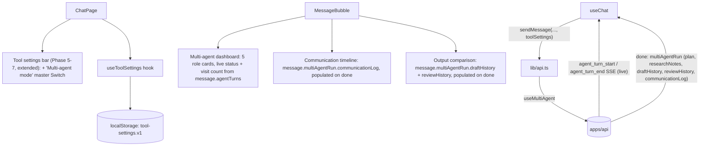

# Phase 8 — Multi-Agent UI

> Scope: `apps/web`. Extends the Phase 1–7 chat client with the Phase 8
> roadmap's three UI goals — **multi-agent dashboard**, **agent
> communication timeline**, and **output comparison** — wired to the
> backend described in `phase-8-multi-agent.md`. No new dependency: unlike
> Phase 7's `GraphVisualization`, none of these three components need a
> graph-layout library (the supervisor topology is a fixed 5-role
> hub-and-spoke, always rendered as cards/lists, not a node graph).

## 1. Architecture

- **`ToolSettingsBar`** (`src/components/chat/tool-settings-bar.tsx`,
  extended again, not duplicated): a *fourth* master `Switch` row,
  "Multi-agent mode" (`useMultiAgent`), beneath "Tools"/"Agent mode
  (ReAct)"/"Graph mode (LangGraph)", sharing the same per-tool rows below
  (the researcher specialist uses them). The helper text states the full
  precedence inline: `useMultiAgent` wins over all three if more than one
  is on, matching `ChatService`'s `useMultiAgent > useGraph > useAgent >
  useTools > structuredOutput > normal` branch order
  (`phase-8-multi-agent.md` §4).
- **`useToolSettings`** (`src/hooks/use-tool-settings.ts`, unchanged):
  `ToolSettings` now also carries `useMultiAgent`, persisted to the same
  `atlas.tool-settings.v1` `localStorage` key.

## 2. New components

### `MultiAgentDashboard` (`src/components/chat/multi-agent-dashboard.tsx`)

The **Multi-agent dashboard** roadmap item — a role-grouped scoreboard of
all 5 roles (`coordinator`, `planner`, `researcher`, `writer`, `reviewer`),
each rendered as a small card showing:

| Field | Source |
| --- | --- |
| Status (`idle`/`running`/`success`/`error`) | That role's most recent entry in `message.agentTurns` |
| Visit count this turn | How many entries that role has in `message.agentTurns` (each `agent_turn_start` appends one, `agent_turn_end` fills it in — a "visit" is a start+end pair) |
| Last visit's duration | `durationMs` on that role's most recent entry, once it has finished |

Unlike Phase 7's `GraphVisualization`, this doesn't fetch a topology from
the server or use `@xyflow/react` — the supervisor's 5 roles and
hub-and-spoke shape are fixed and small enough to hand-lay-out as a
`grid-cols-5` of cards (`ROLES`/`ROLE_ICONS`/`ROLE_LABELS` in the
component), the same "small, fixed shape, no extra dependency" reasoning
`phase-7-web-ui.md` §1 used to justify the opposite call for Phase 7's five
*graph* nodes (those needed edges/positions; this needs neither). Driven
entirely by `message.agentTurns`, live during streaming.

### `AgentCommunicationTimeline` (`src/components/chat/agent-communication-timeline.tsx`)

The **Agent communication timeline** roadmap item — a chronological,
expandable list of `communicationLog` entries (`{round, from, to,
content}`), mirroring `AgentReasoningTimeline`'s waterfall shape but for a
multi-party exchange (`from → to`) instead of one actor's thoughts. Long
messages (`content.length > 140`) are collapsible; short ones render
inline with no expand affordance.

**Not live, unlike `MultiAgentDashboard`**: the backend only emits
`communicationLog` in full as part of the final `multiAgentRun`, not as an
incremental SSE event per entry (§7 of `phase-8-multi-agent.md` lists only
`agent_turn_start`/`agent_turn_end` as the live events). So this panel is
empty during streaming and populates all at once when `done` arrives —
the same "renders once available" behavior `StructuredOutputViewer` and
`AgentPlanView` already have for their own `done`-only fields.

### `OutputComparisonView` (`src/components/chat/output-comparison-view.tsx`)

The **Output comparison** roadmap item — a version selector
(`v1`/`v2`/...) over `draftHistory` (one entry per `writer` visit).
Selecting a version shows it side by side with the version immediately
before it, plus a feedback banner for whichever `reviewHistory` entry
triggered that revision — found via `findTriggeringReview()`, which picks
the review whose `round` falls strictly between the previous draft's round
and the selected draft's round (there's exactly one in practice, since the
coordinator always routes reviewer → writer immediately on rejection).

Mirrors `PromptComparisonDialog`'s two-pane layout (`phase-4-prompt-engineering.md`),
but compares successive versions of *one* answer produced by one turn
instead of two independent, separately-run turns — so there's no "run
comparison" button or second API call; it's a pure read of
`message.multiAgentRun`. A single-draft turn (the common case — no
revision needed) still renders as one pane with no version selector and no
feedback banner, so the panel isn't gated behind "did the reviewer ever
reject anything."

## 3. `use-chat.ts` wiring

- **`reduceAgentTurns`** — appends a new row for `agent_turn_start`, or
  fills in the most recent `running` row's final status for
  `agent_turn_end` — mirrors Phase 7's `reduceGraphNodes`, keyed by
  `(role, round)` instead of `nodeId`. There's no equivalent of Phase 7's
  "second `_end` with no matching `_start`" edge case here (a multi-agent
  turn never pauses), so the fallback-append branch only matters if a
  client missed a `_start` event on a flaky connection.
- **`createStreamHandlers`** gained `onAgentTurnStart`/`onAgentTurnEnd`,
  which call `reduceAgentTurns` and write into `message.agentTurns`.
- **`onDone` sets `multiAgentRun` directly from `chunk.multiAgentRun`** —
  safe here in a way it isn't for Phase 7's `graphRun.nodes`: a
  multi-agent turn never pauses/resumes, so there's no earlier partial
  run's data for a `done` payload to ever clobber (contrast with
  `phase-7-web-ui.md` §4's more conservative reconciliation, which has to
  guard against exactly that for a resumed graph run).

## 4. API client changes (`src/lib/api.ts`)

- `buildToolFields` sends `useMultiAgent` alongside
  `useTools`/`useAgent`/`useGraph`/`enabledTools`.
- `attachMultiAgentListeners(source, handlers)` — a small helper wiring
  `agent_turn_start`/`agent_turn_end` onto the `EventSource`, mirroring
  `attachGraphListeners`. Only called from `streamChatMessage()` — there's
  no resume endpoint to share it with, since a multi-agent turn never
  pauses.
- `getMultiAgentDefinition()` / `getMultiAgentStateHistory(threadId)` —
  thin typed fetch wrappers around `GET /api/v1/multi-agent` and
  `GET /api/v1/multi-agent/state/:threadId`, mirroring Phase 7's
  `getGraphDefinition()`/`getGraphStateHistory()`. Not wired into any
  component yet (no dedicated "multi-agent state inspector" dialog was in
  scope for this phase's UI goals — see §6) — kept available for a future
  panel the same way `getGraphStateHistory()` was already there before
  `GraphStateInspector` used it.

## 5. Type changes (`src/types/chat.ts`)

- `AgentRole`, `ResearchNote`, `DraftVersion`, `ReviewVerdict`,
  `AgentMessage`, `MultiAgentRunInfo` — mirror the backend's
  `multi-agent.types.ts` shapes 1:1.
- `MultiAgentTurnInfo` — mirrors the wire `agentTurn` (`role`, `round`,
  `status`, optional `durationMs`).
- `MultiAgentTurnDisplay` — the **UI-only** superset of `MultiAgentTurnInfo`
  that adds `step` (position in the sequence), the same role
  `GraphNodeDisplay` plays for Phase 7 (the same role can legitimately
  visit more than once per turn).
- `StreamChunkType` gained `'agent_turn_start' | 'agent_turn_end'`;
  `StreamChunk` gained `agentTurn?`, `multiAgentRun?`.
- `ToolSettings` gained `useMultiAgent: boolean`.
- `ChatMessage` gained `agentTurns?: readonly MultiAgentTurnDisplay[]` and
  `multiAgentRun?: MultiAgentRunInfo`.

## 6. Roadmap item → implementation mapping

| Roadmap UI goal | Implementation |
| --- | --- |
| Multi-agent dashboard | `MultiAgentDashboard` — 5 role cards with live status + visit count from `message.agentTurns` |
| Agent communication timeline | `AgentCommunicationTimeline` — expandable list of `message.multiAgentRun.communicationLog`, populated on `done` |
| Output comparison | `OutputComparisonView` — version selector + two-pane diff over `message.multiAgentRun.draftHistory`, with the triggering `reviewHistory` feedback |

## 7. Notes and known limitations

- **The communication timeline and output comparison are `done`-only, not
  live** (§2 above) — only `MultiAgentDashboard`'s status/visit-count
  updates during streaming. A future backend change that streamed
  `communicationLog`/`draftHistory` entries incrementally (their own SSE
  event types) could make these live too; not in scope for Phase 8's
  backend (`phase-8-multi-agent.md` §7 lists only the two `agent_turn_*`
  event types).
- **No dedicated multi-agent state inspector dialog**, unlike Phase 7's
  `GraphStateInspector`. `getMultiAgentDefinition()`/
  `getMultiAgentStateHistory()` exist in `lib/api.ts` (§4) for a future one,
  but weren't required by this phase's three named UI goals (dashboard,
  timeline, comparison) — and Phase 8's per-turn `threadId`
  (`magent:{sessionId}:{uuid}`, not a stable per-session id) would need its
  own dialog design rather than reusing `GraphStateInspector` as-is.
- **No dedicated "apply" step for `useMultiAgent`**, matching the rest of
  the settings-bar pattern: toggling it only affects the *next* sent
  message.
- **`useMultiAgent` wins over `useTools`/`useAgent`/`useGraph`** if more
  than one is on — surfaced as an inline note in the settings bar,
  mirroring how Phases 6 and 7 documented their own precedence wins.
- **`OutputComparisonView`'s version selector is per-message, not
  global** — each assistant message renders its own `draftHistory`, so
  there's nothing to carry over between messages, unlike a scrubber
  position that could in principle persist.
- **Rate-limit-constrained manual verification**: forcing a real
  reviewer-rejection (to visually confirm the 2-draft `OutputComparisonView`
  path and a `communicationLog` with a `writer → coordinator → writer`
  round-trip) is not deterministic — it depends on the model actually
  rejecting its own first draft, and repeated attempts during
  verification frequently hit Groq's `on_demand` tier TPM limit before a
  rejection could be observed (the same external constraint documented in
  `phase-8-multi-agent.md` §"Errors and fixes"/how-to-run). The
  single-draft, single-review path was verified live end-to-end
  (`agent_turn_start`/`agent_turn_end` sequence and the final
  `multiAgentRun` shape both confirmed to match `types/chat.ts` exactly);
  the 2+-draft rendering path was verified by code review against a real
  `multiAgentRun` payload's round-numbering scheme (coordinator/specialist
  rounds interleave exactly as `findTriggeringReview()` assumes) plus an
  earlier accidental cross-turn state contamination observed during
  backend verification, which — before being fixed — produced a real
  multi-entry `draftHistory`/`communicationLog` and confirmed the
  underlying accumulation logic (`concat` reducers, `MultiAgentRunner`'s
  streamed events) behaves as designed once more than one round occurs.

## 8. How to run

Same as Phase 1 — see `phase-1-web-ui.md` §5. No new environment
variables; `useMultiAgent` is sent per-request, not configured via `.env`.
Open the "Tools" settings bar (same header button as Phases 5–7) and flip
the new "Multi-agent mode" switch on. Two flows to try:

- **Straightforward run** (no revision): ask something simple and
  factual, e.g. "In two sentences, explain what a hash map is." Watch
  `MultiAgentDashboard`'s cards light up one at a time
  (`coordinator → planner → coordinator → writer → coordinator → reviewer
  → coordinator`), then `AgentCommunicationTimeline` and
  `OutputComparisonView` (single draft, no selector) populate on `done`.
- **Tool-using run**: enable the `calculator` tool below and ask "What is
  47 multiplied by 89?" — the `researcher` card shows a visit before
  `writer`, and its tool call is reflected in `toolCallLog`/the reply.
- **Attempting a revision loop**: ask for something with strict, checkable
  constraints (e.g. "exactly 3 bullet points, each under 8 words") to
  raise the odds the reviewer rejects the first draft — not guaranteed
  (§7). If it happens, `OutputComparisonView` shows a `v1`/`v2` selector
  and the feedback banner between them; `AgentCommunicationTimeline` shows
  the `reviewer → coordinator → writer` round-trip.
