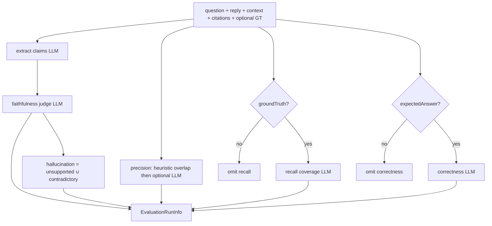
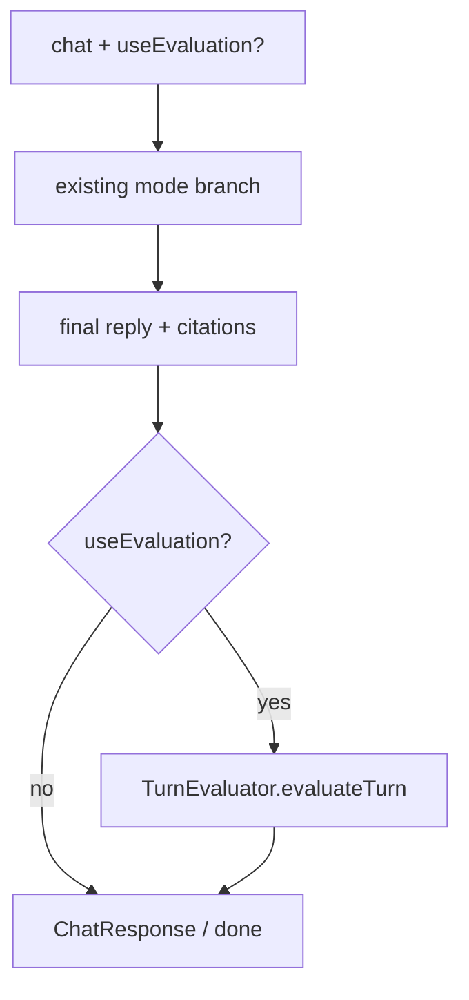

# Phase 9 — Evaluation (Backend)

> Scope: `apps/api`. Adds **hybrid RAG evaluation** — faithfulness,
> context precision, context recall, and hallucination detection — as an
> opt-in post-hoc step on chat (`useEvaluation`), plus a **batch
> benchmark runner** over a fixed knowledge-grounded dataset with
> Redis-backed run history. This is the "Evaluation" section of
> `Atlas-AI-Roadmap.md`. Everything below describes what was actually
> built.

## 0. What is RAG evaluation here?

**Faithfulness** asks whether the assistant's claims are supported by the
*retrieved* context (not whether they are true in the open world).
**Hallucination detection** is the flip side of the same claim pass —
unsupported or contradictory claims. **Context precision** asks whether
retrieved chunks were useful for the question/answer. **Context recall**
asks whether a *ground-truth* answer's claims are covered by what was
retrieved (needs a reference answer).

This phase does **not** pull RAGAS or LangSmith. Scoring is **hybrid**:

| Piece | Method |
| --- | --- |
| Claim extraction + faithfulness | LLM-as-judge via `withStructuredOutput` + Zod (same pattern as Phases 4/6) |
| Hallucination | Derived from faithfulness verdicts |
| Context precision | Token-overlap heuristic first; LLM chunk-relevance only in an ambiguous band |
| Context recall / answer correctness | LLM-as-judge when ground truth / expected answer is present |

**Official / conceptual refs:**

- [LangSmith evaluate RAG tutorial](https://docs.langchain.com/langsmith/evaluate-rag-tutorial) — groundedness / retrieval relevance framing
- RAGAS-style metrics (faithfulness, context precision/recall) as vocabulary, implemented by hand

### 0.1 Core vocabulary

| Term | Meaning here |
| --- | --- |
| **Orthogonal flag** | `useEvaluation` is *not* a generation mode — it runs after whatever mode produced the reply. |
| **Claim verdict** | One atomic statement graded `supported` / `unsupported` / `contradictory` vs context. |
| **Turn evaluation** | Scores for a single chat reply (`EvaluationRunInfo` with `mode: 'turn'`). |
| **Benchmark case** | Fixed `{ id, question, expectedAnswer }` in `benchmark-dataset.ts`. |
| **Benchmark run** | Batch of cases → persisted `BenchmarkRunSummary` in Redis. |

### 0.2 Boundary with Phase 10

Token/cost charts, prompt logging, and distributed tracing belong to
**Phase 10 Observability**. Phase 9 may report `durationMs` for an eval
pass but does not add a monitoring dashboard.

## 1. Hybrid pipeline



**Implementation**: `apps/api/src/langchain/evaluation/` —
`TurnEvaluator.evaluateTurn()`, `claim-heuristics.ts`,
`evaluation-prompts.ts`. Cap claims with `EVALUATION_MAX_CLAIMS`
(default 12). Judges fail open (zeroed / unsupported) rather than
failing the chat turn.

## 2. Per-turn chat integration

`useEvaluation` / optional `evaluationGroundTruth` on
`POST /api/v1/chat` and `GET /api/v1/chat/stream`. After generation
completes (and **not** on a graph interrupt), `ChatService` calls
`TurnEvaluator` and attaches `evaluation` to the response / `done` SSE
event. No live metric SSE events.

Generation precedence is unchanged:
`useMultiAgent > useGraph > useAgent > useTools > structuredOutput > normal`.



## 3. Batch benchmarks

Built-in dataset (`BENCHMARK_CASES`, ~8 cases) grounded in
`knowledge/faq.md`, `refund-policy.md`, and `employee-handbook.md`.

`BenchmarkRunner`:

1. For each case, `ChatService.answerForBenchmark()` — normal RAG only.
2. `evaluateTurn` with `groundTruth` + `expectedAnswer` = case expected answer.
3. Aggregate mean scores; `RedisEvaluationStore.saveRun()`.

## 4. API surface

| Endpoint | Purpose |
| --- | --- |
| `GET /api/v1/evaluation/benchmarks` | List cases (includes expected answers — learning product) |
| `POST /api/v1/evaluation/benchmarks/run` | Body `{ caseIds?: string[] }` → full `BenchmarkRunSummary` |
| `GET /api/v1/evaluation/runs` | Recent run summaries (newest first) |
| `GET /api/v1/evaluation/runs/:runId` | Full run + per-case scorecards |

Chat fields (additive):

| Field | Type | Notes |
| --- | --- | --- |
| `useEvaluation` | boolean | Default false |
| `evaluationGroundTruth` | string | Enables recall on a single turn |
| Response `evaluation` | `EvaluationRunInfo` | On invoke / `done` only |

## 5. Persistence & env

Redis keys under `EVALUATION_REDIS_PREFIX` (default `atlas:eval:`):

- `runs:{runId}` — JSON summary, TTL `EVALUATION_RUN_TTL_MINUTES` (default 1440)
- `runs:index` — sorted set by createdAt

```
EVALUATION_REDIS_PREFIX=atlas:eval:
EVALUATION_RUN_TTL_MINUTES=1440
EVALUATION_MAX_CLAIMS=12
```

## 6. File layout

```
apps/api/src/langchain/evaluation/
  evaluation.types.ts
  evaluation-prompts.ts
  claim-heuristics.ts
  evaluators.ts          # TurnEvaluator
  benchmark-dataset.ts
  benchmark-runner.ts
  index.ts

apps/api/src/modules/evaluation/
  evaluation.controller.ts
  evaluation.route.ts
  infrastructure/redis-evaluation-store.ts
  index.ts
```

## 7. How to run

```bash
docker compose up -d qdrant   # if needed
# Redis via REDIS_URL
pnpm --filter @atlas/api knowledge:index   # so RAG has chunks
pnpm --filter @atlas/api dev
```

```bash
# Per-turn evaluation
curl -X POST http://localhost:3000/api/v1/chat \
  -H 'Content-Type: application/json' \
  -d '{
    "sessionId": "eval-demo-1",
    "message": "What are the Free Tier limits?",
    "useEvaluation": true,
    "evaluationGroundTruth": "Free Tier: 5 GB storage, 250 MB max upload, 100 API requests per hour."
  }'

# Benchmarks
curl http://localhost:3000/api/v1/evaluation/benchmarks
curl -X POST http://localhost:3000/api/v1/evaluation/benchmarks/run \
  -H 'Content-Type: application/json' \
  -d '{"caseIds":["faq-free-tier","faq-upload-size"]}'
curl http://localhost:3000/api/v1/evaluation/runs
```

## 8. Out of scope

- RAGAS / LangSmith packages
- Auto-eval on every message without the flag
- Evaluating interrupted graph turns
- Phase 10 observability dashboards
