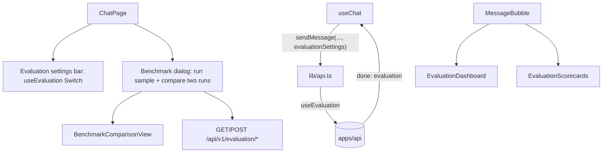

# Phase 9 — Evaluation UI

> Scope: `apps/web`. Extends the Phase 1–8 chat client with Phase 9
> roadmap UI: **evaluation dashboard**, **scorecards**, and **benchmark
> comparison**, wired to the backend in `phase-9-evaluation.md`.

## 1. Architecture

- **`EvaluationSettingsBar`** — header panel "Eval" with `useEvaluation` toggle (persisted via `useEvaluationSettings` / `atlas.evaluation-settings.v1`).
- **`BenchmarkDialog`** — header "Benchmarks" button; runs a 2-case sample by default (TPM-friendly), lists past runs, compares Run A vs Run B.

## 2. Components

### `EvaluationDashboard`

Aggregate score strip (faithfulness / precision / recall / hallucination / correctness when present) for `message.evaluation`. Color bands: emerald / amber / destructive (hallucination inverted — lower is better).

### `EvaluationScorecards`

Expandable per-metric cards: claim verdicts, citation relevance rows, GT coverage, correctness note.

### `BenchmarkComparisonView`

Two-pane aggregate comparison for two `BenchmarkRunSummary` payloads.

### `BenchmarkDialog`

Triggers `POST /api/v1/evaluation/benchmarks/run`, loads runs via `listEvaluationRuns` / `getEvaluationRun`.

## 3. Wiring

- `types/chat.ts` — mirrors API evaluation types; `ChatMessage.evaluation`, `EvaluationSettings`.
- `lib/api.ts` — `buildEvaluationFields`, stream query `useEvaluation`, fetch helpers for benchmarks/runs.
- `use-chat.ts` — `onDone` sets `evaluation` from `chunk.evaluation`; `sendMessage` accepts `evaluationSettings`.
- `message-bubble.tsx` — dashboard + scorecards when `message.evaluation` is set.
- `chat-page.tsx` — Eval panel + Benchmarks dialog.

## 4. Roadmap mapping

| Roadmap UI | Implementation |
| --- | --- |
| Evaluation dashboard | `EvaluationDashboard` |
| Scorecards | `EvaluationScorecards` |
| Benchmark comparison | `BenchmarkComparisonView` + `BenchmarkDialog` |

## 5. Notes

- Scores arrive only on `done` (no live metric SSE).
- Sample benchmark runs 2 cases by default to limit Groq TPM; full dataset available via API.
- Evaluation is orthogonal to Tools/Agent/Graph/Multi-agent — toggle independently.

## 6. How to run

Same as Phase 1. Open **Eval**, enable "Evaluate reply", ask a knowledge question. Open **Benchmarks** to run a sample and compare runs.
